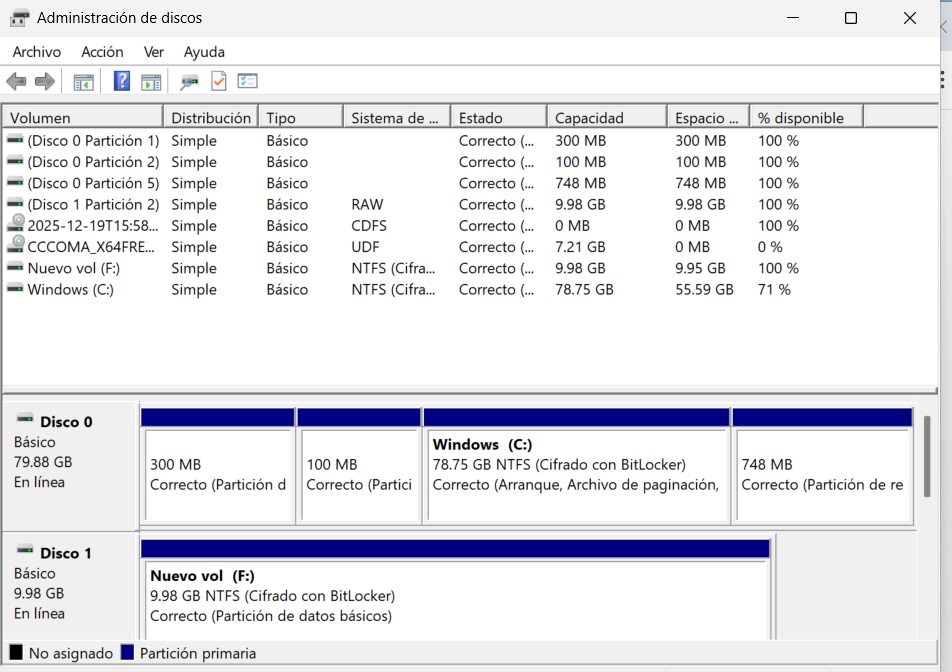
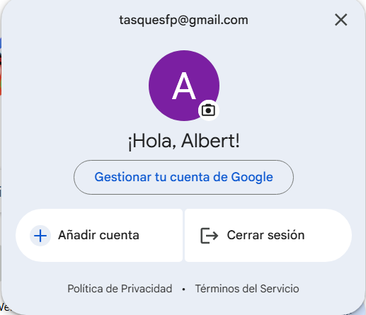
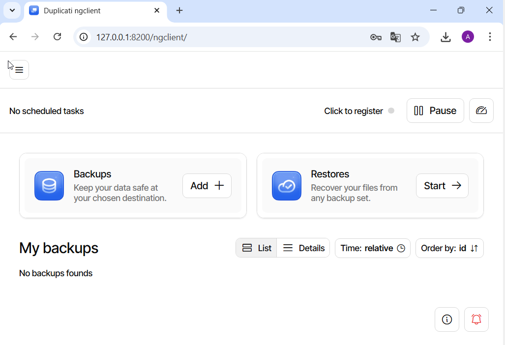
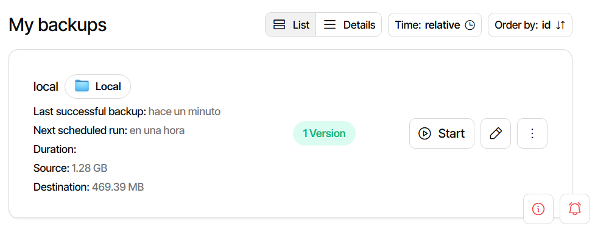
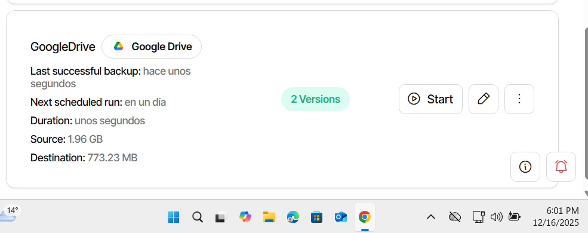
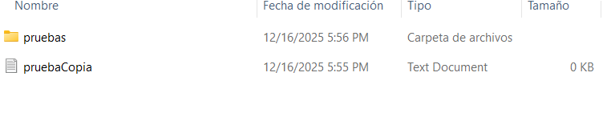
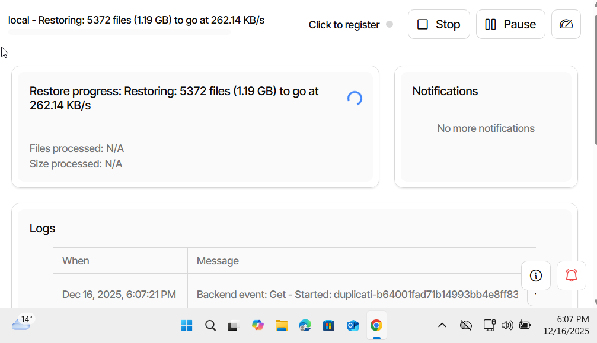
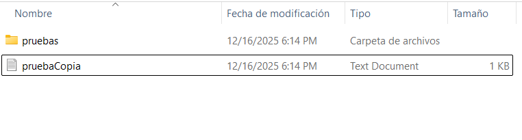
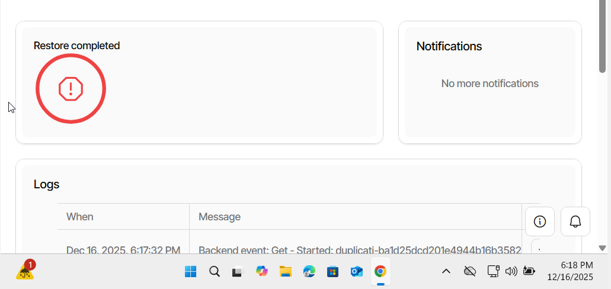
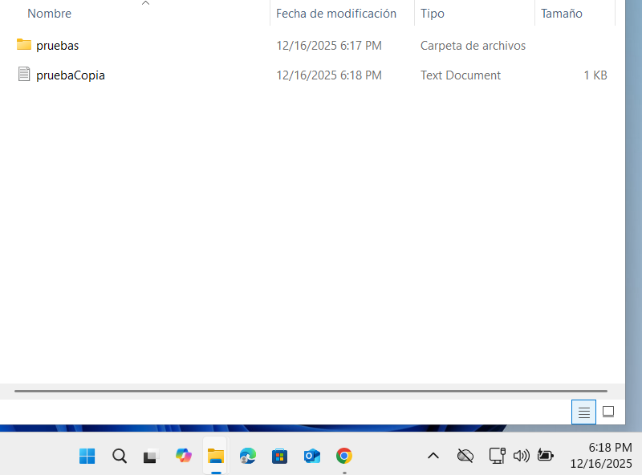

# PART 1: Còpia de seguretat d’un equip Windows

## 1. Preparar la màquina virtual
- Crea una màquina virtual amb Windows 11.  
- Afegeix dos discos:  
  - Disc 1: sistema operatiu  
  - Disc 2: disc secundari de 10 GB per a les còpies  
- Inicia Windows i comprova que el segon disc apareix al sistema i el configurem amb format NTFS.  

---

## 2. Crear o usar un compte de Google Drive
- Crea o utiltzar un compte de Google que no sigui el del centre educatiu.  
- Aquest compte s’utilitzarà per guardar la còpia al núvol.  

---

## 3. Instal·lar Duplicati
- Accedeix a: [https://duplicati.com/](https://duplicati.com/)  
- Descarrega la versió per a Windows.  
- Instal·la el programa amb les opcions per defecte.  
- Obre Duplicati, s’obre al navegador.  

---

## 4. Configurar la còpia al disc secundari
1. Fes clic a “Afegir còpia de seguretat”.  
2. Assigna un nom (exemple: *Backup local usuari*).  
3. Selecciona la carpeta de destinació → disc secundari.  
4. Tria què copiar:
   - Carpeta del perfil de l’usuari
   - Especialment Documents 
5. Programació: còpia cada hora.
6. Desa la configuració.  

---

## 5. Configurar la còpia a Google Drive
1. Crea una nova còpia de seguretat.  
2. Destinació: Google Drive.  
3. Inicia sessió amb el compte creat. 
4. Selecciona les mateixes carpetes de l’usuari.
5. Entras en el link https://duplicati-oauth-handler.appspot.com?type=googledrive per poder conseguir el AuthID 
6. Programació: còpia diària a les 18:00  
7. Desa la configuració.  

---

## 6. Comprovar el funcionament
- Afegeix diversos arxius a Documents.  
- Espera que s’executi la còpia.  
- Comprova que al disc secundari s’han creat els arxius de *backup*.  

---  

## 7. Restaurar des del disc secundari
1. Esborra tot el contingut de Documents.  
2. A Duplicati, selecciona Restaurar.  
3. Tria la còpia del disc secundari.  
4. Restaura els arxius.  
5. Comprova que els documents tornen a aparèixer.  

---

## 8. Restaurar des de Google Drive
1. A Duplicati, selecciona la còpia emmagatzemada a Google Drive.  
2. Fes clic a Restaurar.  
3. Verifica que els arxius es recuperen correctament.  

