# Guia Tècnica: Configuració i Gestió SSH

## Part 1: Configuració a Linux (Ubuntu)

### 1. Instal·lació del servei

A la màquina Ubuntu, actualitzem paquets i instal·lem el SSH:

```bash
sudo apt update
sudo apt install openssh-server
```

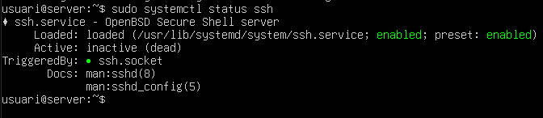


### 2. Primera connexió i Empremta digital

Des del client, connectem per primera vegada al servidor.
Accepta el que et demana escrivint yes:

```bash
ssh usuari@192.168.56.109
```

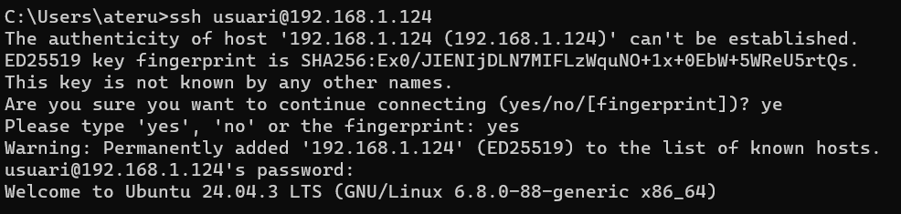


### 3. Activar l’usuari Root

Assignem una contrasenya a l’usuari root al servidor Ubuntu:

```bash
sudo passwd root
```

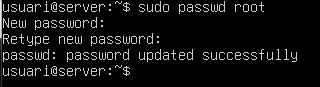


### 4. Restricció d’usuaris (sshd_config)

Editem la configuració per permetre només un usuari específic i bloquejar la resta.

1. Edita el fitxer:

```bash
sudo nano /etc/ssh/sshd_config
```

2. Fem una configuració inicial com es veu a la següent captura:

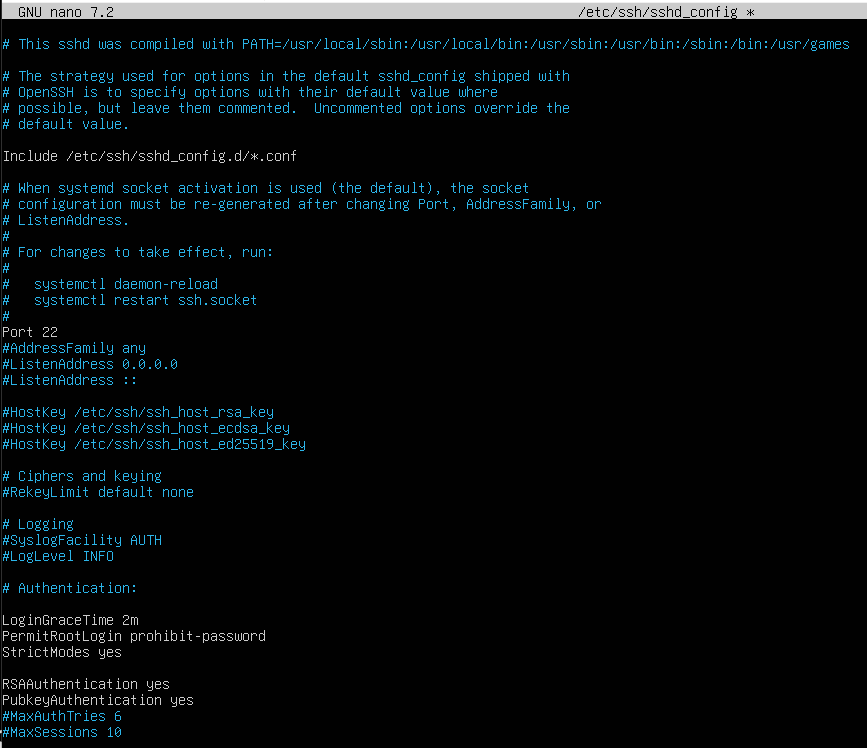

3. Afegeix al final:

```
AllowUsers (el usuari de ubuntu)
```

4. Desem i surtim.
5. Reiniciem el servei:

```bash
sudo systemctl restart ssh
```


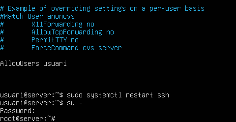


### 5. Verificació del bloqueig Root

Comprovem que root pot entrar en local però no en remot.

- Prova local:
Executem `su -` al servidor (ha de demanar contrasenya i entrar).
- Prova remota:
Executem `ssh root@ip_servidor` (ha de fallar).
Podem veure més clar que està bé la prova si al servidor mirem els logs a temps real amb `sudo tail -f /var/log/auth.log`

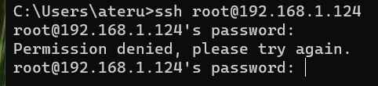

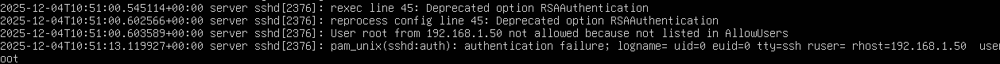


## Part 2: Autenticació amb Claus i Windows

### 6. Accés amb Certificat (Sense contrasenya)

Configurem l’accés mitjançant claus pública/privada.

Al client:

```bash
ssh-keygen
```

(Prem Enter a tot.)

Copia la clau al servidor:

```bash
ssh-copy-id usuari@ip_servidor (per linux)
type %USERPROFILE%\.ssh\id_rsa.pub | ssh usuari@192.168.56.111 "mkdir -p ~/.ssh && cat >> ~/.ssh/authorized_keys" (per windows)
```
O tambe es pot fer manualment i ens arrisquem menys a errors.

I donem permisos:

```
chmod 700 /home/usuari/.ssh
chmod 600 /home/usuari/.ssh/authorized_keys
```

Provem de tornar a connectar-te. No hauria de demanar contrasenya.

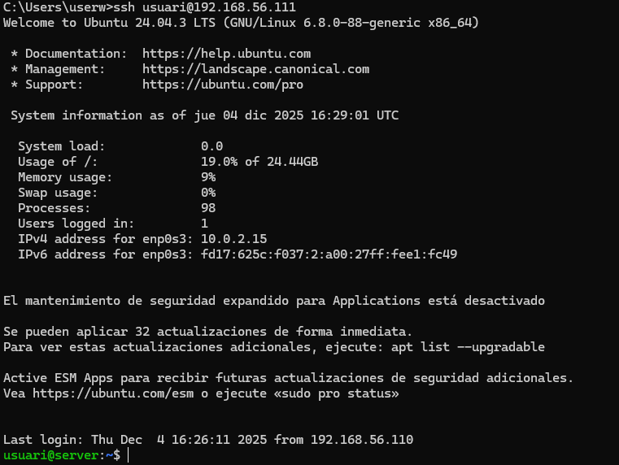


### 7. Servidor SSH a Windows

A la màquina Windows 11:

1. Anem a Configuració > Sistema > Funcions opcionals.
2. Seleccionem Afegeix una funció > Instal·la OpenSSH Server.
3. Obrim PowerShell com a administrador i executa:
```powershell
Start-Service sshd
Set-Service -Name sshd -StartupType 'Automatic'
```
I si fa falta modifiquem el firewall.

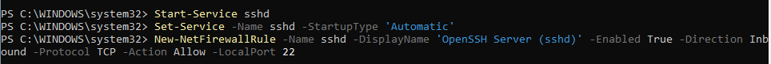


### 8. Connexió de Linux a Windows

Des del terminal de Linux, ens connectem remotament al Windows:

```bash
ssh usuari@ip
```

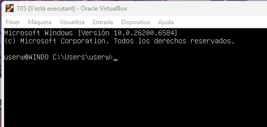


### 9. Túnel SSH i Wireshark

Creem un túnel dinàmic per assegurar el trànsit web.

Al client (deixa el terminal obert):

```bash
ssh -D 9876 usuari@ip
```

- Navegador: Configurem el Proxy manual a `127.0.0.1` port `9876`.
- Wireshark: Inicia la captura, naveguem per internet, filtrem per `tcp.stream eq 1` i veurem els paquets.

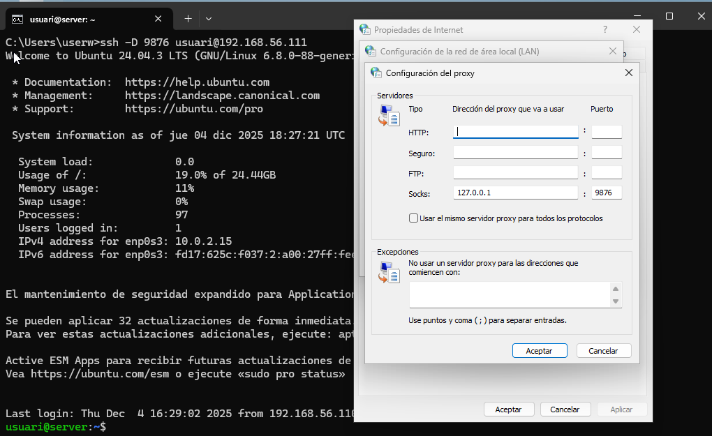

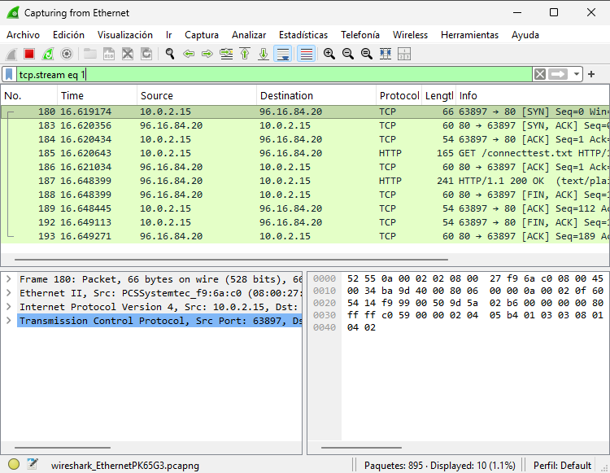


[Torna](README.md)
