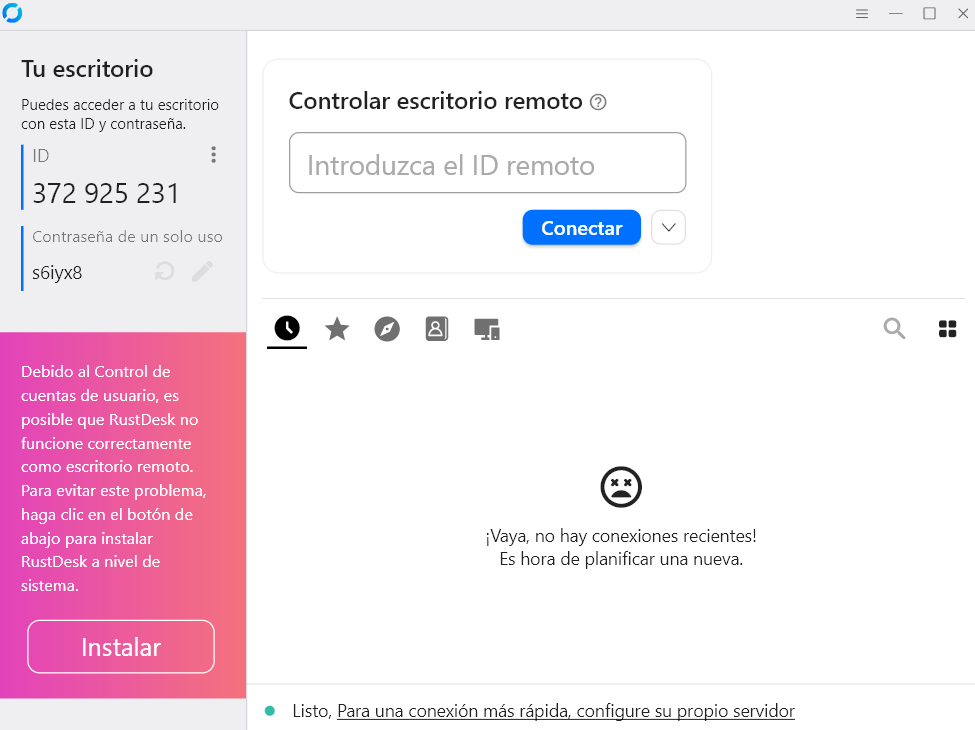
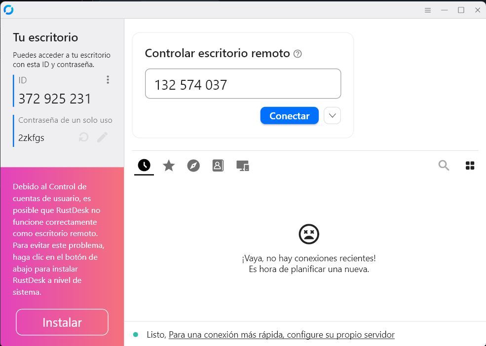
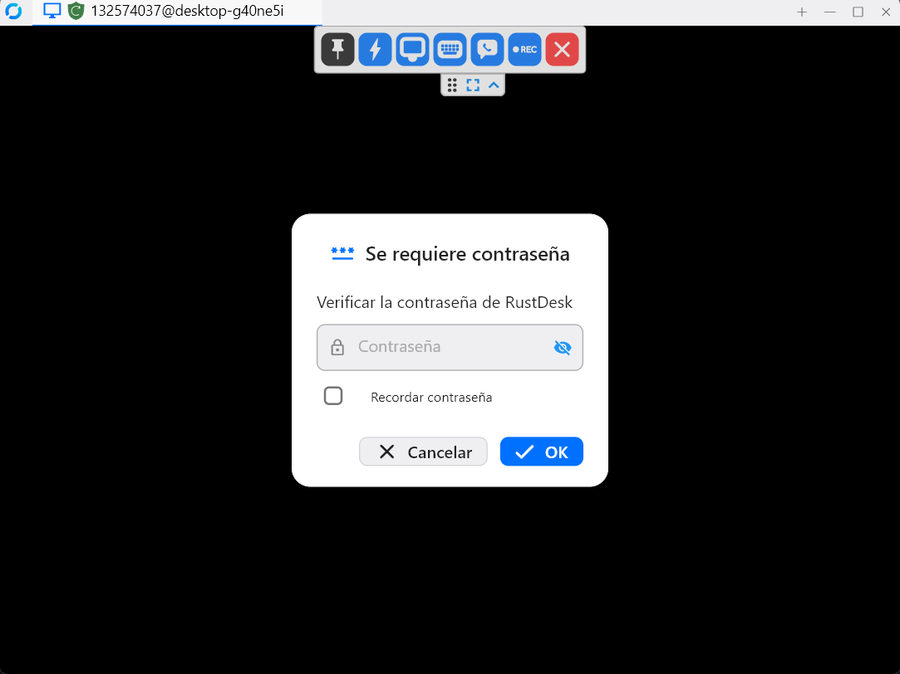
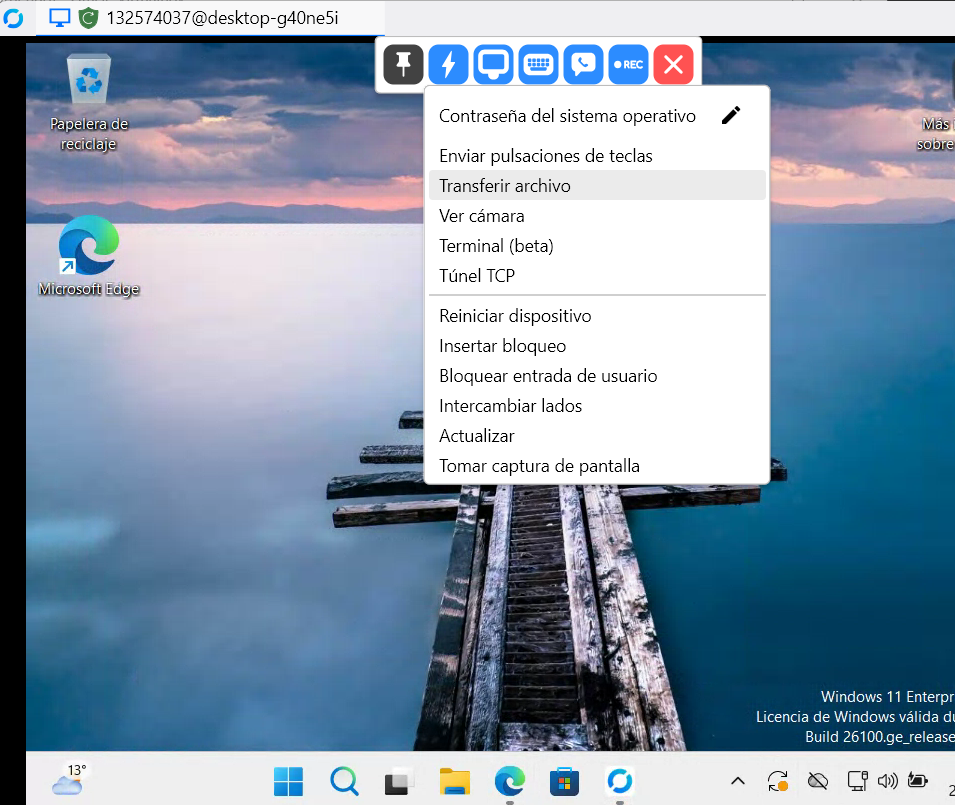
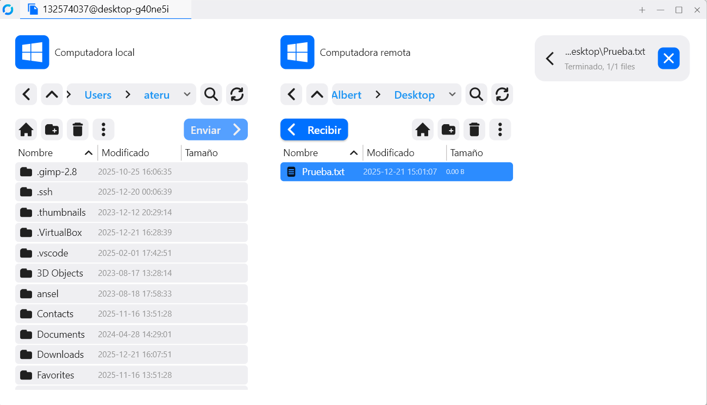
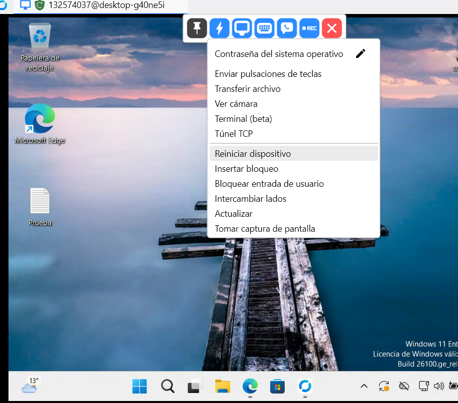
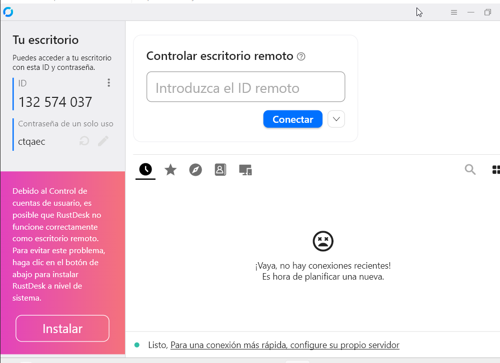
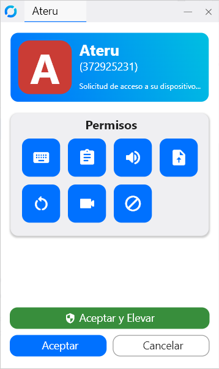

# Fase 2 – Creació de les guies d’ús

---

## RustDesk – Manual per al tècnic (Intern d’EverPia)

---

### 1. Instal·lació de RustDesk (per al tècnic)

1. Obre el navegador i ves a:  
   [https://rustdesk.com](https://rustdesk.com)
2. Descarrega la versió corresponent al teu sistema (Windows, Linux, macOS).  
3. Executa el fitxer descarregat.  
4. Segueix l’assistent d’instal·lació si cal.  
5. Inicia RustDesk.  

---

### 2. Com iniciar una sessió de suport

1. Obre **RustDesk**.  
2. Demana al client que t’enviï el seu ID de RustDesk.  
3. El client el trobarà a la seva finestra principal.  
4. Introdueix aquest ID al camp de la teva interfície
5. Clica Connect o Conectar.
 

---

### 3. Com autoritzar l’accés

1. Quan el client rebi la petició, apareixerà una finestra.  
2. El client ha d’acceptar la connexió.  
3. Si hi ha contrasenya, el client la passa al tècnic.  

---

### 4. Funcions clau durant la sessió

# Funcions avançades a RustDesk

---

## 4.1. Transferència d’arxius

1. Durant la sessió activa, localitzar la barra superior de RustDesk.  
2. Clicar a la icona de Transferència d’arxius.  
3. S’obrirà una finestra amb dos panells:
   - Equip local (tècnic)  
   - Equip remot (client)  
4. Seleccionar l’arxiu o carpeta desitjada.  
5. Arrossegar l’arxiu o utilitzar l’opció Enviar / Rebre.  
6. Esperar que finalitzi la transferència.  

---

## 4.2. Canvi de pantalla (equips amb més d’un monitor)

1. Durant la connexió, obrir el menú superior.  
2. Clicar a l’opció Pantalla o Display.  
3. Seleccionar la pantalla que es vol visualitzar:
   - Pantalla principal  
   - Pantalla secundària  
4. La visualització canviarà automàticament.  

---

## 4.3. Reinici remot de l’equip del client

1. Informar prèviament el client que es reiniciarà l’equip.  
2. A la barra d’eines, clicar a l’opció Reiniciar remot.  
3. Confirmar l’acció.  
4. L’equip del client es reiniciarà automàticament.  
5. Un cop l’equip torni a estar operatiu, RustDesk intentarà reconnectar-se automàticament.  
6. Si cal, el client acceptarà de nou la connexió.  

---

### 5. Bones pràctiques de seguretat

- En acabar, tancar sempre la sessió.  
- No desar contrasenyes de clients.  
- Demanar confirmació explícita abans de fer canvis.  
- Assegurar que la connexió sigui segura (via RustDesk ID).  

---

## RustDesk – Manual per al client (Usuari Final)

### 1. Descàrrega del mòdul de suport

1. Obre el navegador.  
2. Ves a:  
   [https://rustdesk.com](https://rustdesk.com)
3. Descarrega al client.  
4. Obre el programa.  

---

### 2. Identificar l’ID

1. Un cop obert RustDesk, apareixerà un ID numèric a la pantalla.  
2. Aquest ID és únic per a la sessió.  
3. El client l’envia al tècnic per telèfon o missatge.  

---

### 3. Acceptar la connexió remota

1. Quan el tècnic introdueixi l’ID, el client rebrà una petició de connexió.  
2. Clica Acceptar.  
3. Si se sol·licita una contrasenya, el tècnic t’ho indicarà.  

---

### 4. Finalitzar la sessió

1. Quan el suport hagi acabat, el tècnic tancarà la connexió.  
2. El client pot tancar RustDesk i sortir del programa.  
