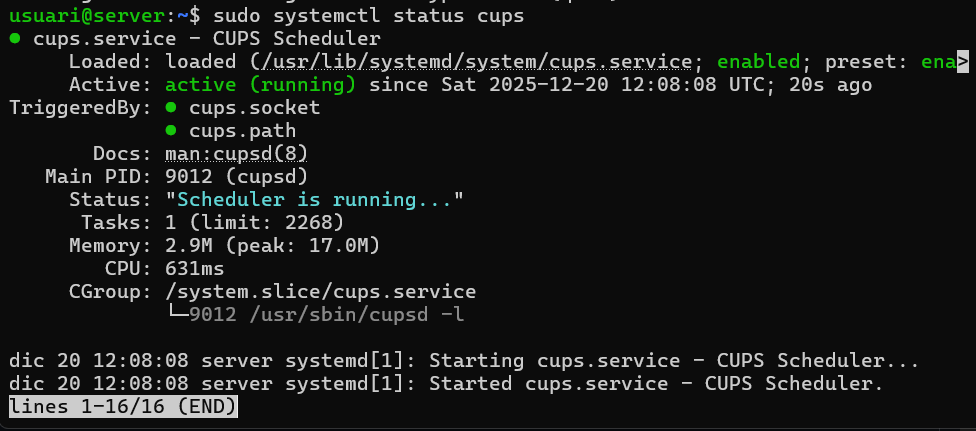
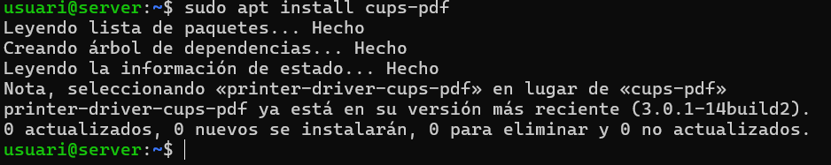
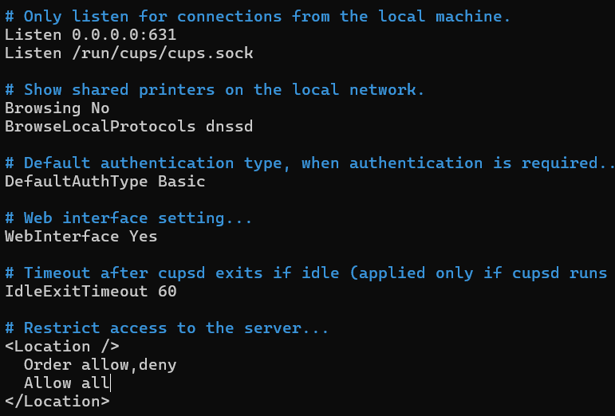
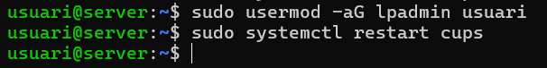
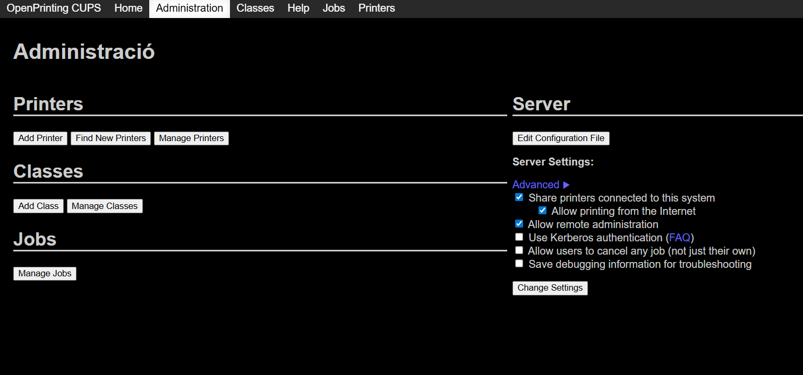
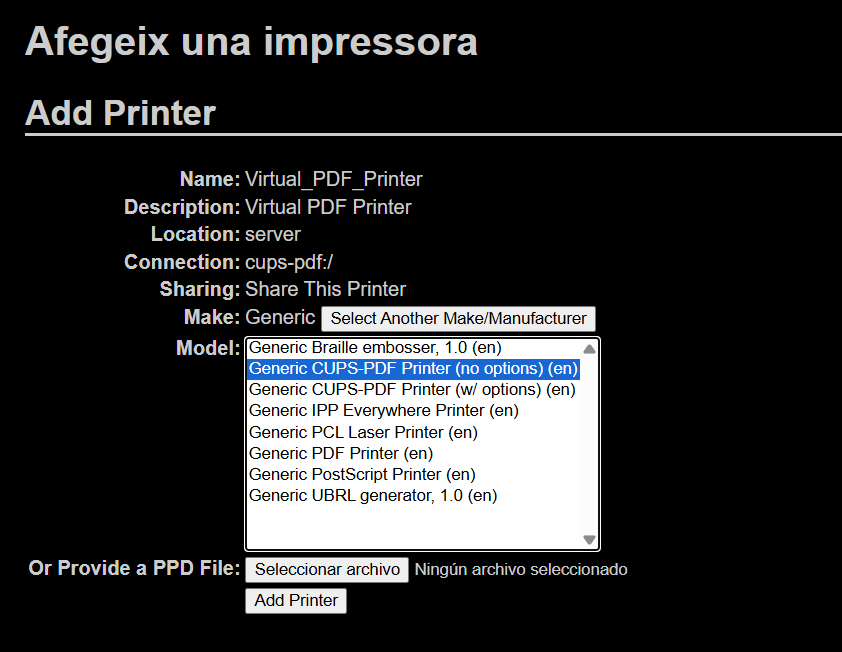
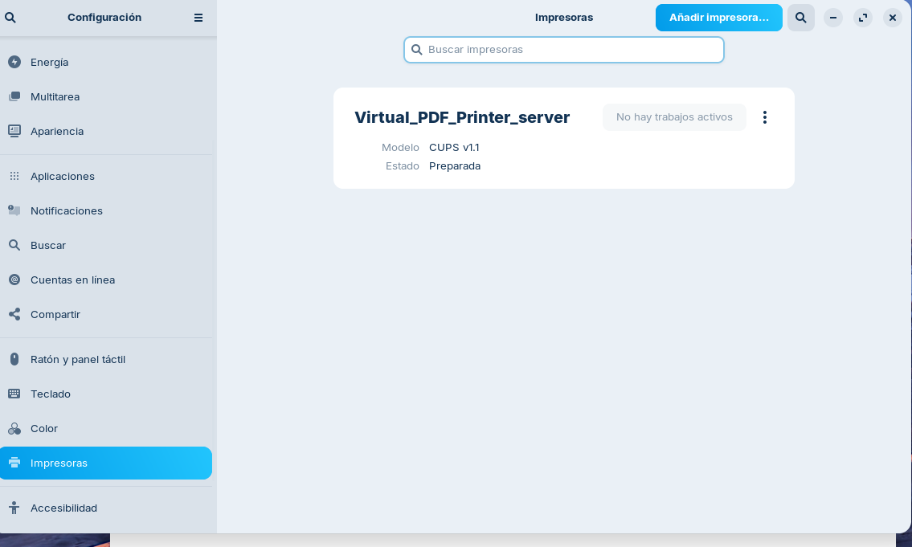
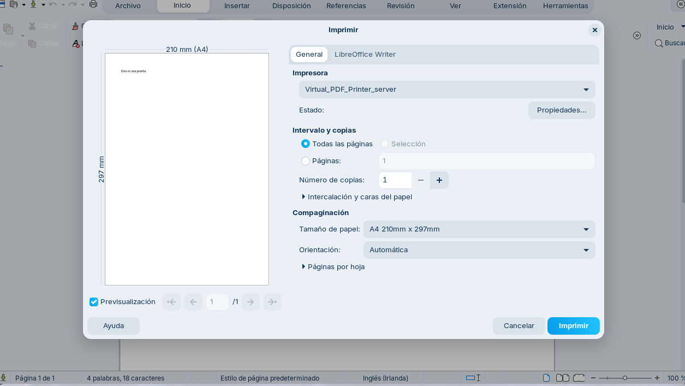
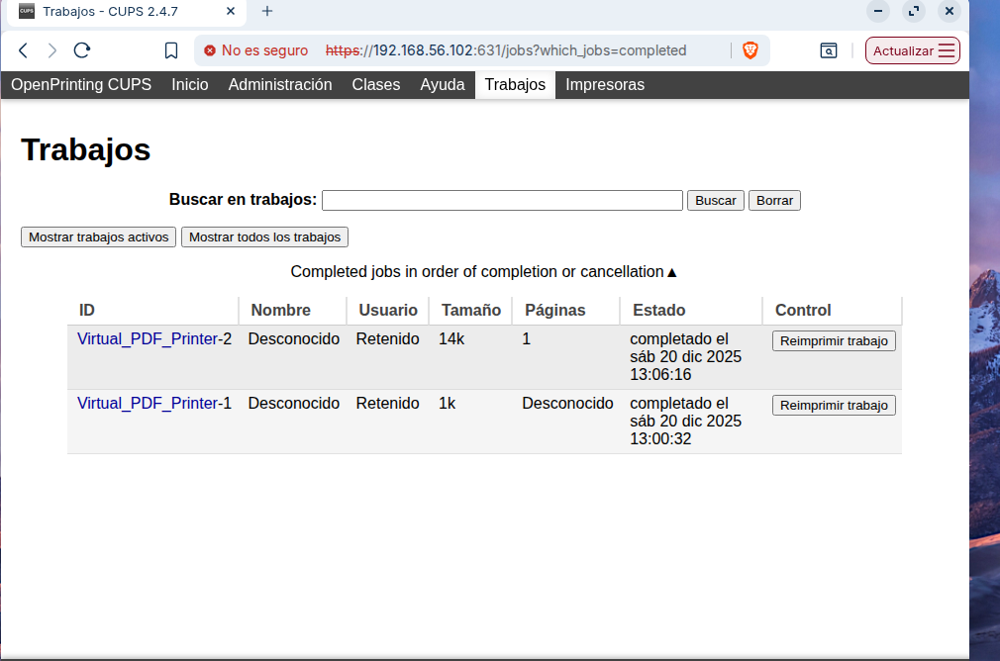
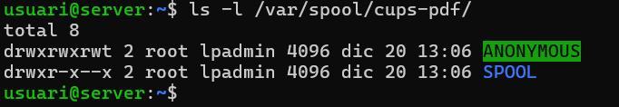

# Guia Tècnica – Servidor d’Impressió Centralitzat amb CUPS

## Escenari de treball

Servidor: Ubuntu Server  
- Xarxa NAT  
- Xarxa Host-Only  

Client: Zorin OS (Desktop)  
- Mateixa configuració de xarxa  

---

## 1. Instal·lació de CUPS al servidor

**Actualitzar repositoris i instal·lar CUPS:**
```
sudo apt update
sudo apt install cups
```

**Comprovar que el servei està actiu:**
```
sudo systemctl status cups
```



---

## 2. Instal·lar la impressora virtual `cups-pdf`

**Instal·lar el paquet:**
```
sudo apt install cups-pdf
```

Aquesta impressora generarà arxius PDF en lloc d’imprimir en paper.



---

## 3. Configurar l’administració de CUPS

**Editar el fitxer de configuració:**
```
sudo nano /etc/cups/cupsd.conf
```

**Modificar o comprovar les línies següents:**
```
Listen 0.0.0.0:631
WebInterface Yes
```

**Permetre accés remot** (afegir dins de `<Location />`):
```
Allow all
```
**Permetre accés a admin** (afegir dins de `<Location /admin>`):
```
Allow all
```


Afegir el teu usuari al grup lpadmin

Al servidor, executa:
```
sudo usermod -aG lpadmin usuari
```

**Reiniciar el servei:**
```
sudo systemctl restart cups
```




---

## 4. Compartir la impressora des del frontal web de CUPS

**Obrir el navegador:**
```
http://192.168.56.102:631
```

1. Entrar a Administration 
2. Marcar Share printers connected to this system
3. Donar-li a add printer



5. Marca CUPS-PDF de las locals
6. Següent i li donem a share this printer
7. A make posem generic i a model Generic CUPS-PDF



---

## 5. Afegir la impressora al client Zorin OS

1. Obrir Settings → Printers
2. Si estan a la mateixa xarxa, la impressora Virtual_PDF_Printer_server hauria d'aparèixer automàticament. Si no:  
3. Afegir una nova impressora  
4. Seleccionar la impressora compartida del servidor  
5. Acceptar la configuració per defecte  



---

## 6. Prova d’impressió

1. Obrir un document (PDF o text) al client Zorin.  
2. Enviar-lo a imprimir a la impressora del servidor.  
3. Repetir la prova amb diversos documents.  



---

## 7. Comprovar els arxius PDF al servidor

**Comprovar a la web:**
A la web de CUPS en treballs podem veure el seu estat



**Comprovar els arxius del servidor:**
```
ls -l /var/spool/cups-pdf/
```

Verifica que cada impressió ha creat un nou fitxer PDF.



---

## Conclusió

- El servidor Ubuntu gestiona la impressora de forma centralitzada.  
- Els clients Zorin OS poden imprimir sense instal·lar drivers locals.  
- Les impressions es generen correctament en format PDF al servidor.  
- La PoC demostra que un servidor Linux pot actuar com a servidor d’impressió professional.
