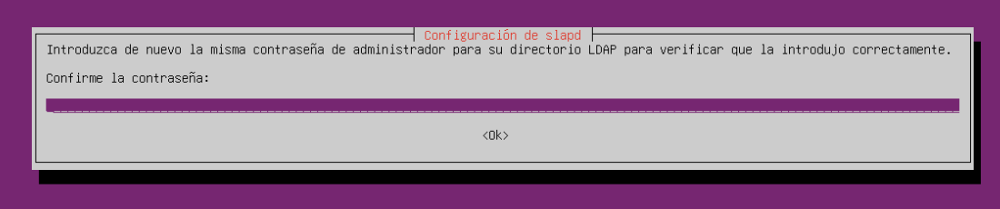
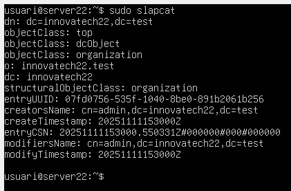

# Guia d'Instal·lació del Servidor LDAP amb Ubuntu

---

## Part 2: Instal·lació d'OpenLDAP

### Pas 3: Actualitzar el Sistema

Primer, actualitzem els paquets del sistema:
```bash
sudo apt update
sudo apt upgrade
```

### Pas 4: Instal·lar OpenLDAP

Executem la comanda d'instal·lació:
```bash
sudo apt install slapd ldap-utils
```

Durant l'instal·lació, et demanarà una contrasenya d'administrador.



### Pas 5: Validar la Instal·lació

Per verificar que OpenLDAP s'ha instal·lat correctament, executem:
```bash
sudo slapcat
```

Aquesta comanda mostrarà la base de dades de LDAP actual.



---

[Torna al README](README.md)

[](../README.md)

[](../../README.md)
