# PART 2: Còpia de seguretat d’un servidor Linux (Ubuntu Server)

## Preparació de l’entorn

- **Màquina virtual** amb **Ubuntu Server**.  
- **Segon disc dur** de **10 GB** afegit a la màquina.  

---

## 1. Inicialitzar, formatar i muntar el disc de backup
- Crear el directori de muntatge:
  ```
  sudo mkdir /media/backup
  ```
- Identificar el nou disc:
  ```
  lsblk
  ```
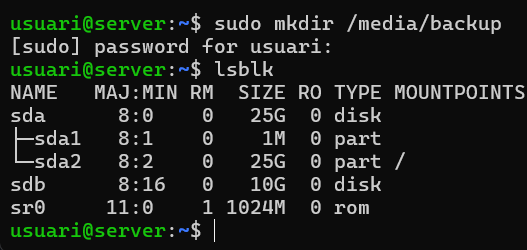

- Crear el sistema de fitxers **xfs**:
  ```
  sudo mkfs.xfs /dev/sdb
  ```
- Muntar el disc a `/media/backup`:
  ```
  sudo mount /dev/sdb /media/backup
  ```
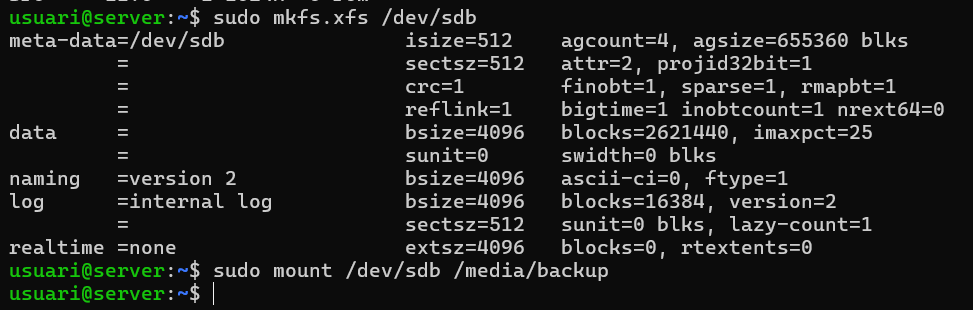

---

## 2. Instal·lar Duplicity
Instal·lar el programari necessari:
```
sudo apt update
sudo apt install duplicity
```
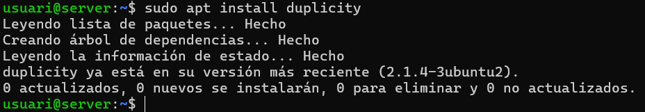

---

## 3. Crear usuaris i arxius de prova
- Crear dos usuaris nous:
  ```
  sudo adduser usuari1
  sudo adduser usuari2
  ```
- Crear **4 arxius de 10 MB** dins el directori `/home` del teu usuari:
  ```
  fallocate -l 10M arxiu1
  fallocate -l 10M arxiu2
  fallocate -l 10M arxiu3
  fallocate -l 10M arxiu4
  ```
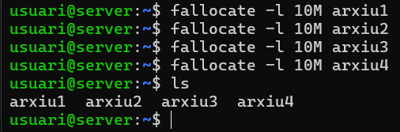

---

## 4. Fer una còpia de seguretat de /home
Executar una còpia completa de la carpeta `/home` com a root:
```
duplicity /home file:///media/backup
```
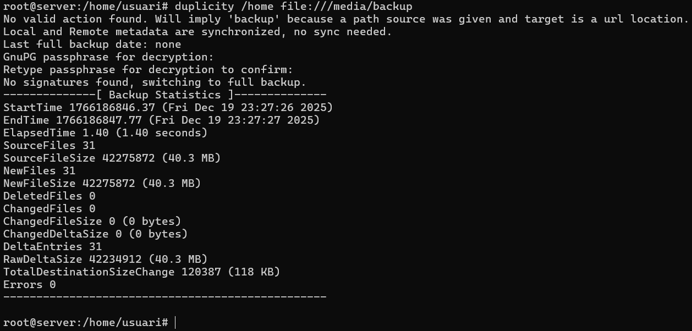

---

## 5. Esborrar arxius i restaurar la còpia
- Esborrar els arxius creats:
  ```
  rm arxiu*
  ```
- Restaurar la còpia com a root:
  ```
  duplicity restore file:///media/backup /home --force
  ```
- Comprovar que els arxius s’han recuperat correctament.  
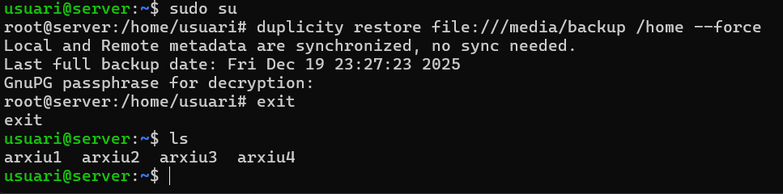

---

## 6. Còpia incremental
- Crear un **nou arxiu de 4 MB**:
  ```
  fallocate -l 4M arxiu5
  ```
- Tornar a executar la còpia com a root:
  ```
  duplicity /home file:///media/backup
  ```
- Verificar que la còpia és incremental (confirmem que u es mirant la següent captura).  
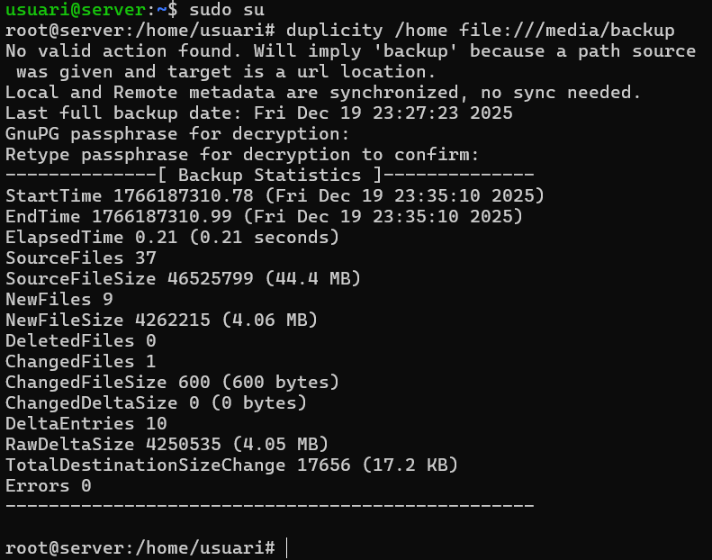

---

## 7. Desmuntar la unitat de backup
Desmuntar el disc:
```
sudo umount /media/backup
```
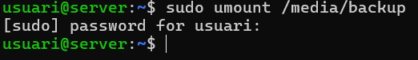

---

# Automatització amb scripts i cron
> La unitat de backup ha d’estar desmuntada per defecte.

---

## 8. Script de còpia completa fullbackup.sh
- Crear l’script:
  ```
  nano fullbackup.sh
  ```
- Contingut bàsic:
  ```
  #!/bin/bash
  export PASSPHRASE=contrasenya
  mount /dev/sdb /media/backup
  duplicity /home file:///media/backup
  umount /media/backup
  ```
- Donar permisos d’execució:
  ```
  chmod +x fullbackup.sh
  ```
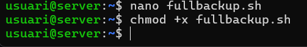

---

## 9. Programar la còpia completa amb cron
- Editar el **crontab** com a *root*:
  ```
  sudo crontab -e
  ```
  (opció 1)

- Afegir la línia:
  ```
  0 23 * * 0 /ruta/fullbackup.sh
  ```
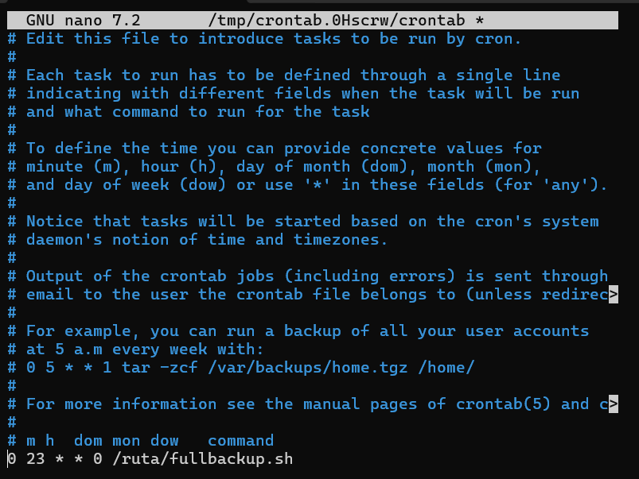

---

## 10. Script de còpia incremental-incrementalbackup.sh
- Crear l’script:
  ```
  nano incrementalbackup.sh
  ```
- Contingut:
  ```
  #!/bin/bash
  export PASSPHRASE=contrasenya
  mount /dev/sdb /media/backup
  duplicity incremental /home file:///media/backup
  umount /media/backup
  ```
- Donar permisos:
  ```
  chmod +x incrementalbackup.sh
  ```
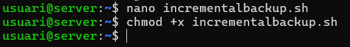

---

## 11. Programar la còpia incremental amb cron
Afegir al **crontab**:
```
0 23 * * 1-6 /ruta/incrementalbackup.sh
```
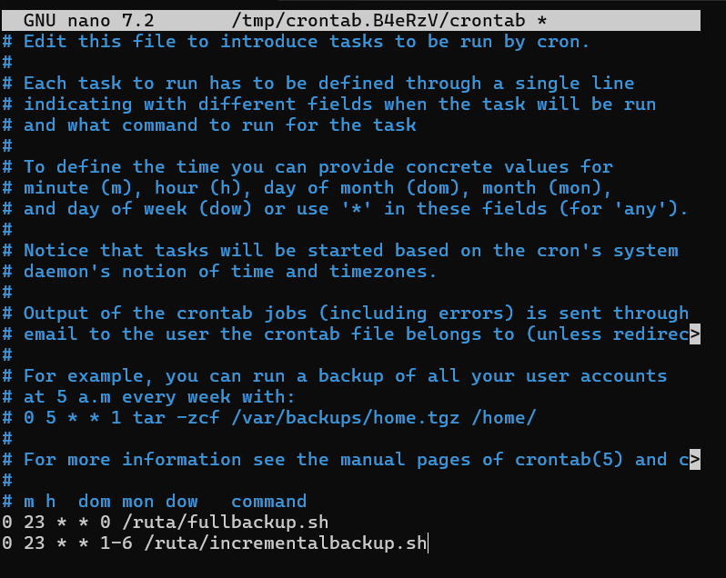


## Conclusió

Còpia completa: diumenge a les 23:00

Còpia incremental: de dilluns a dissabte a les 23:00

La unitat de backup només es munta durant el procés, millorant la seguretat

[Torna al README](README.md)

[](../README.md)

[](../../README.md)