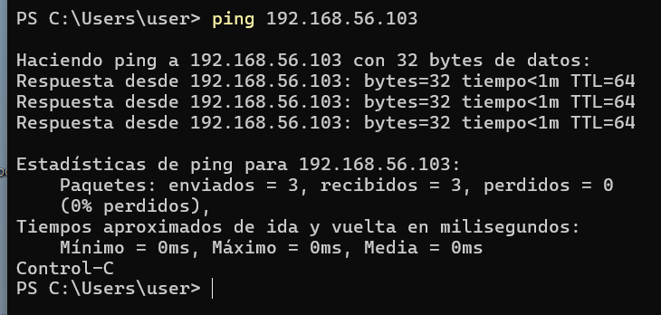
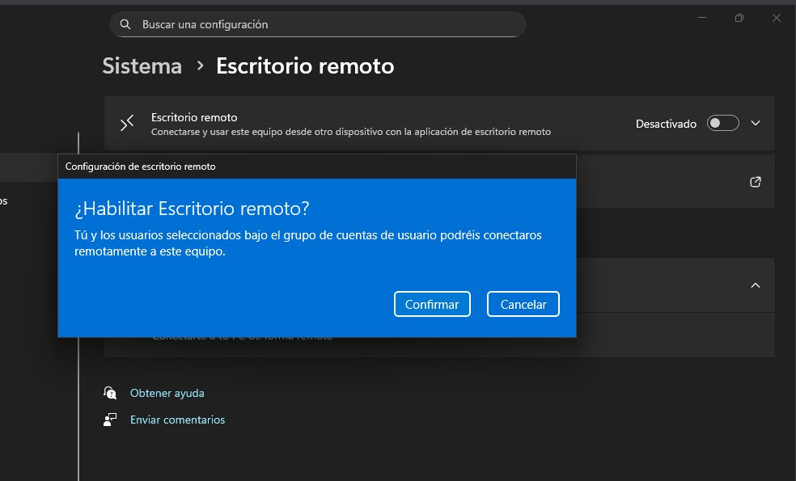
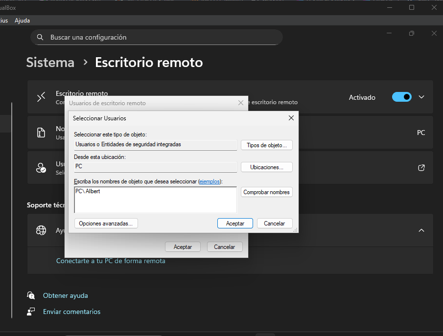
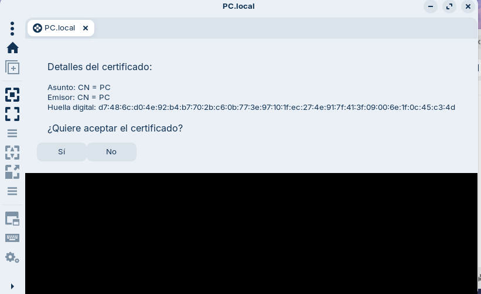
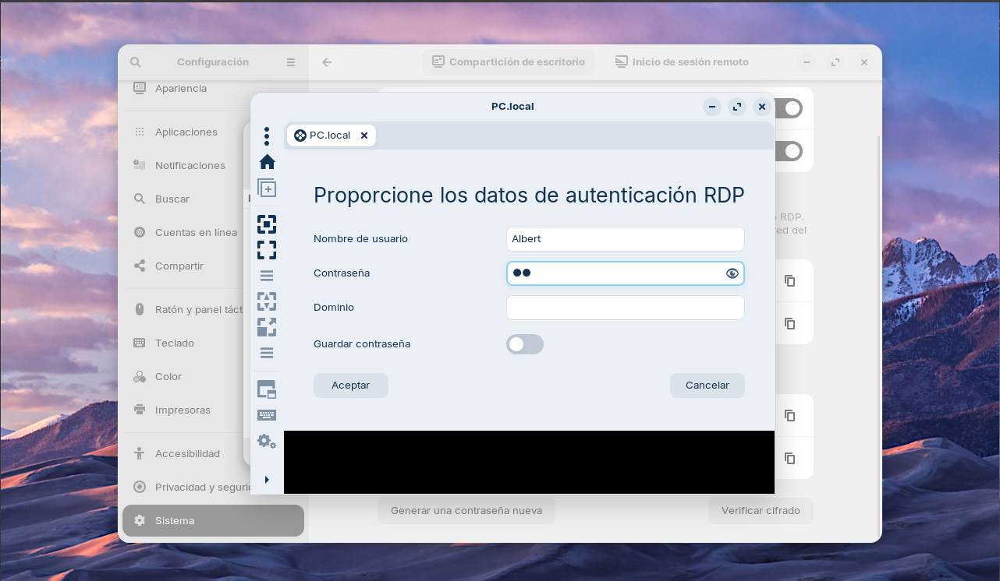
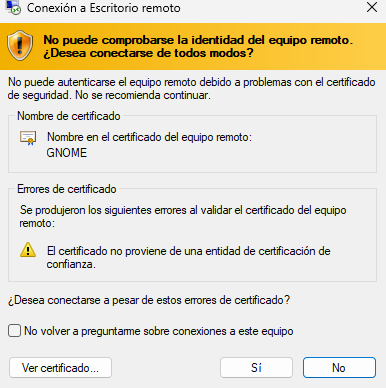

## 1. Entorn i requisits

- Màquina virtual Windows 11  
- Màquina virtual Zorin OS  
- Ordinador físic amb VirtualBox o VMware  
- Xarxa configurada com Adaptador de només amfitrió (Host-only)  
- Un usuari amb contrasenya a cada sistema  

---

## 2. Configuració de la xarxa virtual (Host-only)

Abans de començar, comprovem amb un ping si les màquines es veuen.

---

## 3. Configuració de l’escriptori remot a Windows

### 3.1 Activació de l’RDP

1. Obrir Configuració.  
2. Accedir a Sistema.  
3. Entrar a Escriptori remot.  
4. Activar l’opció Permetre l’escriptori remot.  
5. Acceptar l’avís de seguretat.  

---

### 3.2 Autoritzar usuaris per a la connexió

1. Dins del menú d’escriptori remot, clicar Usuaris d’escriptori remot.  
2. Prémer Afegeix.  
3. Escriure el nom del compte de Windows.  
4. Validar amb Comprova noms.  
5. Confirmar els canvis.  

---

### 3.3 Desactivar el tallafoc

Per evitar bloquejos durant la prova:

1. Obrir **Configuració**.  
2. Cercar **Firewall de Windows**.  
3. Accedir a la configuració de notificacions.  
4. **Desactivar el tallafoc temporalment**.  

---

## 4. Connexió des de Linux (Zorin) cap a Windows

1. Iniciar la màquina Linux Zorin.  
2. Obrir l’aplicació Remmina.  
3. Crear una nova connexió RDP.  
4. Introduir el nom del dispositiu Windows.  
5. Acceptar el certificat.  

6. Escriure l’usuari i contrasenya de Windows.  

Si tot és correcte, es mostrarà l’escriptori de Windows remot.  

---

## 5. Configuració de l’escriptori remot a Zorin OS

### 5.1 Activar la compartició d’escriptori

1. Obrir Configuració del sistema.  
2. Accedir a Escriptori remot.  
3. Activar:
   - Compartició d’escriptori
   - Control remot
   - Inici de sessió remot (RDP)

---

## 6. Connexió des de Windows cap a Zorin

1. A Windows, obrir Connexió a Escriptori Remot.  
2. Escriure el nom del dispositiu Linux o la seva IP.  
3. Clicar Connecta.  
4. Introduir l’usuari i contrasenya de Zorin.  
5. Acceptar l’avís de seguretat.  

---

## 8. Conclusió

Aquesta prova de concepte demostra que és possible establir connexions RDP funcionals entre sistemes Windows i Linux dins d’un mateix ordinador mitjançant la virtualització.

Aquesta metodologia és clau per a tasques de suport tècnic i assistència remota a usuaris finals.

[Torna al README](README.md)

