## Fase 1: Preparació de l'entorn

Creem dues màquines virtuals:
- Servidor: Ubuntu Server
- Client: Zorin OS 

Configurem dos adaptadors de xarxa NAT i Host-only.

Apliquem actualitzacions:
```
sudo apt update
sudo apt upgrade -y
```

Comprovem connexió entre equips amb un ping a google i a l'altre màquina


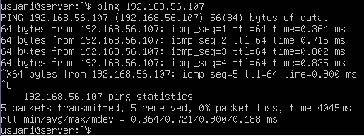

---

## Fase 2: Preparació del servidor

### Creació de grups

L’empresa té dos grups developers i administradors, creem aquests grups amb les següents comandes:

```
sudo groupadd -g 1050 devs
sudo groupadd -g 1051 admins
```

### Creació d'usuaris

Creem comptes d’usuari i li posem la contrasenya amb:

```
sudo useradd -m -u 1052 -g devs dev01
sudo passwd dev01

sudo useradd -m -u 1053 -g admins admin01
sudo passwd admin01
```

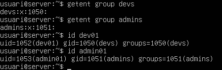

### Directoris compartits NFS

Creem els directoris amb:

```bash
sudo mkdir -p /srv/nfs/dev_projects
sudo mkdir -p /srv/nfs/admin_tools
```

### Permisos

Apliquem permisos els grups corresponents:

```bash
sudo chown root:devs /srv/nfs/dev_projects
sudo chmod 2770 /srv/nfs/dev_projects

sudo chown root:admins /srv/nfs/admin_tools
sudo chmod 2770 /srv/nfs/admin_tools
```
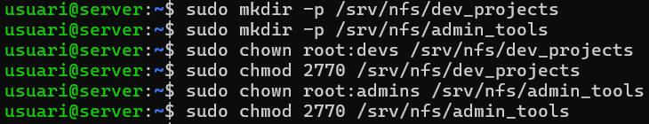

### Instal·lació del servidor NFS

Instal·lem NFS:

```bash
sudo apt install nfs-kernel-server -y
```

### Configuració inicial exportacions

Dintre de /etc/exports posem:
```bash
/srv/nfs/admin_tools 192.168.56.0/24(rw,sync)
/srv/nfs/dev_projects 192.168.56.0/24(rw,sync)
```

```bash
sudo exportfs -ra
sudo systemctl restart nfs-kernel-server
```

Replicar usuaris i grups al client per tenir mateix UID/GID.

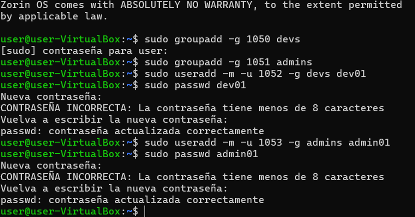

---

## Fase 3: L'exportació d'Administració

Instalem nfs:
```bash
sudo apt install nfs-common -y
```

### Prova 1: Error típic (root_squash)

Muntem recurs al client:

```bash
sudo mkdir -p /mnt/admin_tools
sudo mount 192.168.56.102:/srv/nfs/admin_tools /mnt/admin_tools
```

Com a root:

```bash
sudo touch /mnt/admin_tools/prova.txt
```

Propietari apareix com **nobody** → *root_squash*

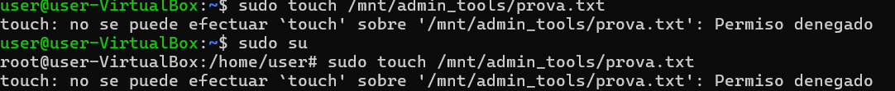

---

### Prova 2: Solució (no_root_squash)

Editem `/etc/exports`:

```bash
/srv/nfs/admin_tools 192.168.56.0/24(rw,sync,no_root_squash)
```

```bash
sudo exportfs -ra
sudo systemctl restart nfs-kernel-server
```

Muntem de nou i creem:

```bash
sudo touch /mnt/admin_tools/prova2.txt
```

Propietari ara és **root**

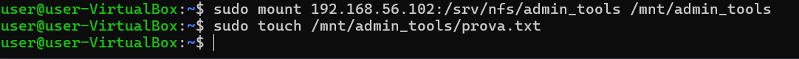

---

## Fase 4: Exportació de Desenvolupament

Configuració exportació a /etc/exports:

```bash
/srv/nfs/dev_projects 192.168.56.0/24(rw,sync) 192.168.56.105(ro,sync)
```

Muntem al client:

```bash
sudo mkdir -p /mnt/dev_projects
sudo mount 192.168.56.102:/srv/nfs/dev_projects /mnt/dev_projects
```

#### Test usuari dev01 (ha de funcionar)

```bash
su - dev01
touch /mnt/dev_projects/fitxer1.txt
```

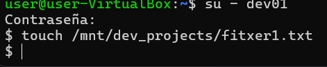

#### Canviem IP a 192.168.56.105 → només lectura

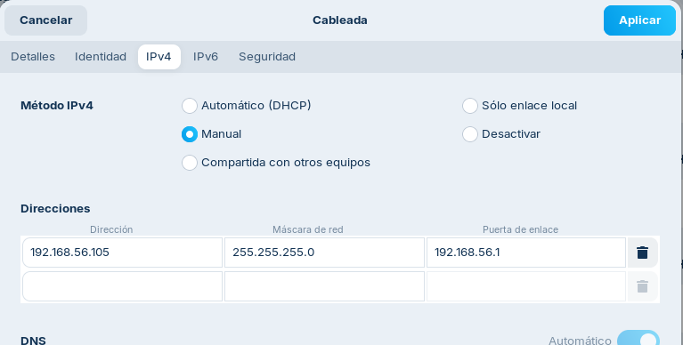

Intent d’escriptura → error

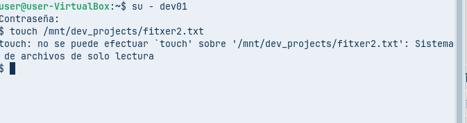

#### Usuari admin01 → tampoc pot escriure (no és grup devs)

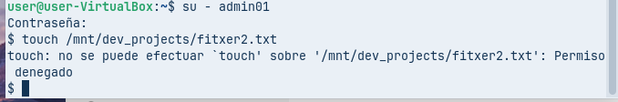

---

## Fase 5: Muntatge automàtic – /etc/fstab

Afegim a /etc/fstab al client:

```bash
192.168.56.102:/srv/nfs/admin_tools /mnt/admin_tools  nfs  defaults,_netdev  0  0
192.168.56.102:/srv/nfs/dev_projects /mnt/dev_projects nfs  defaults,_netdev  0  0
```

Provem:

```bash
sudo mount -a
```

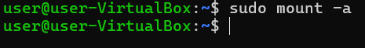

Reinici i comprovació:

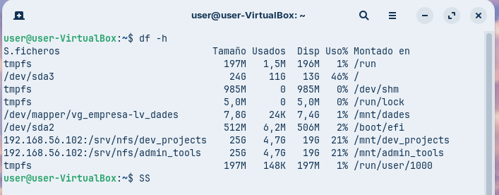

---

[Torna al README](README.md)

[](../README.md)

[](../../README.md)