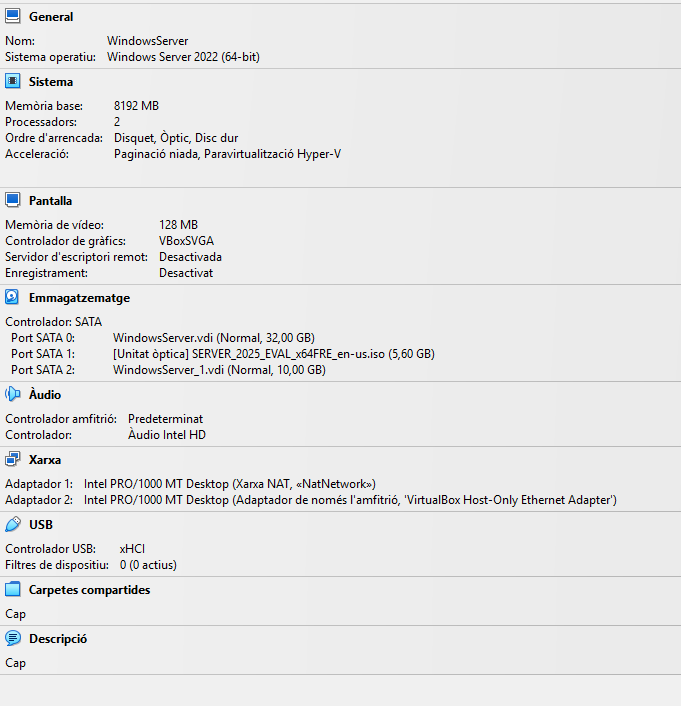
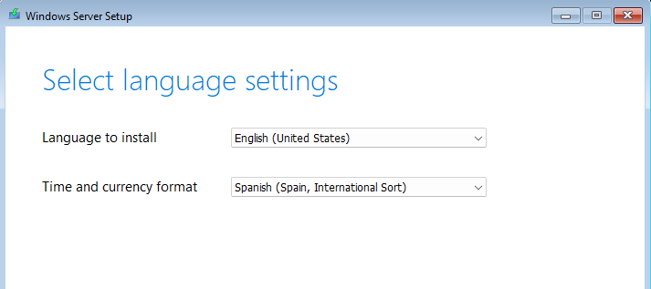
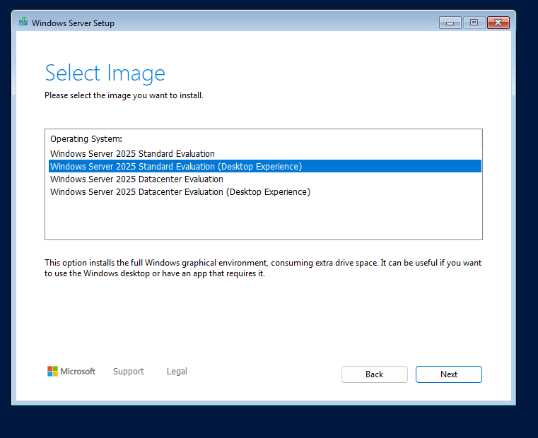
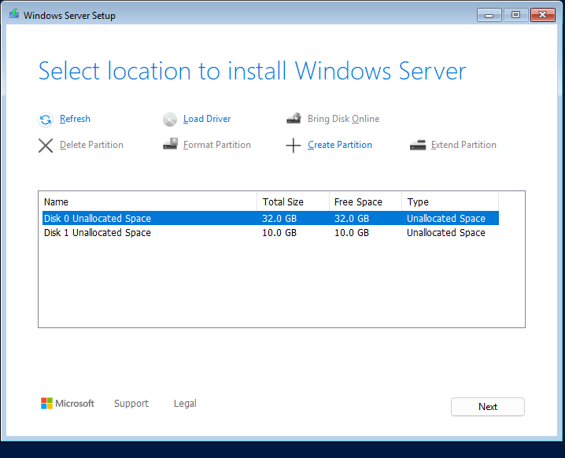
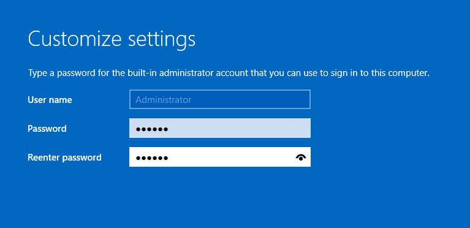
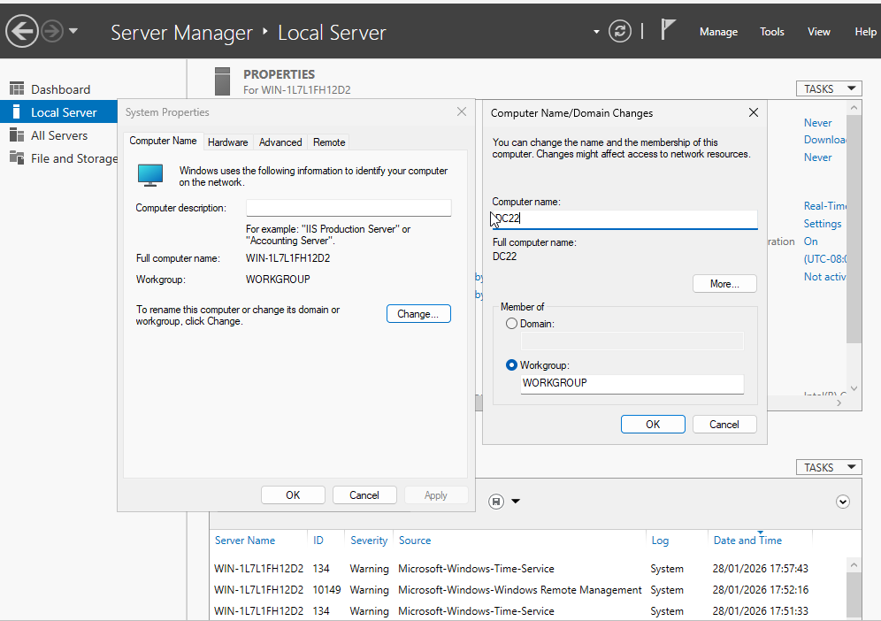
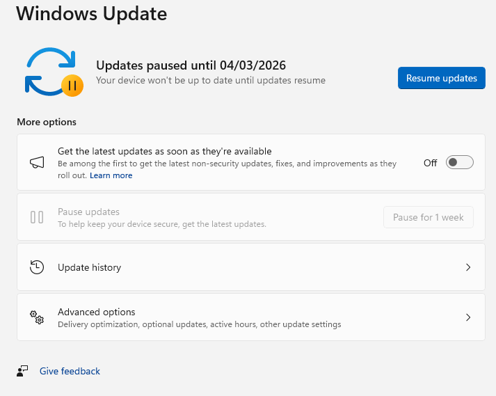

# Guia d'instal·lació: Windows Server 2025

## 1. Configuració de la màquina virtual

Abans d'instal·lar el sistema, configurem el maquinari virtual amb aquests paràmetres:

- Processadors: 2
- Memòria RAM: 8 GB
- Disc principal: 32 GB (per al sistema operatiu)
- Disc secundari: 10 GB
- Xarxa 1: NAT
- Xarxa 2: Host-only (només amfitrió)
- 

---

## 2. Procés d'instal·lació

Iniciem la màquina amb la ISO i seguim aquests passos:

1. Idioma i teclat: Seleccionem idioma English (US), però configurem el format d'hora i el teclat en Spanish.

2. Edició del sistema: Triem Windows Server 2025 Standard (Desktop Experience).

3. Destinació: Seleccionem la instal·lació personalitzada i escollim el disc de 32 GB.

4. Usuari: Creem la contrasenya per a l'administrador i iniciem sessió.

---

## 3. Configuració final del sistema

Un cop dins de l'escriptori, apliquem els darrers ajustos:

### Canvi de nom de l'equip
Anem a la configuració del sistema i canviem el nom de l'equip a DC22 (número de llista). Reiniciem el servidor.

### Actualitzacions
1. Obrim Windows Update.
2. Busquem i instal·lem totes les actualitzacions disponibles.
3. Un cop finalitzat, fem clic a l'opció de pausar actualitzacions durant el temps màxim permès.

