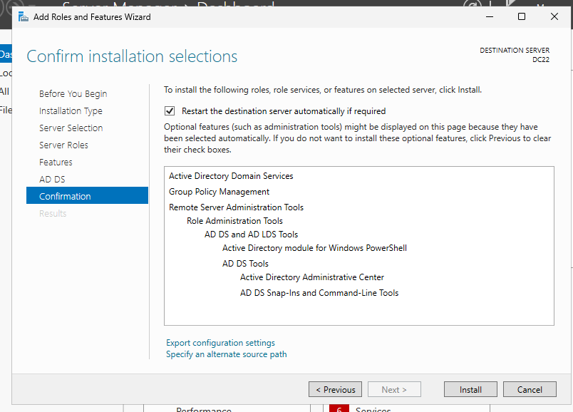
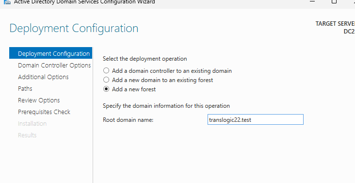
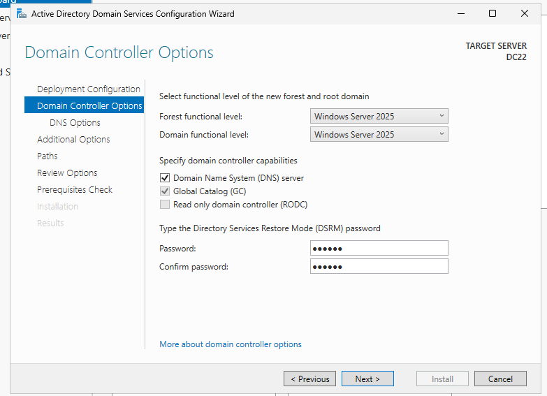
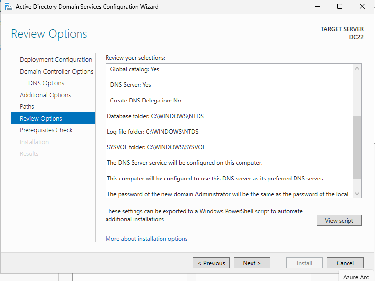
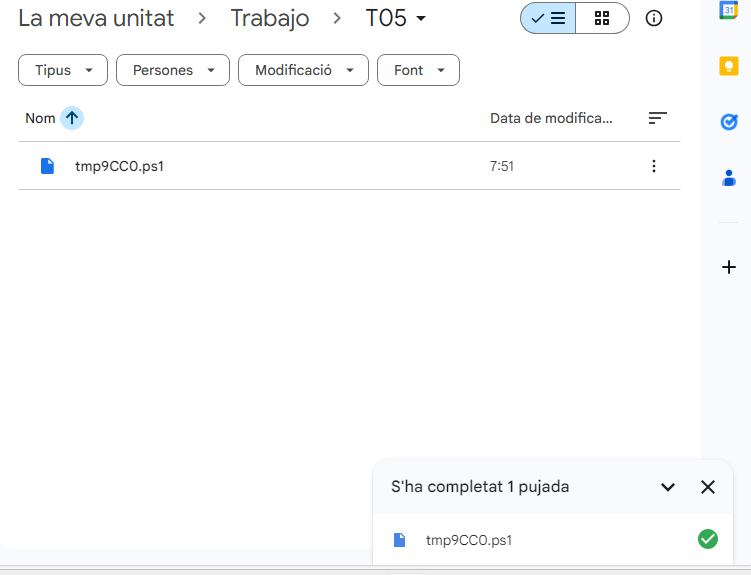

# Guia de desplegament del domini: translogic22.test

## 1. Instal·lació del rol de servidor
Obrim l'administrador del servidor i seleccionem l'opció d'afegir rols i característiques. Marquem el rol de Serveis de domini d'Active Directory (AD DS) i acceptem les característiques requerides fins a completar la instal·lació.

---

## 2. Promoció del servidor a controlador de domini
Un cop instal·lat el rol, cliquem a la notificació i seleccionem l'opció de promocionar el servidor a controlador de domini. Seguim aquests passos:

1. Seleccionem l'opció d'afegir un bosc nou.
2. Escrivim el nom del domini: translogic22.test.

3. Triem el nivell funcional del bosc i del domini a Windows Server 2025.
4. Establim la contrasenya per al mode de restauració de serveis de directori.

---

## 3. Resum i script PowerShell
Abans de confirmar la instal·lació definitiva, anem a la pantalla de resum de les opcions seleccionades per verificar la configuració.

1. Revisem que totes les dades siguin correctes.
2. Cliquem al botó de visualitzar el script de PowerShell.
3. Guardem el contingut d'aquest script en un fitxer de text amb extensió .ps1 per automatitzar el procés en el futur.

---

## 4. Finalització i transferència del fitxer
Deixem que el sistema finalitzi la promoció i es reiniciï. Un cop el domini estigui operatiu, copiem l'arxiu PowerShell al repositori extern. Per fer-ho, utilitzem un dispositiu USB, un servei d'emmagatzematge al núvol o enviem el fitxer mitjançant el protocol scp.

- [arxiu](tmp9CC0.ps1)

