# T06 – Configuració del domini Active Directory

## 1. Objectiu de la pràctica

Configurar l’estructura del domini translogic22.test creant:

- Unitats Organitzatives (OU)
- Grups de seguretat
- Plantilles d’usuari
- Usuaris
- Un equip client unit al domini

El domini ha de quedar organitzat i funcional.

***

## 2. Accés a Active Directory

Iniciar sessió al servidor DC22 com a:
`TRANSLOGIC22\Administrator`

Obrir:

```
Server Manager - Tools - Active Directory Users and Computers
```

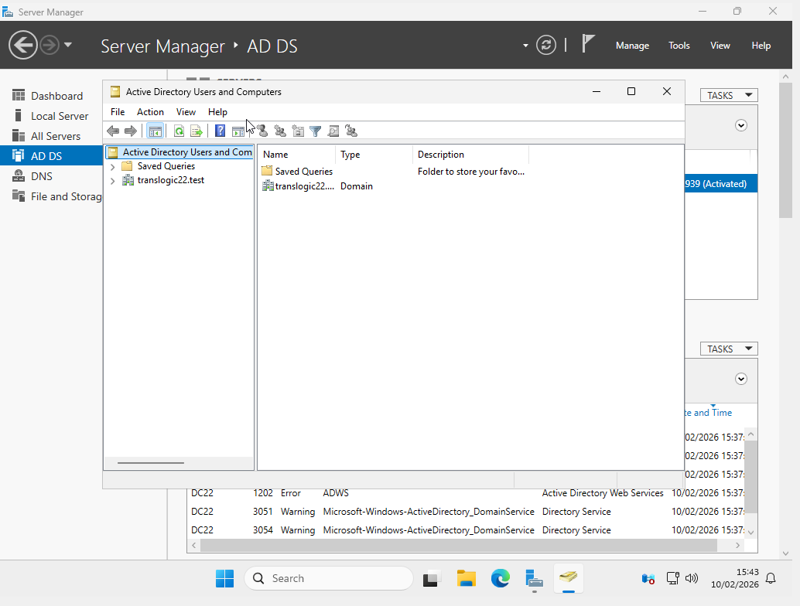

***

## 3. Creació d’Unitats Organitzatives (OU)

Estructura que s’ha de crear:

```
translogic22.test
│
├── Gestio
├── Magatzem
├── Gerencia
└── Equips
```

Per crear cada OU:

- Clic dret sobre el domini - New - Organizational Unit
- Escriure el nom corresponent
- Polsar OK

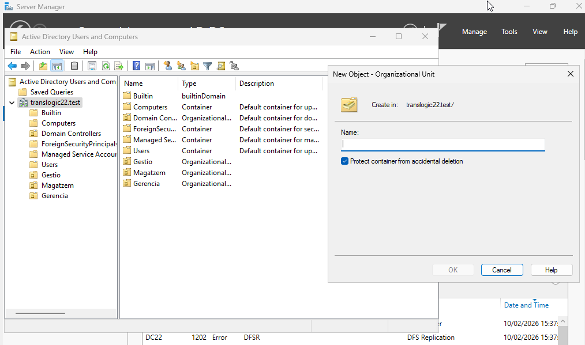

***

## 4. Creació de grups de seguretat

Els grups es creen a l’arrel del domini.

Grups a crear:

- gestio
- magatzem
- gerencia
- personal

Per crear cada grup:

- Clic dret sobre el domini - New - Group
- Escriure el nom
- Configurar:
    - Group scope: Global
    - Group type: Security
- Polsar OK

Tots els grups han de ser de tipus Global i Security.

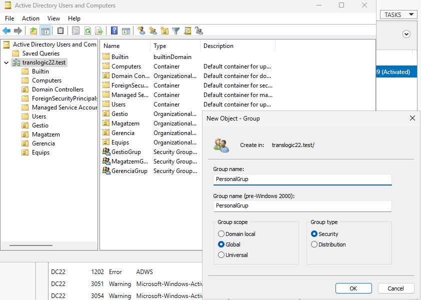

Afegir els grups al grup personal:

1. Obrir propietats del grup gestio
2. Pestanya Member Of - Add
3. Escriure personal - OK
4. Repetir amb magatzem i gerencia

***

## 5. Creació de plantilles d’usuari

A cada OU crear una plantilla:

- A Gestio - plantilla_gestio
- A Magatzem - plantilla_magatzem
- A Gerencia - plantilla_gerencia

Per crear cada plantilla:

1. Entrar a la OU corresponent
2. Clic dret - New - User
3. Escriure el nom indicat
4. Assignar contrasenya

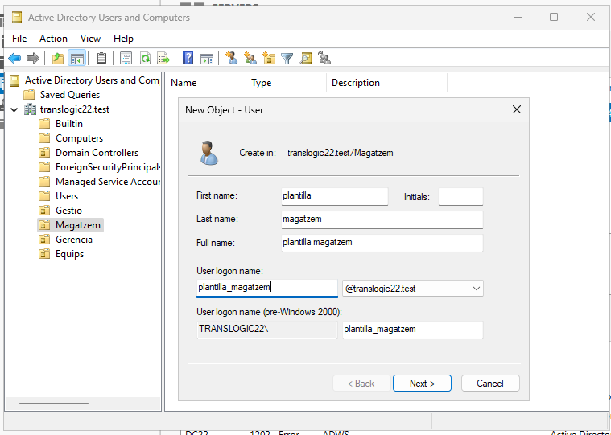

Configurar els grups de cada plantilla:

- Obrir propietats de l’usuari
- Pestanya Member Of - Add
- Afegir el seu grup corresponent
- Afegir també el grup personal

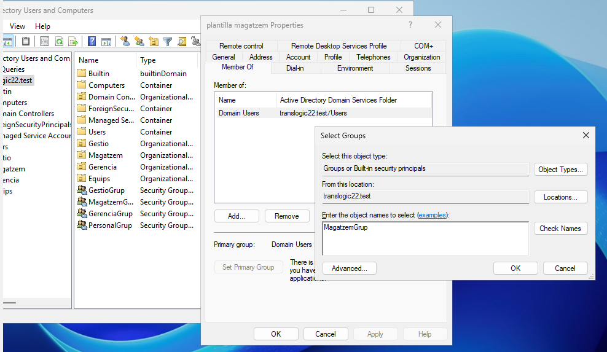


***

## 6. Creació d’usuaris

Usuaris a crear:

- u_gestio a la OU Gestio
- u_magatzem a la OU Magatzem
- u_gerencia a la OU Gerencia

Per crear-los:

- Clic dret sobre la plantilla - Copy
- Escriure el nom del nou usuari
- Assignar contrasenya
- Finalitzar

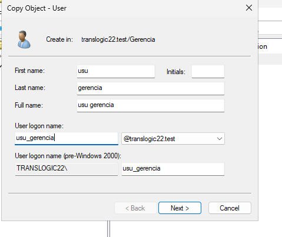
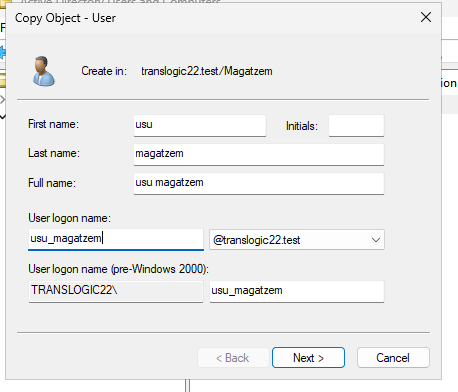
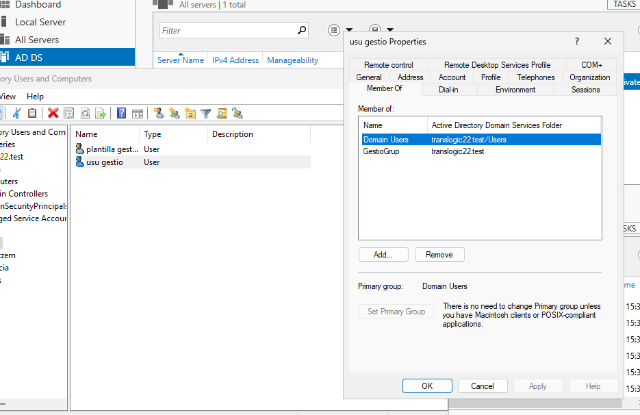


Comprovar que cada usuari pertany als grups correctes.

***

## 7. Crear l’equip a Active Directory

Dins la OU Equips:

- Clic dret - New - Computer
- Nom: PC1
- Polsar OK

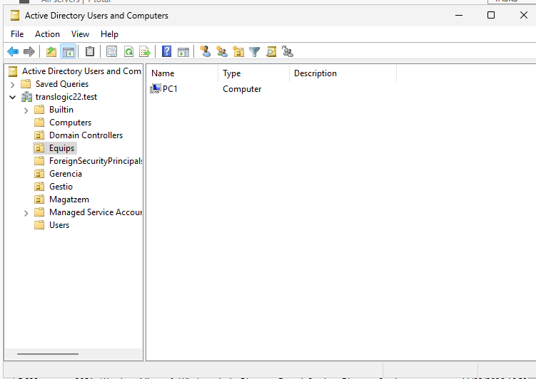

***

## 8. Crear la màquina virtual Windows 11

Crear una màquina virtual amb:

- 4 GB de RAM
- 1 CPU o més
- 64 GB de disc mínim
- Adaptador de xarxa a la mateixa xarxa que el DC

Instal·lar Windows 11 Pro, Enterprise o Education.

***

## 9. Configurar PC1 abans d’unir-lo al domini

1. Canviar el nom de l’equip:

```
Rename-Computer -NewName "PC1" -Restart
```

2. Configurar el DNS perquè apunti a la IP del DC:

```
Set-DnsClientServerAddress -InterfaceAlias "Ethernet" -ServerAddresses 10.0.2.15
```

3. Comprovar la connectivitat:

```
ping 10.0.2.15
nslookup translogic22.test
```
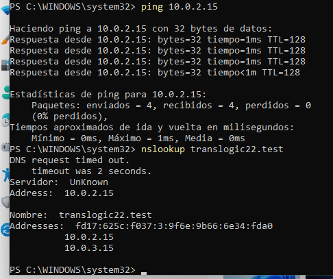

***

## 10. Unir l’equip al domini

Anem a configuracio - Comptes - Obtenir accés a treball o escola - Connectar - Connectar a AD local

Posem l'administrador i després l'usuari al qual ens volem connectar

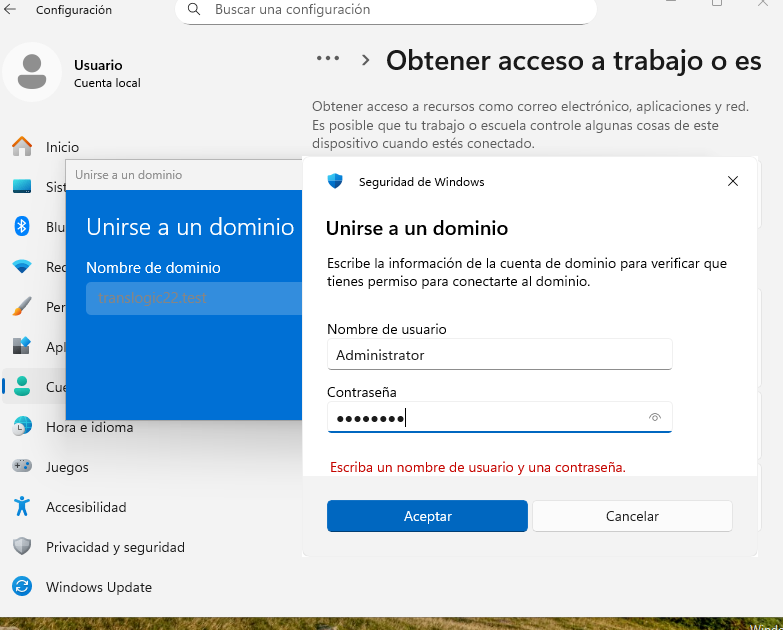

Demanara reiniciar

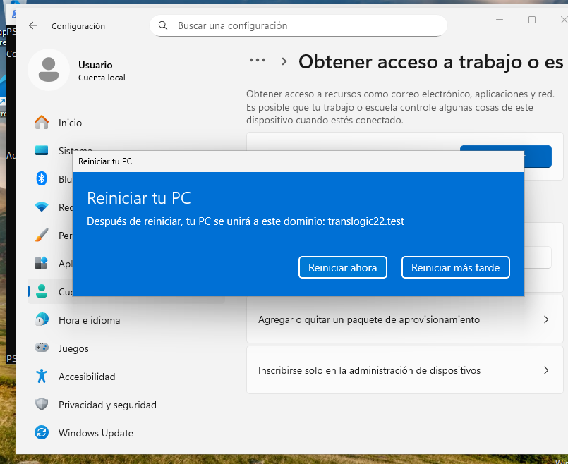

***

## 11. Verificació

Iniciar sessió amb un usuari del domini:

```
translogic22\u_gestio
```

Ha d’aparèixer:

```
translogic22\nom_usuari
```

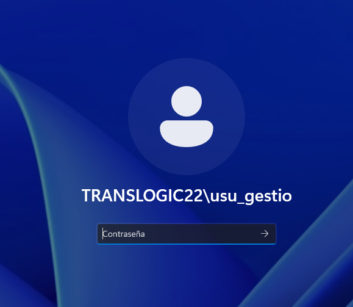
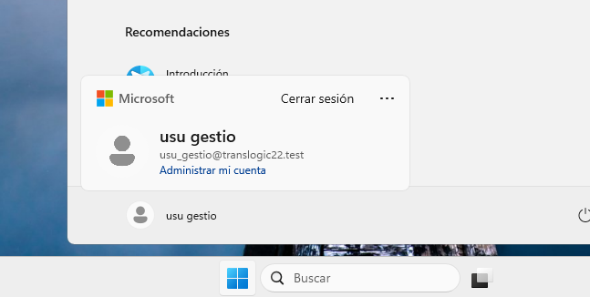
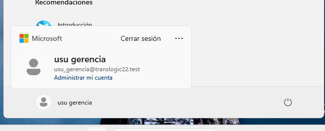
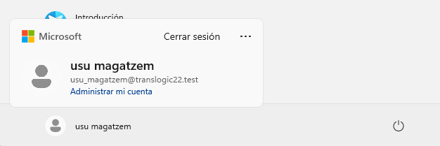


