# MALWARE I PROGRAMARI ANTIMALWARE – GUIA PRÀCTICA

## 1. Comprovació del funcionament de l’antimalware (EICAR)

### Desactivació de SmartScreen

1. Obrim Seguretat de Windows.  
2. Anem a Control d’aplicacions i navegador.  
3. Entrem a Configuració de protecció basada en la reputació.  
4. Desactivem SmartScreen.
  
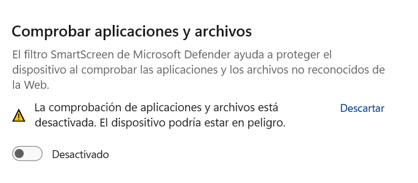

### Desactivació de la protecció en temps real

Desactivem temporalment la protecció en temps real de Windows Defender.  

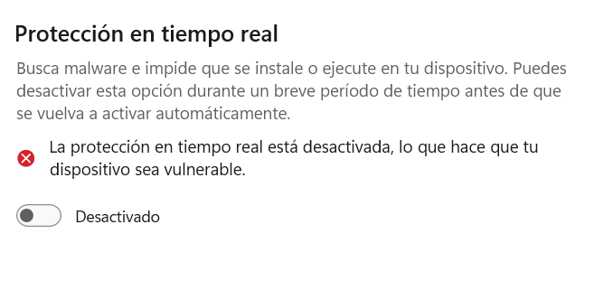

### Prova amb el fitxer EICAR

1. Descarreguem el fitxer de prova EICAR des de la web oficial.  
2. Un cop descarregat, tornem a activar la protecció en temps real.  
3. Comprovem que l’antimalware detecta el fitxer i el bloqueja.  

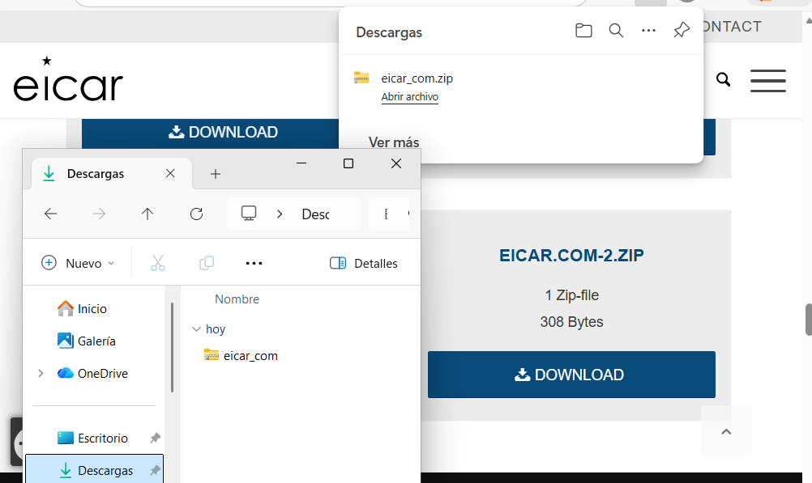  

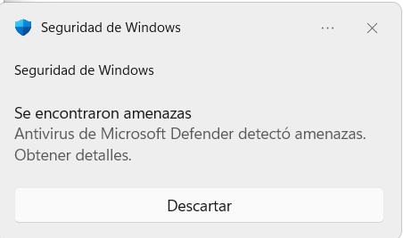

### Fitxers comprimirts

1. Tornem a desactivar la protecció en temps real.  
2. Comprimim el fitxer EICAR en diferents formats:
   - ZIP  
   - TAR  
   - 7ZIP  
3. Tornem a activar l’antimalware i comprovem el resultat:
   - ZIP → Detectat  
   - TAR → Detectat  
   - 7ZIP → Detectat  

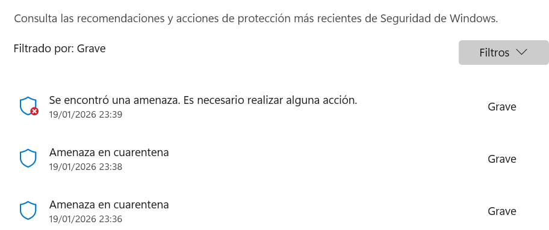

***

## 2. Proteccions de Windows 11

Entrem a Seguretat de Windows → Protecció antivirus i contra amenaces i comprovem que Windows 11 inclou:

- Protecció en temps real  
- Protecció al núvol  
- Historial d’amenaces  

Després entrem a Control d’aplicacions i navegador i veiem opcions com:

- SmartScreen  
- Protecció contra llocs web perillosos  

Finalment comprovem que Windows 11 disposa de protecció contra ransomware mitjançant l’accés controlat a carpetes.  

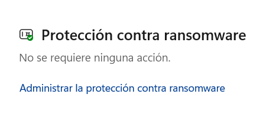

***

## 3. Prova pràctica de ransomware (PSRansom)

1. Creem diversos fitxers .TXT dins la carpeta *Documents*.  
2. Desactivem la protecció contra ransomware.  
3. Descarreguem l’script PSRansom i obrim una finestra de PowerShell com a administrador.  
4. Executem l’ordre per permetre scripts:

Set-ExecutionPolicy unrestricted

5. Ens situem a la carpeta de l’script i el executem. 

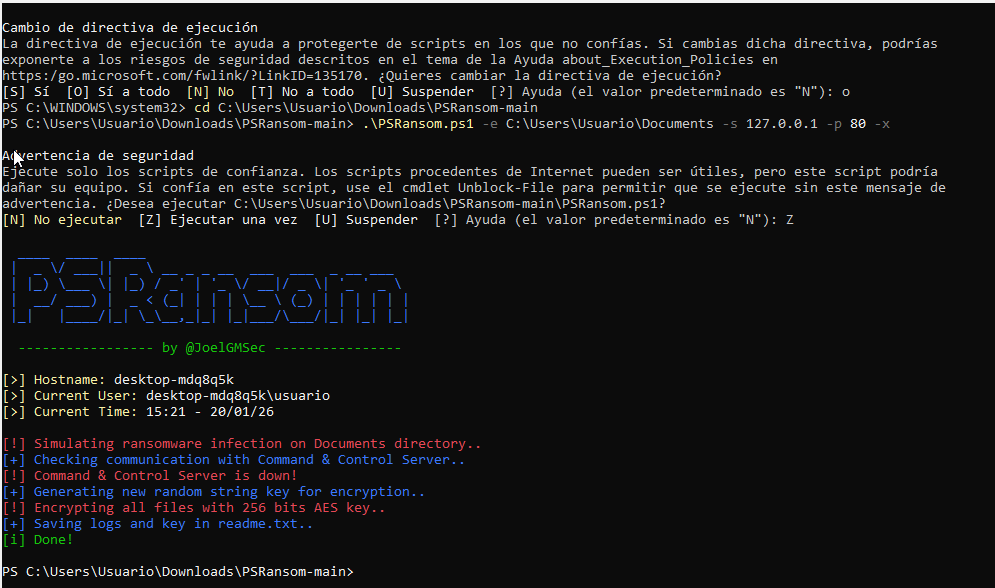

6. Comprovem que els fitxers de *Documents* han estat xifrats i que apareix el fitxer READ_ME.txt amb la clau.  

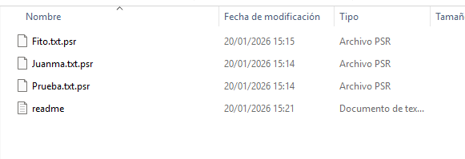

Ara executem l’script amb l’opció de desxifrat i comprovem que els fitxers tornen al seu estat original.  

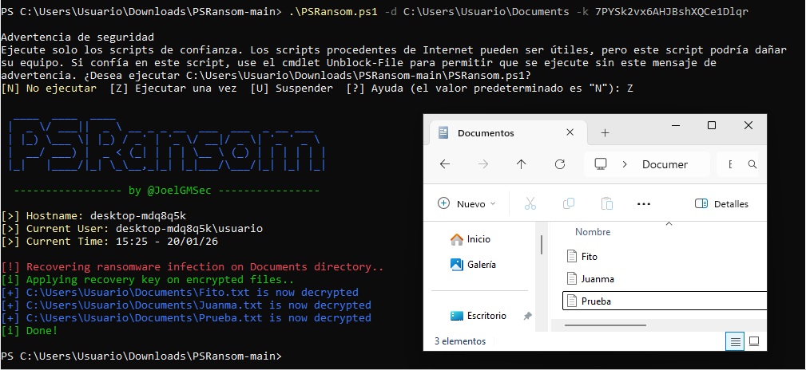

### Amb protecció contra ransomware activada

1. Activem de nou la protecció contra ransomware.  
2. Tornem a executar PSRansom i comprovem que:  
   - Els fitxers NO es xifren.  
   - Windows mostra una alerta de seguretat.  

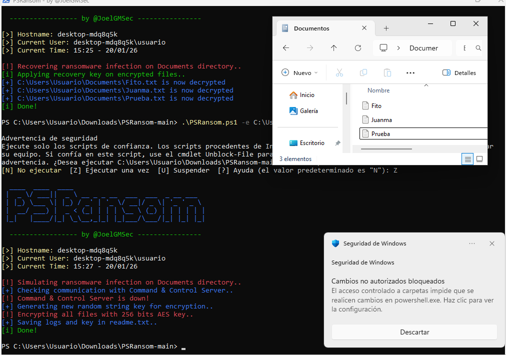

***

## 4. Ransomware WannaCry

- Llegim informació sobre WannaCry i comprovem que es propaga molt ràpid perquè aprofita una vulnerabilitat de Windows.  
- La vulnerabilitat utilitzada és CVE-2017-0144 (EternalBlue).  
- No és recomanable pagar el rescat, ja que no garanteix recuperar les dades.  

### Prevenció d’atacs de ransomware

- Actualitzar el sistema  
- Tenir còpies de seguretat  
- Utilitzar antimalware  

### Si ja hem patit un atac

- Aïllar l’equip  
- Eliminar el malware  
- Restaurar còpies de seguretat  

***

## 5. Prova pràctica amb WannaCry

1. Fem una instantània de la màquina virtual amb el nom *“Abans del virus”*.  
2. Creem o copiem a *Documents* els següents fitxers:
   - Fitxers TXT  
   - Imatges  
   - Documents Word  
   - PDFs  
   - Un ZIP normal  
   - Un ZIP amb contrasenya  
3. Descarreguem WannaCry des de *theZoo* i descomprimim el ZIP amb contrasenya (infected).  
4. Executem el fitxer .exe i observem si l’antimalware el detecta.  

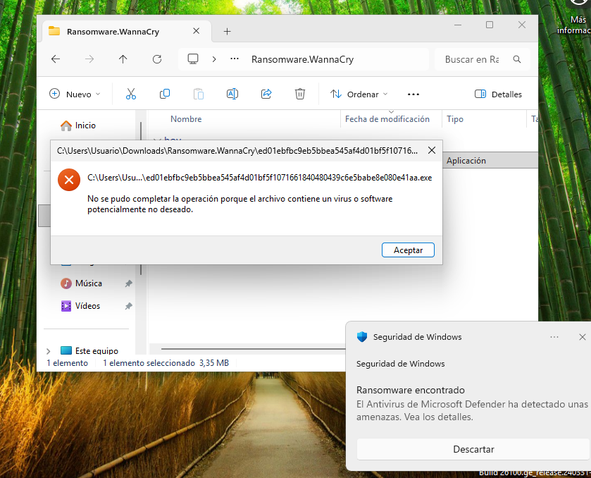

## 6. Prova amb VirusTotal

1. Descomprimim el fitxer ZIP que conté el malware **sense contrasenya**.  

2. Anem a [https://www.virustotal.com](https://www.virustotal.com).

3. Premem Triar fitxer i seleccionem el ZIP creat sense contrasenya.

4. Esperem que el fitxer s’analitzi.

5. Mirem els resultats en la captura.

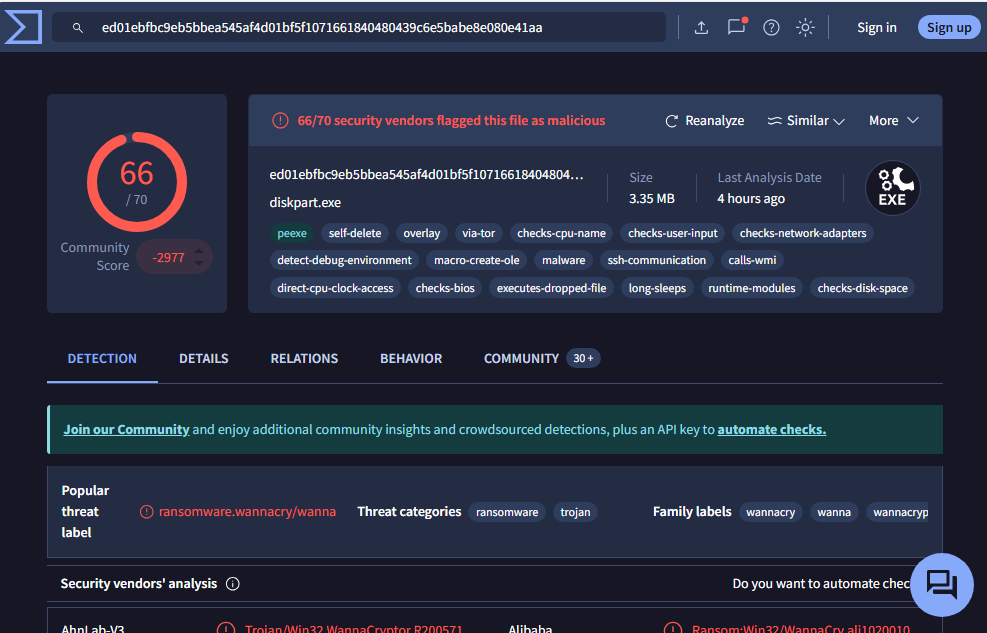

### Execució sense protecció

1. Desconnectem la xarxa.  
2. Desactivem l’antimalware.  
3. Tornem a executar WannaCry.  
4. Comprovem que apareix el missatge de rescat i que alguns fitxers han estat xifrats.  

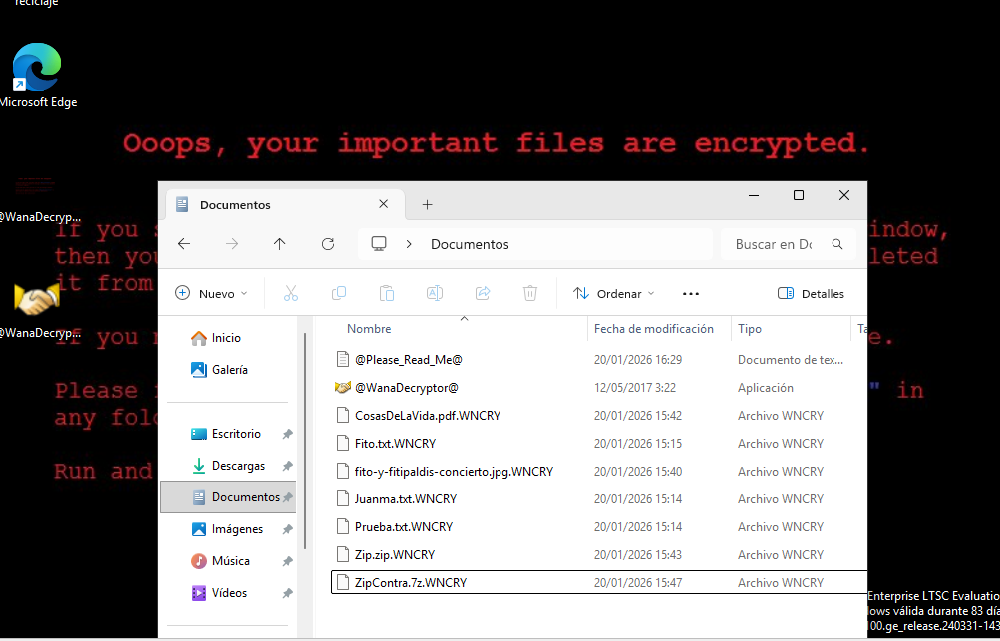

Finalment, apaguem la màquina virtual i restaurem la instantània “Abans del virus.”  

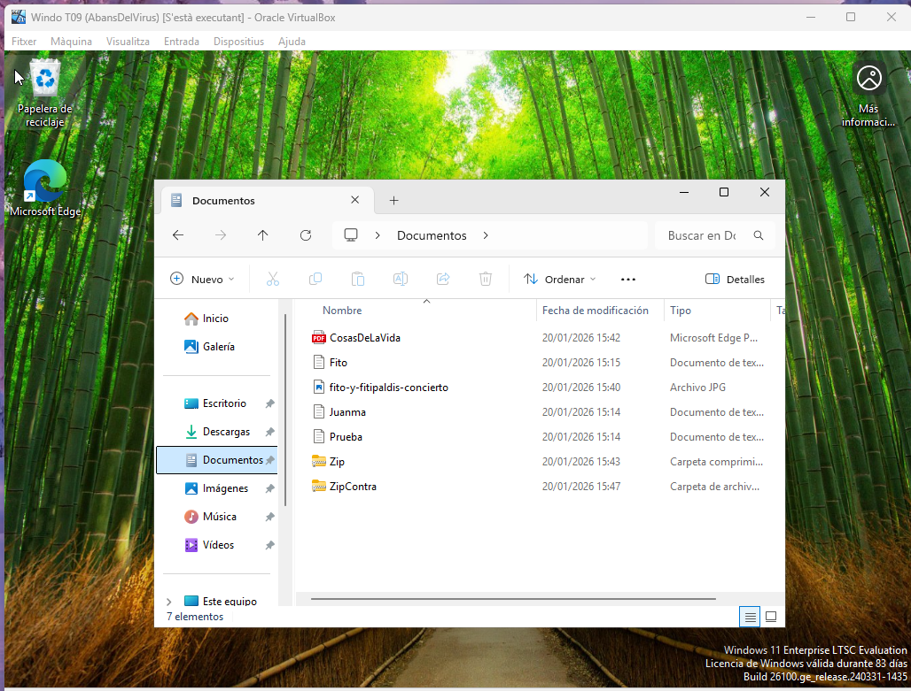

***

