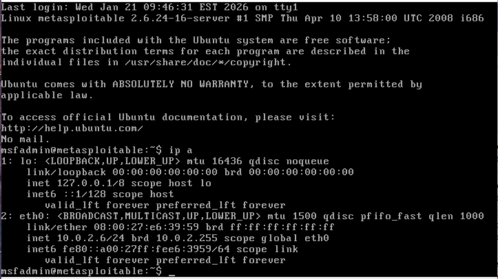
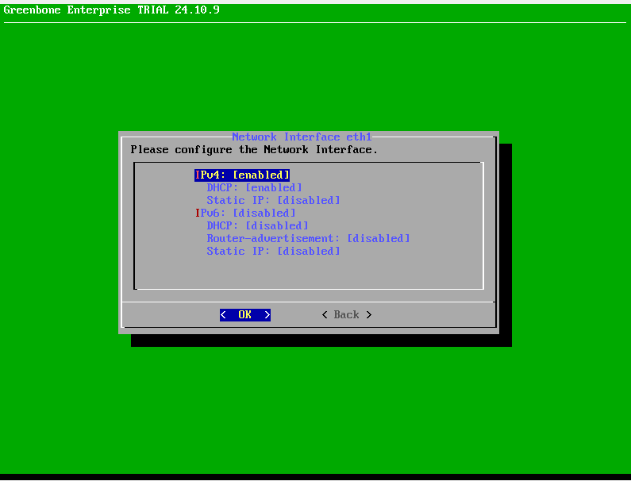
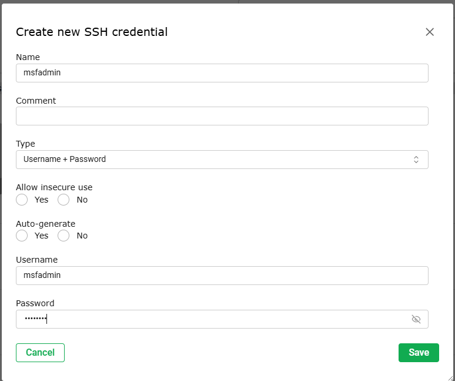
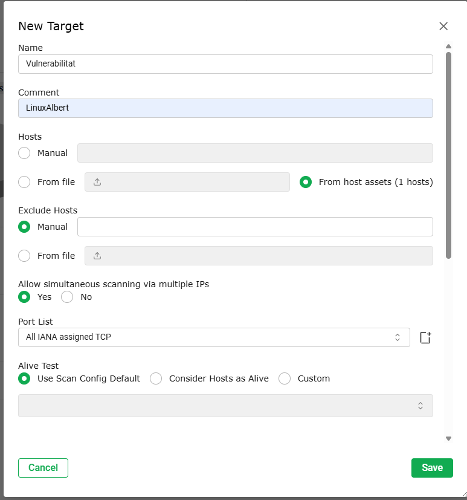
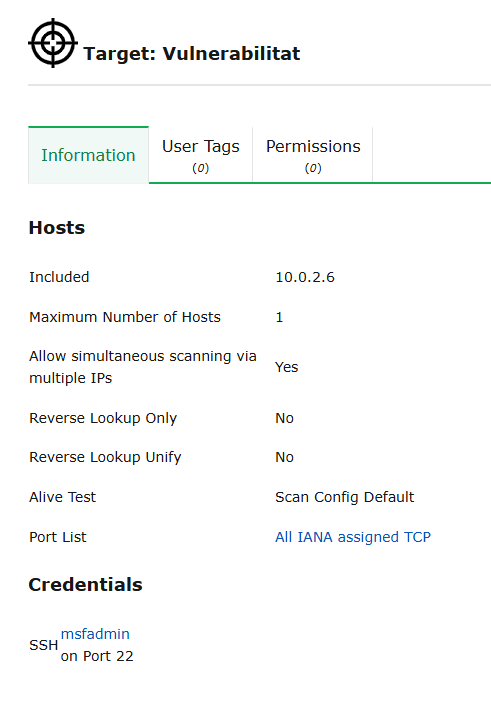
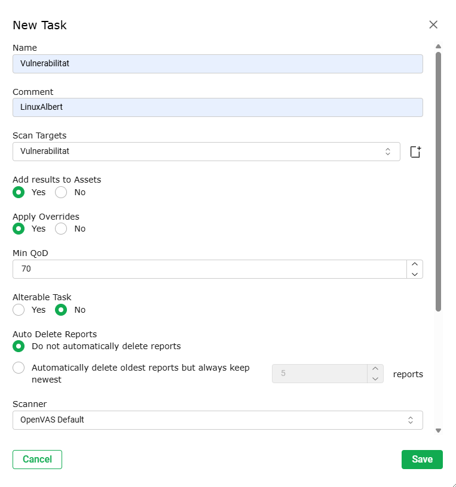
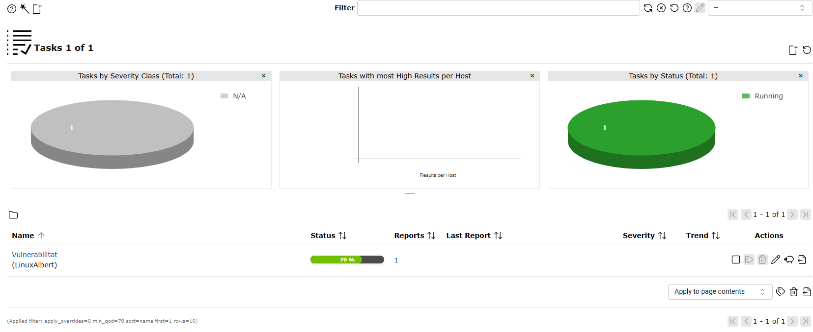
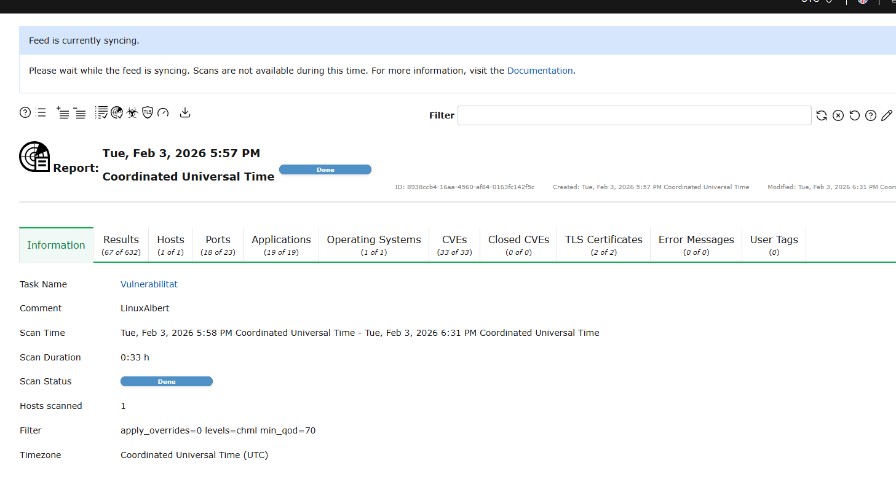
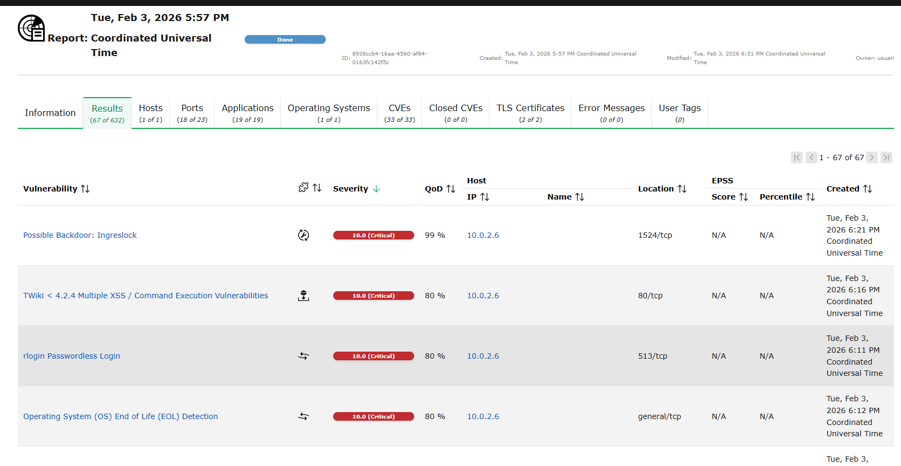

# Guia: Anàlisi de Vulnerabilitats amb OpenVAS

L'objectiu d'aquesta pràctica és utilitzar una eina professional OpenVAS per trobar els punts febles d'un ordinador Metasploitable i aprendre a protegir-lo.

## 1. Preparació de la víctima

Abans de res, hem de saber on és la màquina que volem analitzar.

1. Engega la màquina Metasploitable 2.
2. Entra amb:
    - Usuari: `msfadmin`
    - Contrasenya: `msfadmin`
3. Escriu la comanda:

```bash
ip a
```
4. Apuntem la IP la necessitarem després.



## 2. Configuració de l’escàner

### 2.1. Accés inicial i benvinguda

- Login de consola: quan la màquina acabi de carregar, et demanarà credencials. Escriu l’usuari `admin` i la contrasenya `admin`.
- Inici de l’assistent: s’obrirà automàticament un menú blau de configuració que t’ajudarà a posar-ho tot a punt.

### 2.2. Llicència i usuari web

- Llicència: apareixerà un apartat per introduir una clau. Com que estem en una pràctica, selecciona l’opció Skip per ometre aquest pas.
- Creació de l’usuari web: l’assistent et demanarà crear l’usuari que faràs servir per entrar des del navegador del teu ordinador real. Per simplificar, posa:
    - Usuari: `admin`
    - Contrasenya: `admin`


### 2.3. Configuració de la xarxa

Aquesta és la part on has de ser més precís.

- Selecciona la interfície de xarxa i configura-la seguint la imatge indicada al material de la pràctica.
- Quan tinguis aquests valors, baixa amb les fletxes fins a l’opció Save o `< OK >` i prem Enter.



## 3. Crear les claus d’accés

1. Ens fixem en la IP de l’OpenVAS i la posem al navegador per entrar.
2. Perquè l’anàlisi sigui profunda, OpenVAS ha de poder entrar a la màquina vulnerable.
3. Ves a Configuration > Credentials.
4. Crea una nova credencial anomenada `msfadmin`.
5. Tria el tipus Username + Password.
6. Posa l’usuari `msfadmin` i la contrasenya `msfadmin`.



## 4. Definir l’objectiu

Ara li direm a l’OpenVAS a qui ha d’atacar.

1. Ves a Configuration > Targets i crea’n un de nou.
2. Nom: posa-li un nom descriptiu.



3. Hosts: escriu la IP que hem anotat abans.
4. Credentials: selecciona la credencial d'SSH que hem creat al pas anterior. Això permetrà a l’escàner revisar l’interior del sistema.



## 5. Llançar l’anàlisi

Ja ho tenim tot a punt per començar la cerca de fallades.

1. Ves a Scans > Tasks.
2. Crea una nova tasca i selecciona el Target que acabes de crear.
3. Prem el botó de Play per començar.



4. Paciència: l’escaneig triga una estona; pots veure el progrés a la barra de percentatge.



## 6. Revisió de resultats

1. Quan l’estat digui Done, és hora de veure què s’ha trobat.



2. Fes clic a la data de l’informe per obrir-lo.
3. Ves a la pestanya Results: aquí veuràs una llista de vulnerabilitats ordenades per gravetat.


