# Instal·lació i configuració d’Apache amb VirtualHosts, HTTPS i HTTP/2

## PAS 1 – Instal·lar Apache

Actualitzar els repositoris:

```
sudo apt update
```

Instal·lar Apache:

```
sudo apt install apache2
```

Comprovar que el servei funciona

Executar la comanda:

```
apachectl status
```

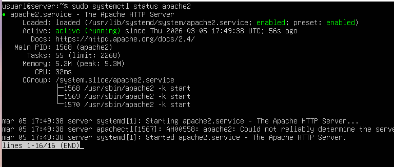


***

## PAS 2 – Verificar l’usuari del servidor web

Apache utilitza l’usuari www-data per gestionar els fitxers web.
Comprovar que existeix amb:

```
cat /etc/passwd | grep www-data
```

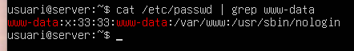

***

## PAS 3 – Comprovar permisos de la carpeta web

La carpeta on es guarden les webs és:
`/var/www`

Comprovar els permisos amb:

```
ls -l /var
```

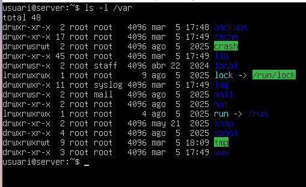

***

# 3. Desplegament de VirtualHosts (multidomini)


## PAS 1 – Crear l’estructura de carpetes

Crear les carpetes de cada web:

```
sudo mkdir -p /var/www/projectenexus
sudo mkdir -p /var/www/academia
```

Crear una pàgina de prova per cada web.

Per la web de Nexus:

```
sudo nano /var/www/projectenexus/index.html
```

Contingut:

```
<h1>Web Projecte Nexus</h1>
```

Per la web de l’acadèmia:

```
sudo nano /var/www/academia/index.html
```

Contingut:

```
<h1>Web Acadèmia Nexus</h1>
```

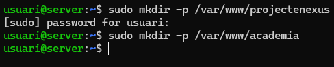

***

## PAS 2 – Crear els VirtualHosts

Anar a la carpeta de configuració:

```
cd /etc/apache2/sites-available
```

Copiar la configuració per defecte:

```
sudo cp 000-default.conf projectenexus.conf
sudo cp 000-default.conf academia.conf
```

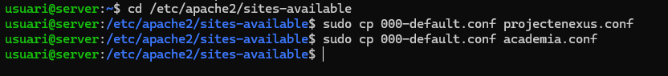

Editar el primer domini:

```
sudo nano projectenexus.conf
```

Modificar les línies principals:

```
ServerName projectenexus.test
DocumentRoot /var/www/projectenexus
```

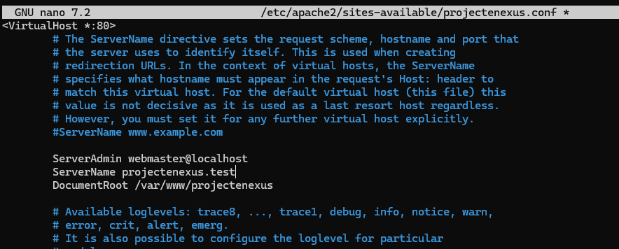

Editar el segon domini:

```
ServerName academia.test
sudo nano academia.conf
```

Modificar:

```
DocumentRoot /var/www/academia
```

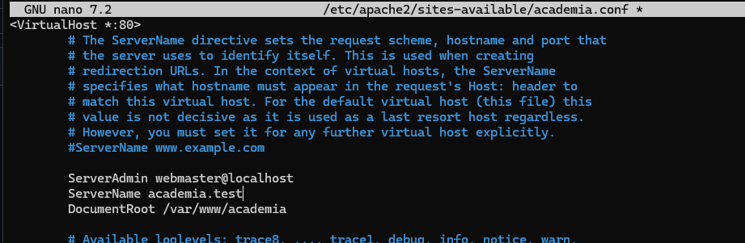

***

## PAS 3 – Activar els llocs web

Activar els VirtualHosts:

```
sudo a2ensite projectenexus.conf
sudo a2ensite academia.conf
```

Reiniciar Apache:

```
sudo systemctl reload apache2
```

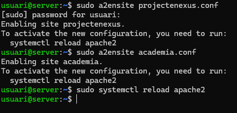

***

## PAS 4 – Simular DNS amb hosts

Editar el fitxer hosts:

```
sudo nano /etc/hosts
```

Afegir:

```
127.0.0.1 projectenexus.test
127.0.0.1 academia.test
```

Guardar i sortir.
Ara els dominis funcionaran dins la màquina.

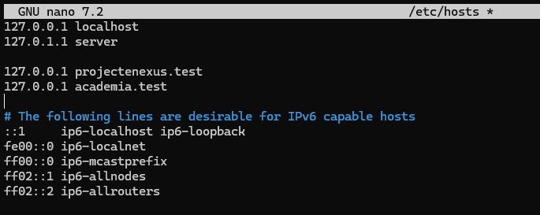

***

# 4. Personalització de la pàgina d’error


## PAS 1 – Crear la pàgina d’error

```
sudo nano /var/www/projectenexus/404.html
```

Contingut exemple:

```
<h1>Error 404</h1>
<p>La pàgina que busques no existeix.</p>
<p>Projecte Nexus</p>
```

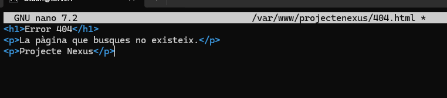

***

## PAS 2 – Configurar Apache

Editar el VirtualHost:

```
sudo nano /etc/apache2/sites-available/projectenexus.conf
```

Afegir:

```
ErrorDocument 404 /404.html
```

Reiniciar Apache:

```
sudo systemctl reload apache2
```

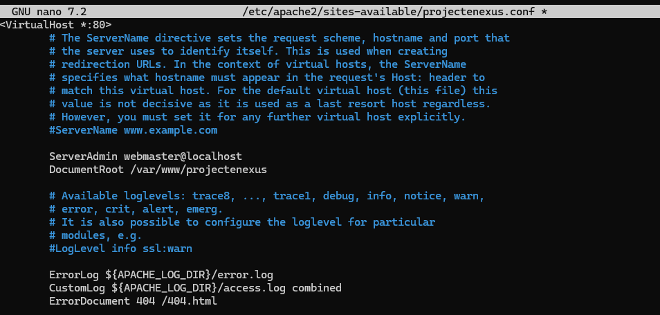

***

# 5. Seguretat amb HTTPS

***

## PAS 1 – Activar SSL

Activar el mòdul:

```
sudo a2enmod ssl
```

Reiniciar Apache:

```
sudo systemctl restart apache2
```

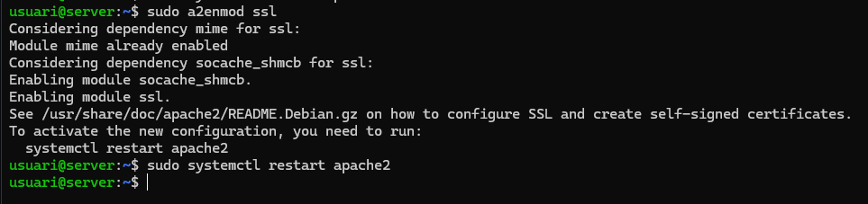

***

## PAS 2 – Crear certificat autosignat

Crear el certificat:

```
sudo openssl req -x509 -nodes -days 365 -newkey rsa:2048 -keyout nexus.key -out nexus.crt
```

Aquest certificat tindrà:
Validesa: 365 dies
Clau: RSA 2048 bits

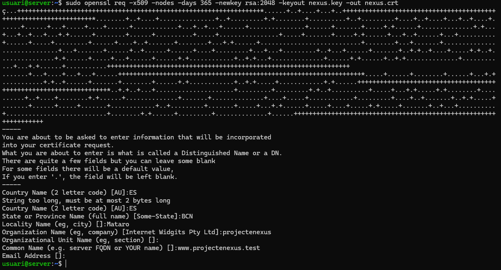

***

## PAS 3 – Configurar VirtualHost segur

Editar configuració:

```
sudo nano /etc/apache2/sites-available/projectenexus.conf
```

Afegir configuració del port 443 amb el certificat pero sota de la anterior.

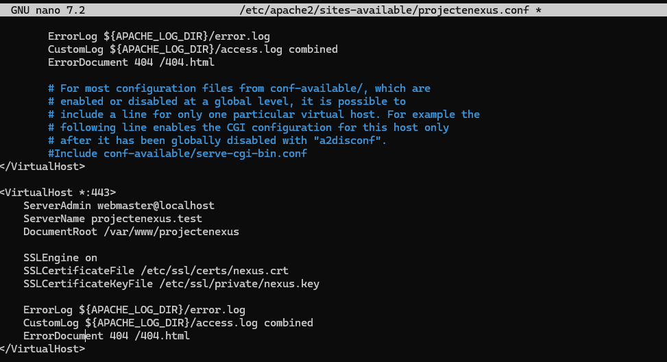

***

## PAS 4 – Redirecció automàtica a HTTPS

Configurar perquè qualsevol accés HTTP redirigeixi a HTTPS.
Això assegura que la web sempre utilitzi connexió segura.

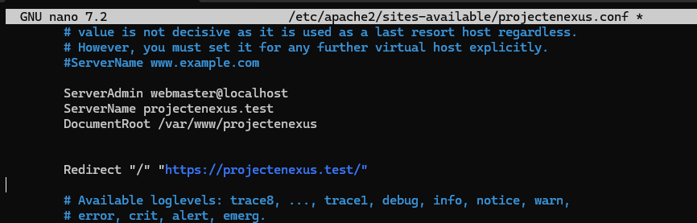

***

# 6. Optimització amb HTTP/2

HTTP/2 millora la velocitat de càrrega de les pàgines web.

***

## PAS 1 – Activar el mòdul

```
sudo a2enmod http2
```

Reiniciar Apache:

```
sudo systemctl restart apache2
```

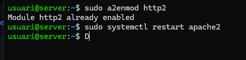

***

## PAS 2 – Configurar el protocol

Editar el VirtualHost HTTPS:

```
sudo nano /etc/apache2/sites-available/projectenexus.conf
```

Afegir:

```
Protocols h2 http/1.1
```

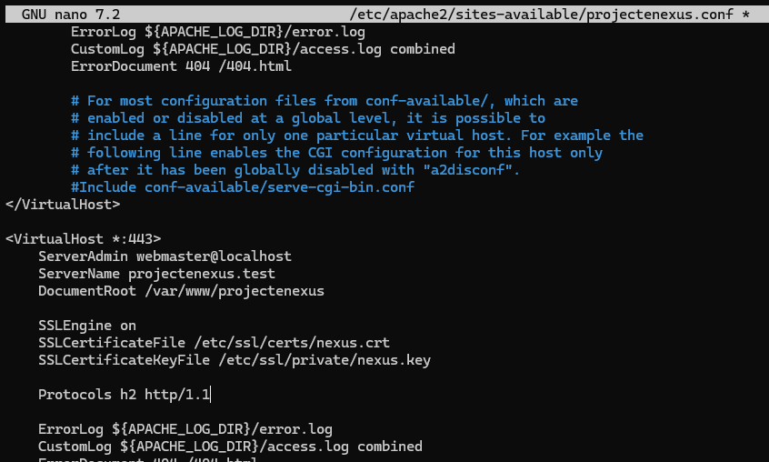

***

## PAS 3 – Comprovar que funciona

Utilitzar la comanda:

```
curl -I -k https://projectenexus.test
```

Si apareix HTTP/2, el protocol està actiu.

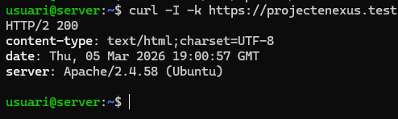


## PAS 1 – Obrir el fitxer `hosts`

1. Obre Bloc de notes com a administrador.
2. Vés a Fitxer > Obre i navega a la ruta del fitxer hosts de Windows:

`C:\Windows\System32\drivers\etc\hosts`

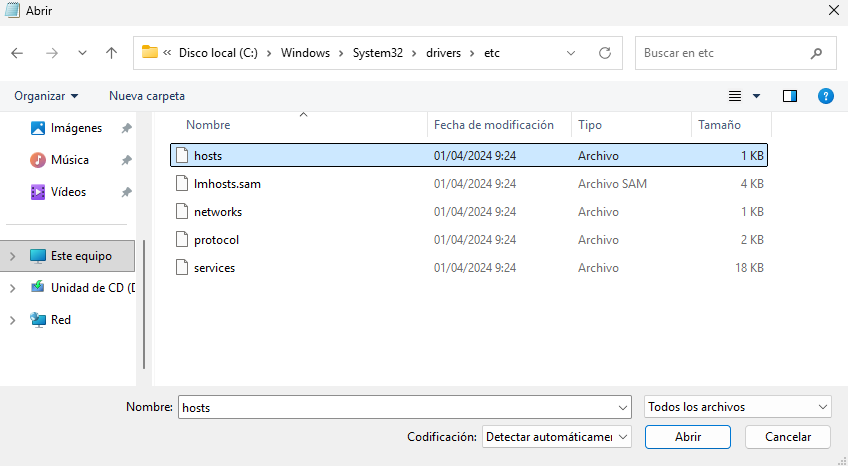

## PAS 2 – Afegir els dominis

Al final del fitxer, afegeix les línies següents:

```text
127.0.0.1 projectenexus.test
127.0.0.1 acadèmia.test
````

Desa els canvis i tanca el bloc de notes.

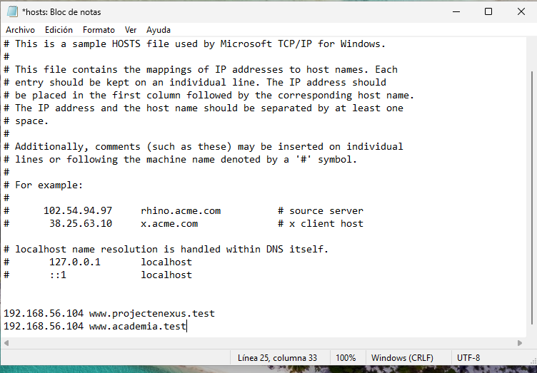
## PAS 3 – Comprovar funcionament al navegador

1. Obre un navegador.
2. Escriu a la barra d'adreces:
    - http://projectenexus.test
    - http://academia.test

Si tot és correcte, s'obrirà el web corresponent a cada domini segons la configuració de VirtualHost a Apache.


