# Memòria tècnica T03: Missió Nginx: Migració d'Alt Rendiment i Arquitectura Lleugera

## 1. Preparació de l'Entorn i Instal·lació

S'alliberen els ports ocupats per Apache i s'instal·la el programari de Nginx.

Aturar el servei actual:
`sudo systemctl stop apache2`

Deshabilitar l'arrencada automàtica:
`sudo systemctl disable apache2`

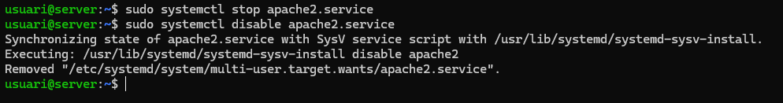

Actualitzar repositoris:
`sudo apt update`

Instal·lar Nginx:
`sudo apt install nginx -y`

Verificació del servei:
`sudo systemctl status nginx`

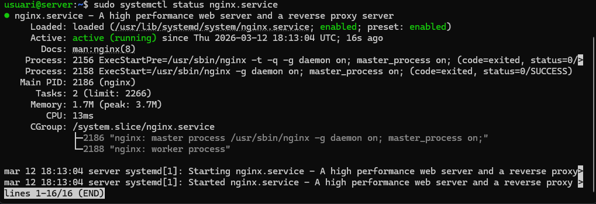

## 2. Configuració de Server Blocks (Multidomini)

Es preparen els fitxers de configuració per gestionar de forma independent els dominis del projecte i s'ajusten els permisos.

Ajust de permisos (Projecte Nexus):
`sudo chown -R www-data:www-data /var/www/projectenexus`

Ajust de permisos (Acadèmia):
`sudo chown -R www-data:www-data /var/www/academia`

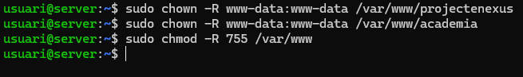

Crear configuració per a Projecte Nexus:
`sudo nano /etc/nginx/sites-available/projectenexus`
Contingut del fitxer:

```nginx
server {
    listen 80;
    server_name projectenexus.test;
    root /var/www/projectenexus;
    index index.html;
    location / {
        try_files $uri $uri/ =404;
    }
}
```

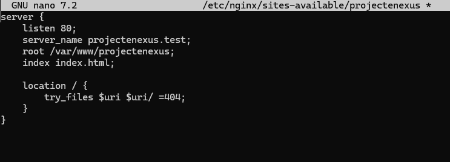

Crear configuració per a Acadèmia:
`sudo nano /etc/nginx/sites-available/academia`
Contingut del fitxer:

```nginx
server {
    listen 80;
    server_name academia.test;
    root /var/www/academia;
    index index.html;
    location / {
        try_files $uri $uri/ =404;
    }
}
```

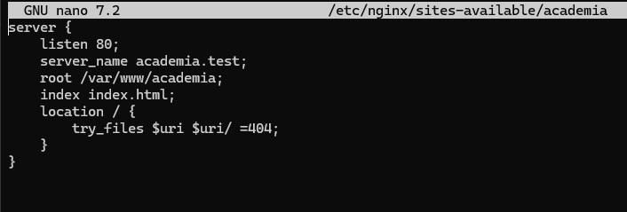

Activar els llocs (Enllaços simbòlics):
`sudo ln -sf /etc/nginx/sites-available/projectenexus /etc/nginx/sites-enabled/`
`sudo ln -sf /etc/nginx/sites-available/academia /etc/nginx/sites-enabled/`

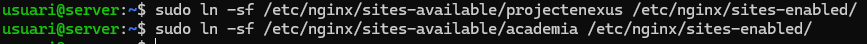

Configurar resolució local:
`sudo nano /etc/hosts`
Afegir las línias:
`127.0.0.1 projectenexus.test academia.test`
`127.0.0.1 academia.test`

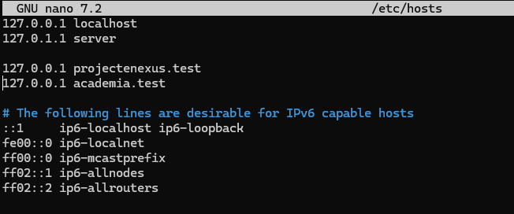

## 3. Personalització d'Errors

Es defineix la gestió del codi d'error 404 per redirigir l'usuari a una pàgina específica dins del seu domini.

Edició del fitxer de configuració: Dins del bloc server de cada fitxer a sites-available, s'ha d'afegir:

```nginx
error_page 404 /404.html;
location = /404.html {
    internal;
}
```

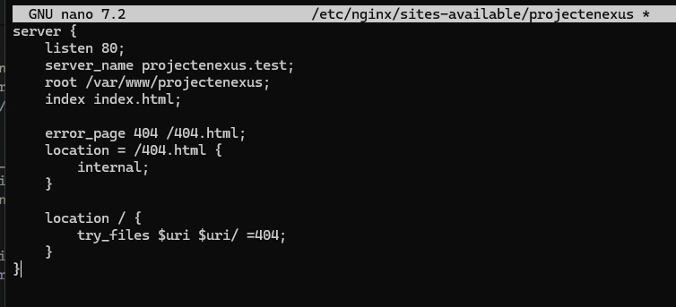
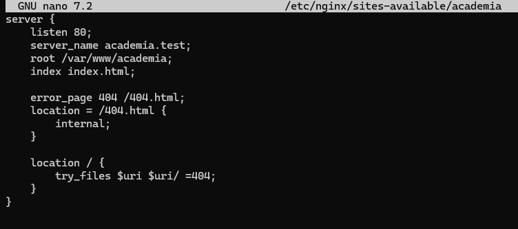

## 4. Seguretat i Certificats (HTTPS)

Generació de Certificats amb OpenSSL
Abans de configurar Nginx, hem de crear manualment els certificats autosignats per a cada domini.

Generar certificat per a Projecte Nexus:

```
sudo openssl req -x509 -nodes -days 365 -newkey rsa:2048 -keyout /etc/ssl/private/nexus.key -out /etc/ssl/certs/nexus.crt -subj "/C=ES/ST=Catalunya/L=Mataro/O=Nexus/CN=projectenexus.test"
```

Generar certificat per a Acadèmia:
```
sudo openssl req -x509 -nodes -days 365 -newkey rsa:2048 -keyout /etc/ssl/private/academia.key -out /etc/ssl/certs/academia.crt -subj "/C=ES/ST=Catalunya/L=Mataro/O=Academia/CN=academia.test"
```

Assignar permisos de seguretat: Protegim les claus privades perquè només el sistema les pugui llegir.
```
sudo chmod 600 /etc/ssl/private/nexus.key
sudo chmod 600 /etc/ssl/private/academia.key
```
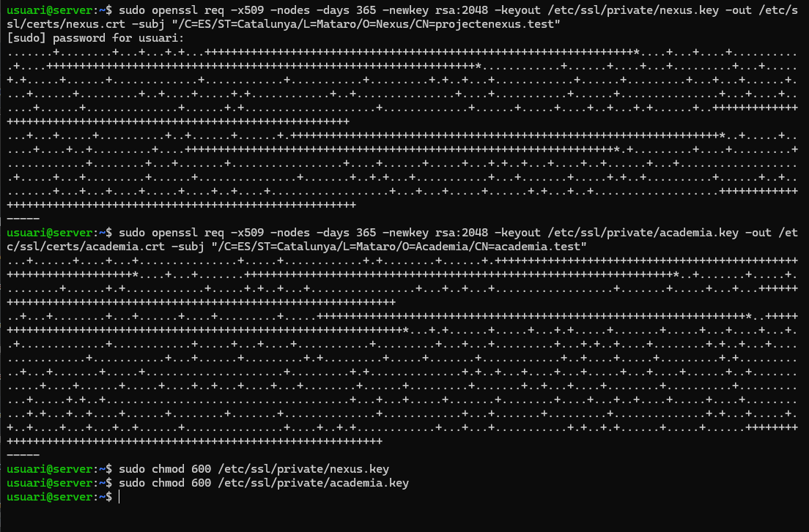


S'implementa el xifratge de dades i la redirecció automàtica per garantir connexions segures.

Configurar el bloc SSL (Exemple per Nexus):
`sudo nano /etc/nginx/sites-available/projectenexus`
Modificar el contingut per incloure:

```nginx
server {
    listen 80;
    server_name projectenexus.test;

    return 301 https://$host$request_uri;
}


server {
    listen 443 ssl;
    server_name projectenexus.test;

    root /var/www/projectenexus;
    index index.html;

    ssl_certificate /etc/ssl/certs/nexus.crt;
    ssl_certificate_key /etc/ssl/private/nexus.key;

    error_page 404 /404.html;
    location = /404.html {
        internal;
    }

    location / {
        try_files $uri $uri/ =404;
    }
}
```

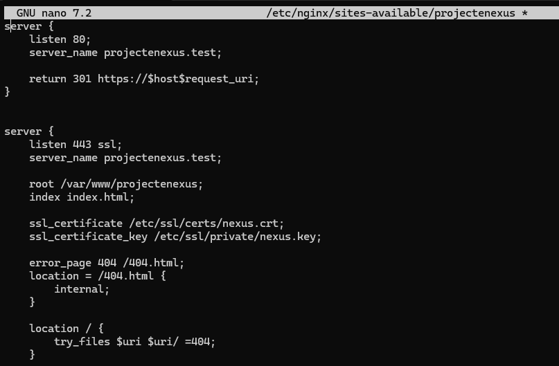
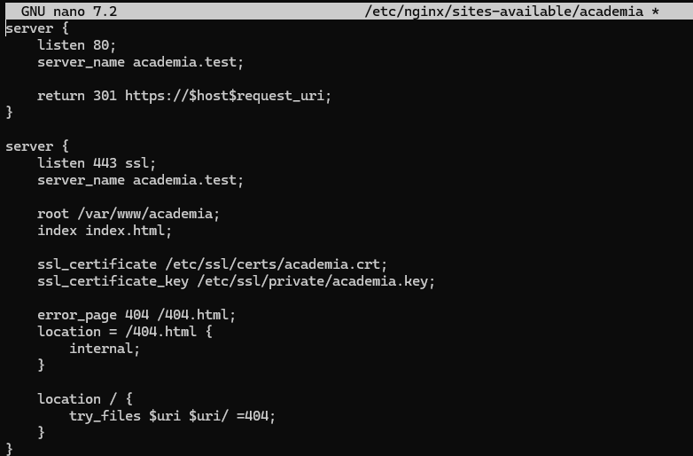

Verificació

Test de sintaxi: `sudo nginx -t`

Aplicar canvis: `sudo systemctl restart nginx`

Prova de redirecció: `curl -I http://projectenexus.test`

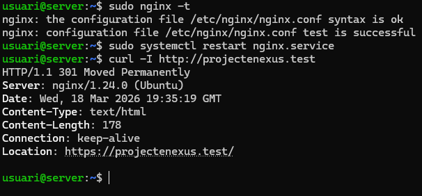

## 5. Optimització amb HTTP/2

Es millora l'eficiència de la transmissió de dades habilitant la multiplexació.

Habilitar el protocol: Modificar la línia listen del port 443:
`listen 443 ssl http2;`

Reiniciar el servei per aplicar canvis:
`sudo systemctl restart nginx`


Verificació final en web:


