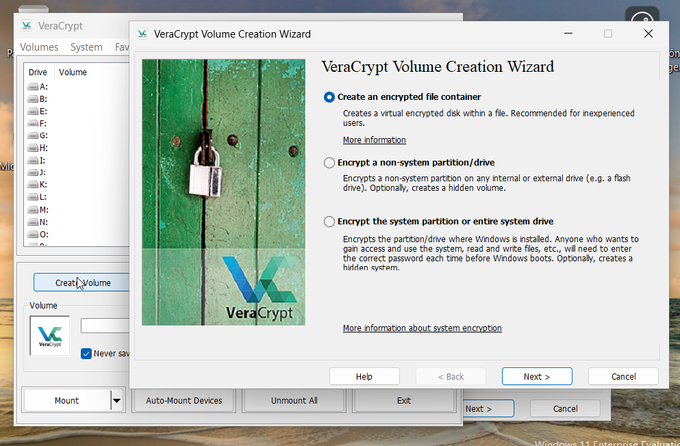
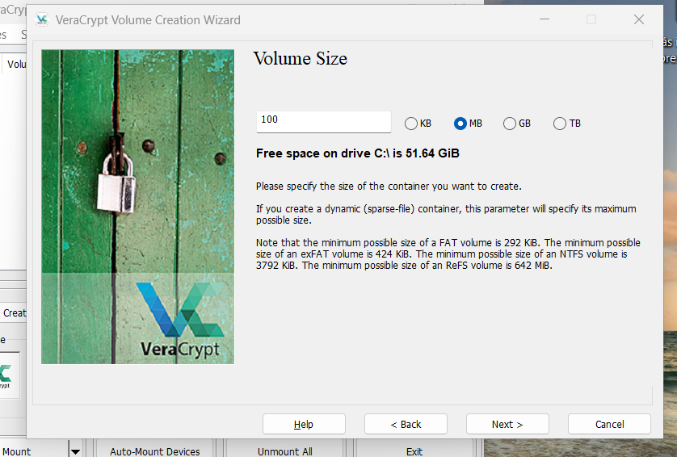
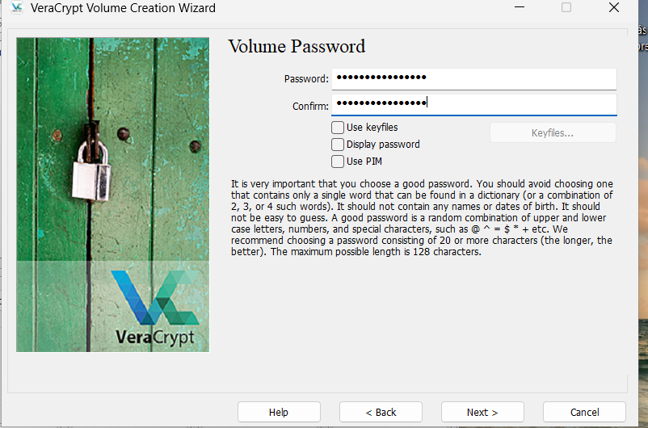
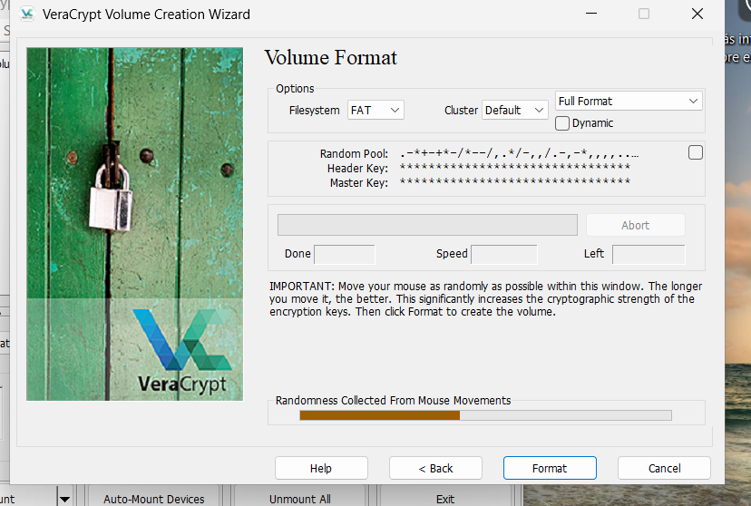
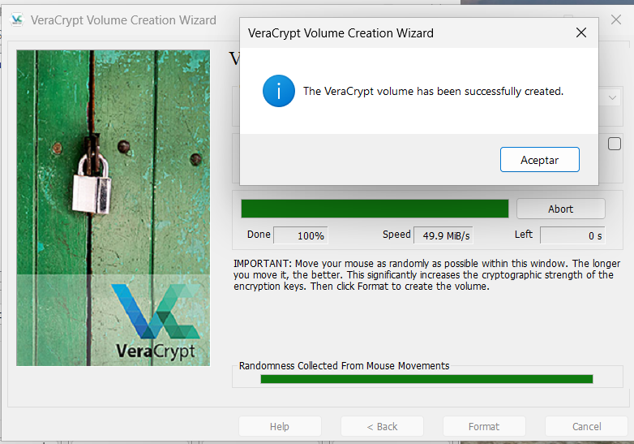
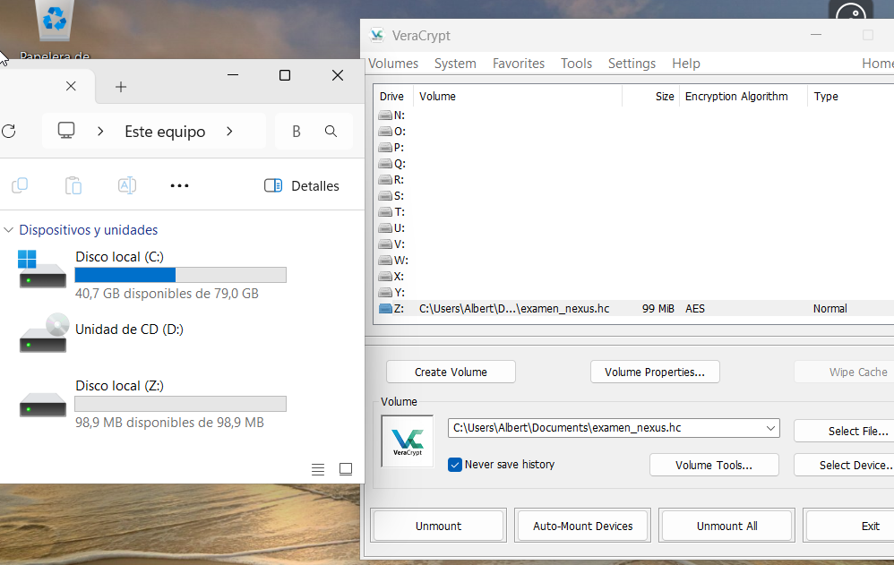
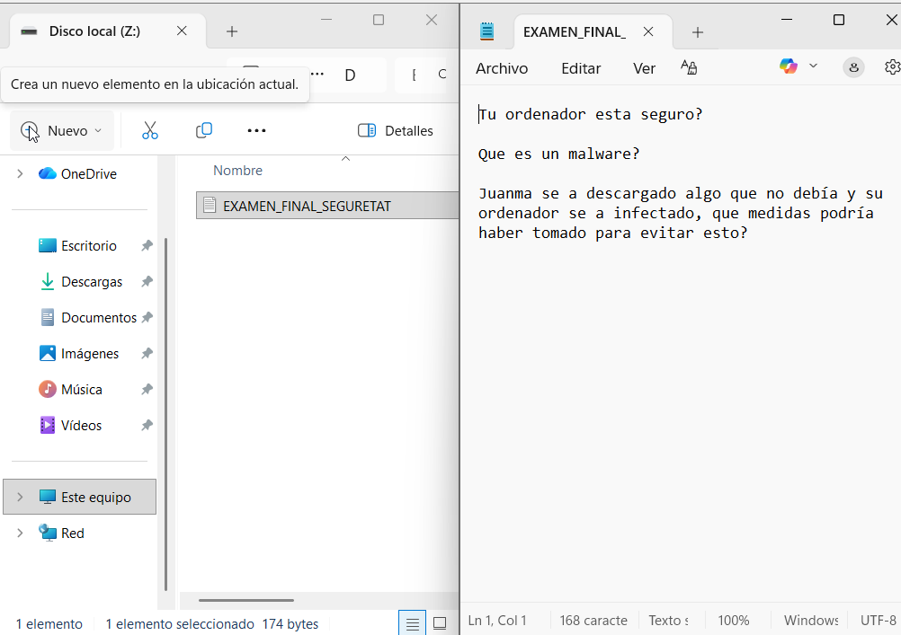
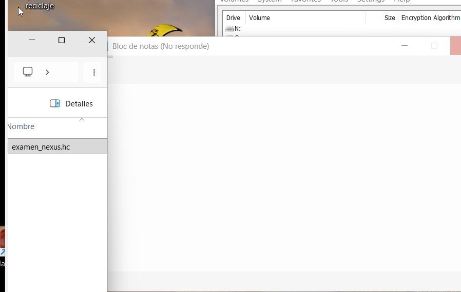
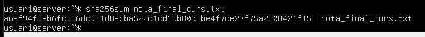
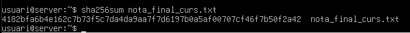

# T05 – Top Secret  

## 1. Justificació teòrica

Per protegir la informació sensible de Projecte Nexus (exàmens, dades personals i certificats), és important entendre dos conceptes bàsics:  
El xifratge serveix per amagar la informació; quan xifrem un fitxer o una unitat, el contingut es transforma en dades il·legibles i només es pot recuperar amb la contrasenya correcta, protegint així la confidencialitat.  
Una funció hash no amaga la informació, sinó que crea una mena d’“empremta digital” única del fitxer; si el contingut canvia encara que sigui una sola lletra o número, el hash canvia completament i permet detectar manipulacions, garantint la integritat.  


## 2. Tasca 1 – Protecció de dades amb VeraCrypt

Programa utilitzat: VeraCrypt  
Objectiu: Crear una unitat virtual xifrada de 100 MB amb AES-256 i guardar-hi un examen.

### 2.1 Guia pas a pas detallada

#### PAS 1 – Crear el volum xifrat
- Obrir el programa VeraCrypt.  
- A la finestra principal, fer clic al botó Create Volume.  
- Seleccionar l’opció: Create an encrypted file container.



- Fer clic a Next.  
- Seleccionar: Standard VeraCrypt volume.  
- Fer clic a Next.  
- Fer clic a Select File….  
- Escollir la ubicació on volem guardar el volum (simulant el pendrive).  
- Escriure un nom, per exemple: `examen_nexus.hc`.  
- Fer clic a Next.  
- A la pantalla d’algorisme:  
  - Encryption Algorithm: seleccionar AES.  
  - Hash Algorithm: deixar el valor per defecte.  
- Fer clic a Next.  
- A la mida del volum:  
  - Escriure `100`.  
  - Seleccionar MB.

 

- Fer clic a Next.  

#### PAS 2 – Crear la contrasenya
- Introduir una contrasenya robusta amb:
  - Mínim 12 caràcters.  
  - Majúscules, minúscules, números i símbols.  
- Exemple: `Nexus$2026Segur!`  
- Repetir la contrasenya.



- Fer clic a Next.  
- A la pantalla de format:
  - Moure el ratolí dins la finestra durant uns segons.  
  - Fer clic a Format.  
  - Esperar que acabi i fer clic a OK i després Exit.  





#### PAS 3 – Muntar la unitat
- Tornar a la pantalla principal de VeraCrypt.  
- Seleccionar una lletra de la llista (per exemple: `Z:`).  
- Fer clic a Select File i buscar `examen_nexus.hc`.  
- Fer clic a Mount.  
- Introduir la contrasenya i fer clic a OK.  
- Apareixerà una nova unitat al sistema.  



#### PAS 4 – Guardar l’examen dins la unitat
- Obrir la nova unitat (`Z:`).  
- Crear un nou document de text.  
- Posar el nom: `EXAMEN_FINAL_SEGURETAT.txt`.  
- Obrir-lo, escriure preguntes de prova, guardar i tancar.



#### PAS 5 – Demostració de seguretat
- Tornar a VeraCrypt.  
- Seleccionar la unitat muntada i fer clic a Dismount. 
- Intentar obrir el fitxer `examen_nexus.hc` directament: el contingut serà il·legible o directament no es pot accedir.  
- No es pot accedir a l’examen sense muntar la unitat i introduir la contrasenya, demostrant que si es perd el pendrive ningú podrà llegir l’examen.  



## 3. Tasca 2 – Verificació d’integritat (Hash SHA-256)

### 3.1 Guia pas a pas (Linux)

#### PAS 1 – Crear el fitxer
```bash
nano nota_final_curs.txt
```

Contingut:

```text
L'alumne ha aprovat amb un 5
```

Guardar amb: `Ctrl + O`, `Enter` i sortir amb `Ctrl + X`.

#### PAS 2 – Calcular el hash original

```bash
sha256sum nota_final_curs.txt
```

- El terminal mostrarà una cadena de 64 caràcters (números i lletres): aquest és el hash original.



#### PAS 3 – Modificar el fitxer

```bash
nano nota_final_curs.txt
```

Canviar el 5 per un 9:

```text
L'alumne ha aprovat amb un 9
```

Guardar i sortir.

#### PAS 4 – Tornar a calcular el hash

```bash
sha256sum nota_final_curs.txt
```

- El resultat serà completament diferent del hash original.



### 3.2 Resultat

Només s’ha canviat un número (`5 → 9`), però el hash ha canviat totalment, demostrant que qualsevol modificació del fitxer és detectable.


## 4. Conclusions i recomanacions

Per protegir la informació de Projecte Nexus es recomana:

- Utilitzar xifratge en tots els dispositius portàtils (pendrives, portàtils, discs externs).
- Crear contrasenyes robustes i no reutilitzar-les entre serveis diferents.
- Utilitzar un gestor de contrasenyes segur per emmagatzemar-les (per exemple Bitwarden).
- Calcular hash dels documents importants abans de publicar-los o distribuir-los.
- Guardar els hash oficials per poder comprovar la integritat dels fitxers més endavant.
