# Memòria Tècnica: Projecte Nexus

## Fase 1: Preparació de l'entorn de laboratori

### 1.1 Configuració de Xarxa

S'han configurat dues interfícies de xarxa per màquina per garantir l'aïllament i l'accés a serveis externs:

- xarxa NAT: Sortida a Internet per a la instal·lació de paquets.
- Adaptador pont/xarxa interna: Comunicació entre el servidor i el client.

Servidor (Ubuntu Server):
- IP estàtica: 192.168.2.22
- Màscara: 255.255.255.0

Client (Windows 11):
- IP estàtica: 192.168.2.5
- Màscara: 255.255.255.0

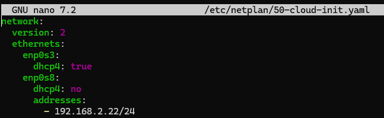

### 1.2 Identitat i Resolució de Noms

Servidor (Ubuntu):

- Configurar el nom del sistema:
`sudo hostnamectl set-hostname ca.nexus22.test`
- Actualitzar el fitxer /etc/hosts: Afegir la línia
`192.168.2.22 ca.nexus22.test`

**Client (Windows 11):**

- Obrir l'editor amb privilegis d'administrador.
- Editar fitxer de hosts:
`C:\Windows\System32\drivers\etc\hosts`
- Afegir resolució estàtica:
`192.168.2.22 ca.nexus22.test`

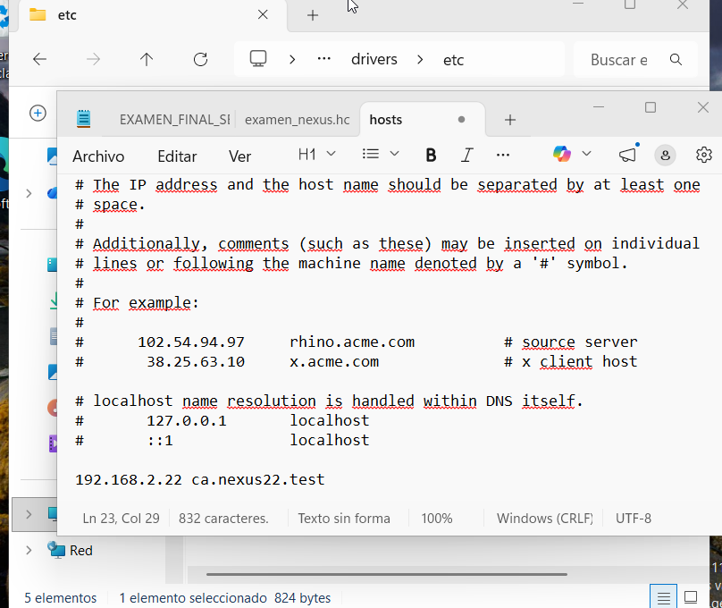

- Validar connexió:
`ping ca.nexus22.test`

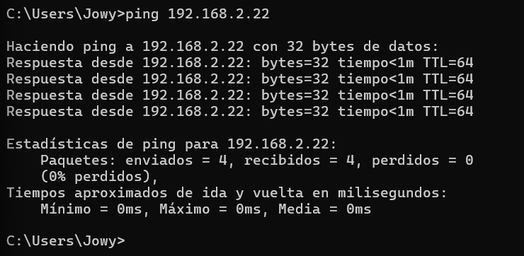

***

## Fase 2: Creació de l'Entitat de Certificació (CA)

### 2.1 Configuració de OpenSSL

S'ha editat `/etc/ssl/openssl.cnf` per definir l'estructura de la CA corporativa:

```plaintext
[ca]
default_ca = CA_default

[CA_default]
dir               = /etc/ssl/CA
certs             = $dir/certs
crl_dir           = $dir/crl
database          = $dir/index.txt
```

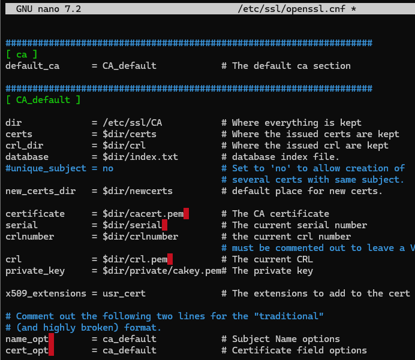

### 2.2 Estructura de fitxers

S'han creat els directoris i fitxers de control necessaris amb el serial començant per "C" per evitar errors d'OpenSSL.

```bash
sudo mkdir -p /etc/ssl/CA/{certs,crl,newcerts,private}
sudo touch /etc/ssl/CA/index.txt
sudo sh -c 'echo "C001" > /etc/ssl/CA/serial'
```

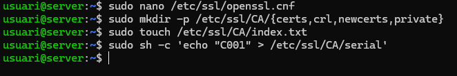

### 2.3 Generació del Certificat Arrel (Root CA)

Generació de la clau privada i el certificat d'autoritat de Nexus:

- Country Name: ES
- Organization Name: Nexus 22.
- Common Name: ca.nexus22.test 

```bash
sudo openssl req -new -x509 -keyout /etc/ssl/CA/private/cakey.pem -out /etc/ssl/CA/cacert.pem
```

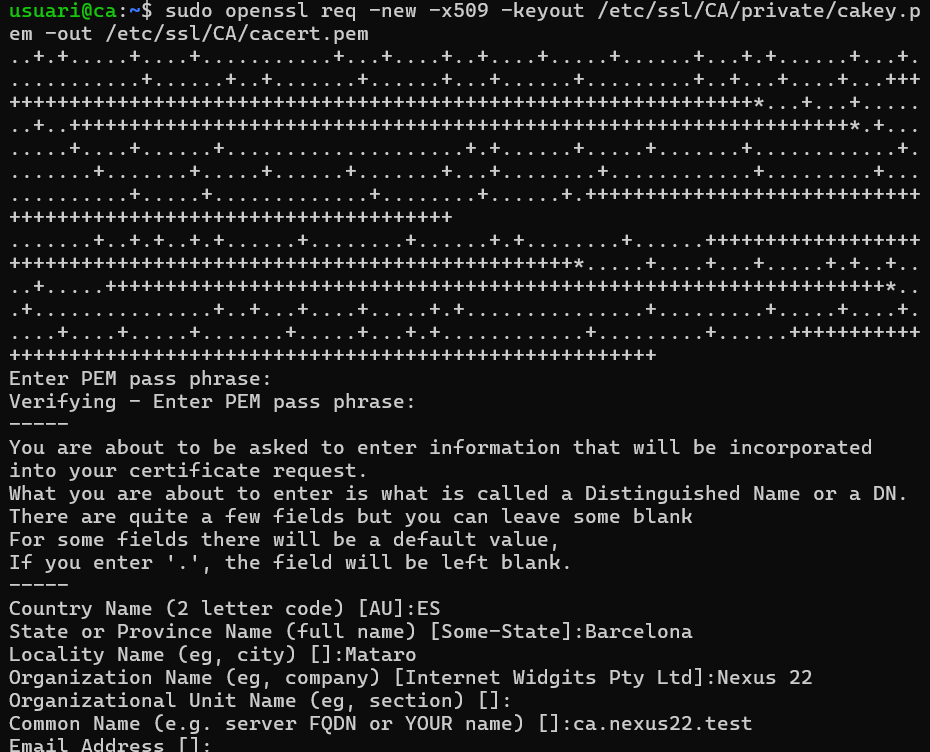

***

## Fase 3: Generació de la clau i certificat d'usuari

### 3.1 Sol·licitud de certificat (CSR)

Es genera la clau privada de l'empleat i la petició de signatura:

- Country Name: ES 
- Organization Name: Nexus 22.
- Common Name: Jowy 
- Challenge password: <Buit>

```bash
openssl req -new -keyout userkey.pem -out userreq.csr
```

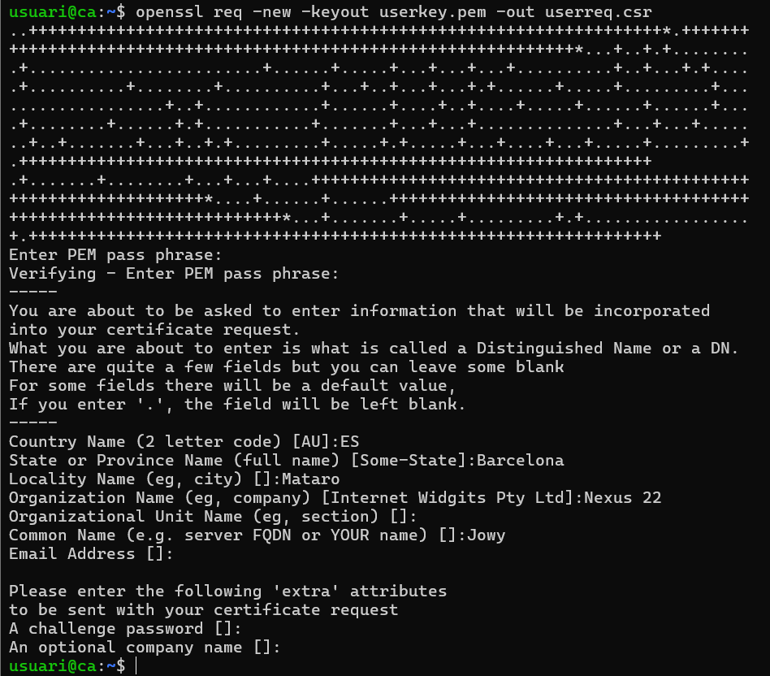

### 3.2 Signatura del certificat

La CA signa la sol·licitud del client:

```bash
sudo openssl ca -in userreq.csr -out usercert.pem
```

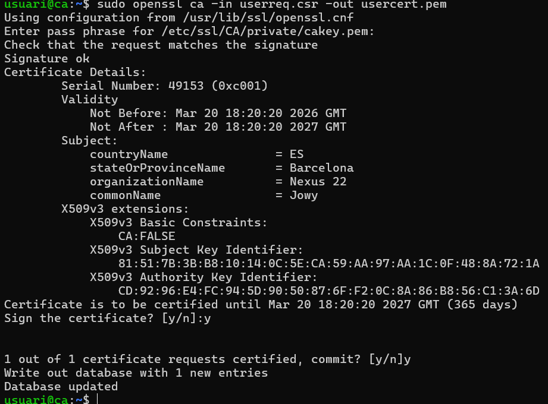

### 3.3 Exportació a format PKCS\#12

Conversió a format `.pfx` per a la seva correcta instal·lació en sistemes Windows:

```bash
openssl pkcs12 -export -out CertUser.pfx -inkey userkey.pem -in usercert.pem
```

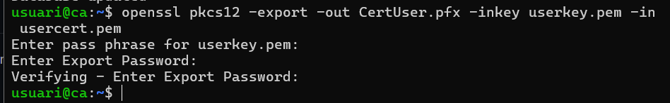

***

## Fase 4: Distribució de Certificats

### 4.1 Instal·lació del Servidor Web
S'utilitza Apache per allotjar el portal de descàrrega.

- Comanda: `sudo apt install apache2 -y`

### 4.2 Publicació dels fitxers
Els certificats han de ser accessibles pel servidor web al directori arrel /var/www/html/.

- Còpia del certificat de la CA: `sudo cp /etc/ssl/CA/cacert.pem /var/www/html/`

- Còpia del certificat de l'usuari: `sudo cp CertUser.pfx /var/www/html/`

- Ajust de permisos: Per garantir que el client pugui llegir els fitxers, s'apliquen permisos de lectura global: `sudo chmod 644 /var/www/html/cacert.pem /var/www/html/CertUser.pfx`

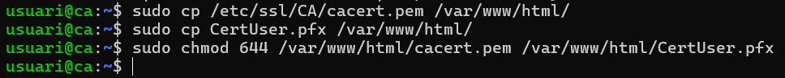

### 4.3 Accés i Descàrrega des del Client
L'usuari Jowy utilitza el navegador web (Edge o Chrome) al Windows 11 per obtenir els fitxers.

- Navegació: Accedir a http://ca.nexus22.test/.

- Descàrrega: Fer clic sobre els noms dels fitxers per desar-los localment al client.

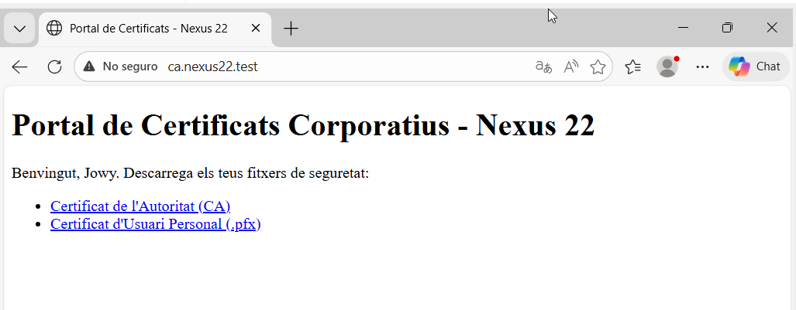

***

## Fase 5: Instal·lació de Certificats al Client

### 5.1 Importació

- Instal·lació de Adobe Acrobat Reader via Winget.
```
winget install Adobe.Acrobat.Reader.64-bit --accept-source-agreements --accept-package-agreements
```

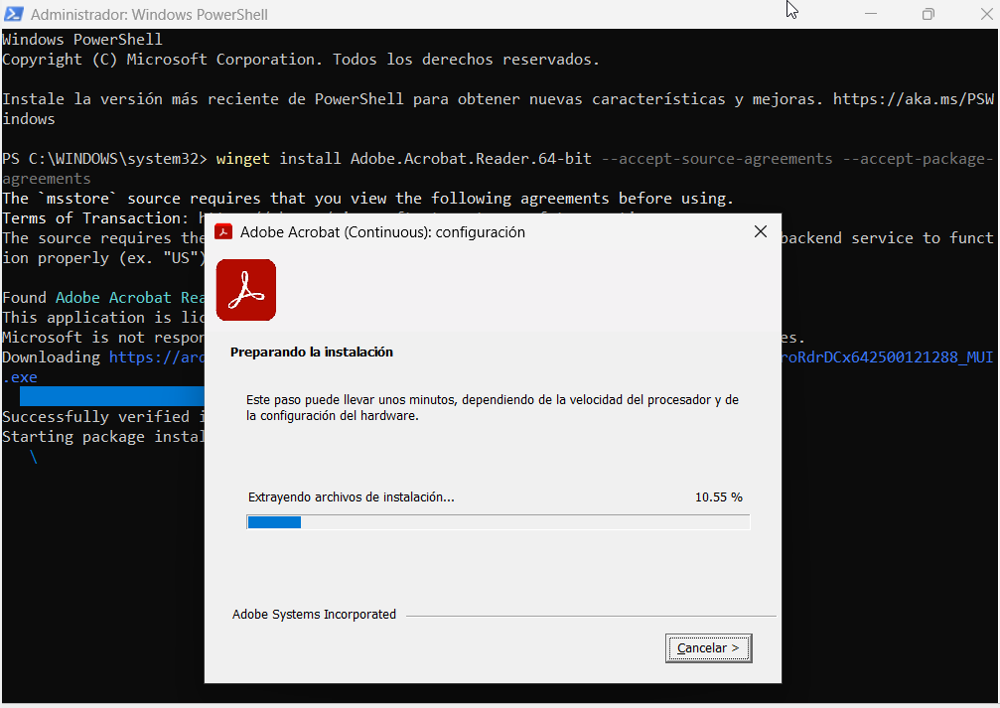

### 5.2 Importació del Certificat de l'Autoritat (CA)

Executa la consola de certificats de l'usuari: prem Win + R, escriu `certmgr.msc` i prem Enter.

Navega fins a la branca: Entitats d'autenticació de confiança > Certificats.

Fes clic dret sobre la carpeta "Certificats" -> Totes les tasques -> Importar....

Selecciona el fitxer cacert.pem descarregat del portal web.

Finalitza l'assistent assegurant-te que el magatzem de destinació és el d'"Entitats d'autenticació de confiança".

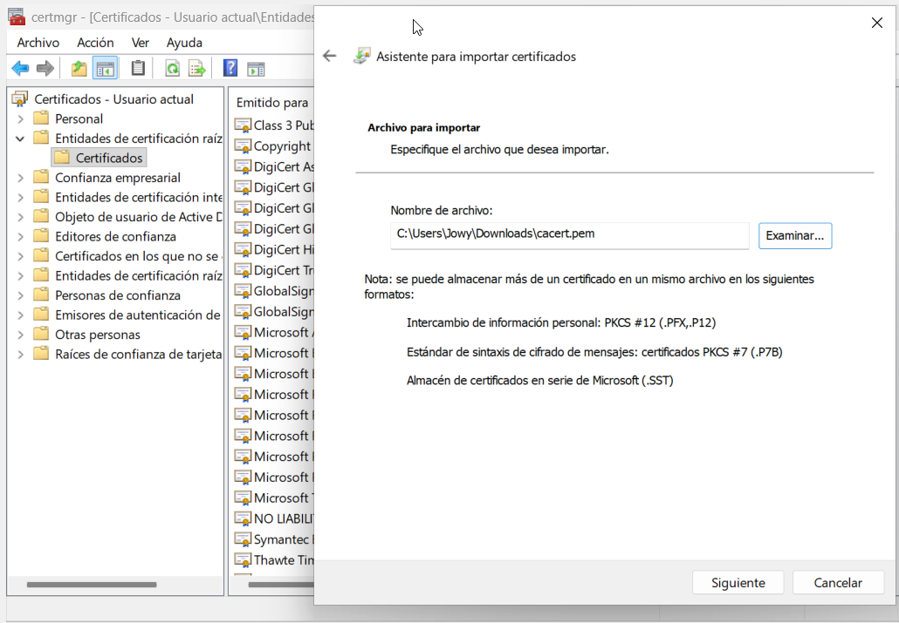

### 5.3 Importació del Certificat d'Usuari (Personal)

Aquest certificat és el que utilitzarà l'Adobe Acrobat per signar els documents en nom de l'usuari.

Dins de la mateixa consola certmgr.msc, ves a la branca: Personal > Certificats.

Fes clic dret -> Totes les tasques -> Importar....

Selecciona el fitxer CertUser.pfx.

Contrasenya: Introdueix la contrasenya d'exportació que vas configurar al servidor.

Finalitza l'assistent per carregar la teva identitat digital al magatzem personal.

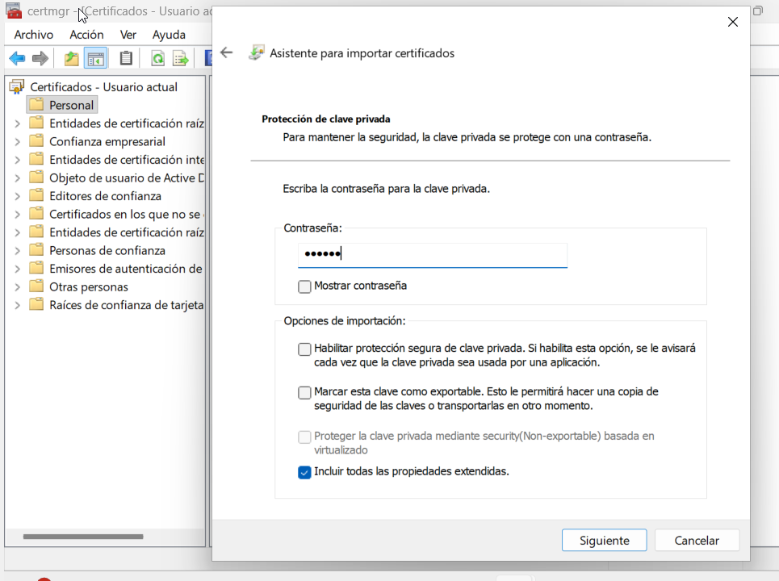

***

## Fase 6: Signatura Digital d'un Document PDF

S'ha signat un document PDF utilitzant el certificat corporatiu de l'empleat instal·lat al client.

Eina: Adobe Acrobat Reader → Utilitzar un certificat → Signar digitalment.

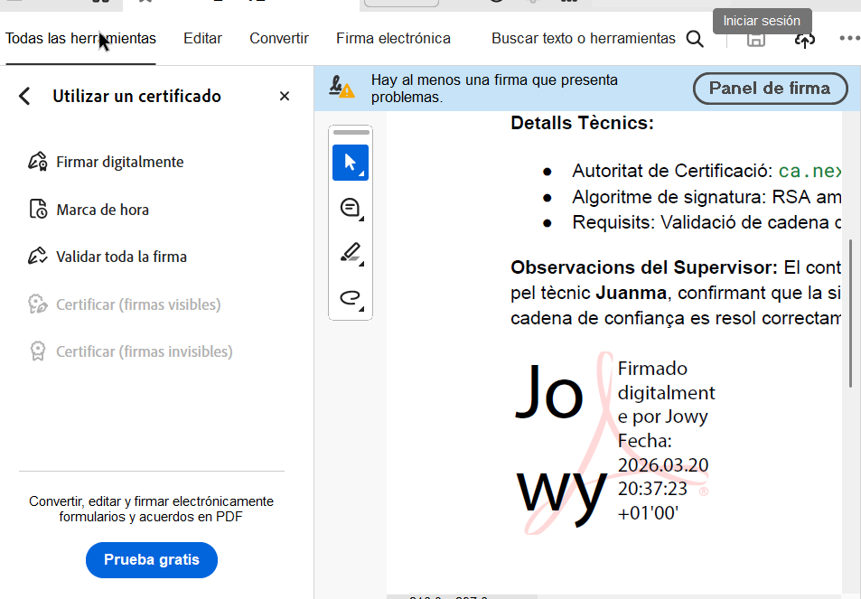

***

## Diferència entre Clau Pública i Privada

**Clau Privada:** Component secret que s'emmagatzema al fitxer .pfx de la CA. S'utilitza per generar la signatura digital. Garanteix l'autenticitat i el no repudi, ja que només el seu propietari la posseeix.

**Clau Pública:** Continguda en els certificats cacert.pem. Es distribueix a tothom per verificar la signatura digital. Garanteix que el document no ha estat alterat des de la signatura.


## Evidència 

- [Fitxer PDF de prova signat digitalment](Factura_Jowy_Nexus22_Firmada.pdf)
- [Fitxer .cer](cacert.pem)
