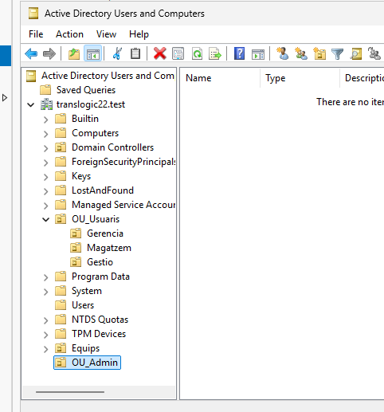
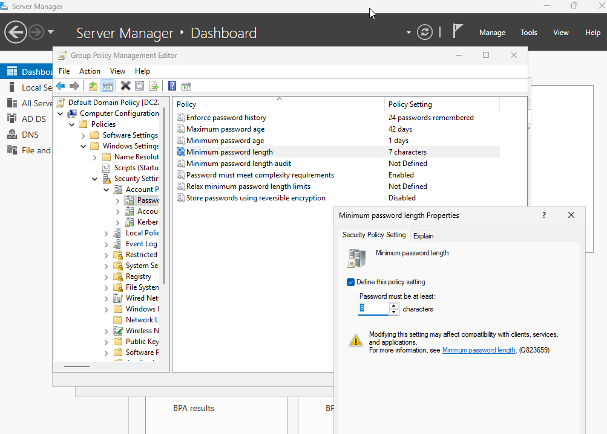
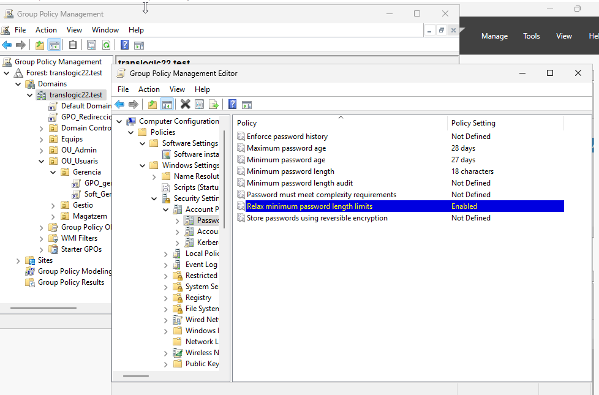
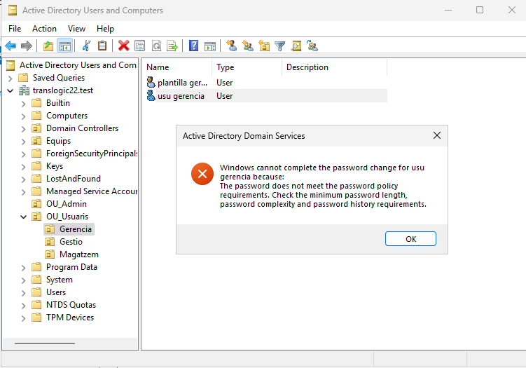
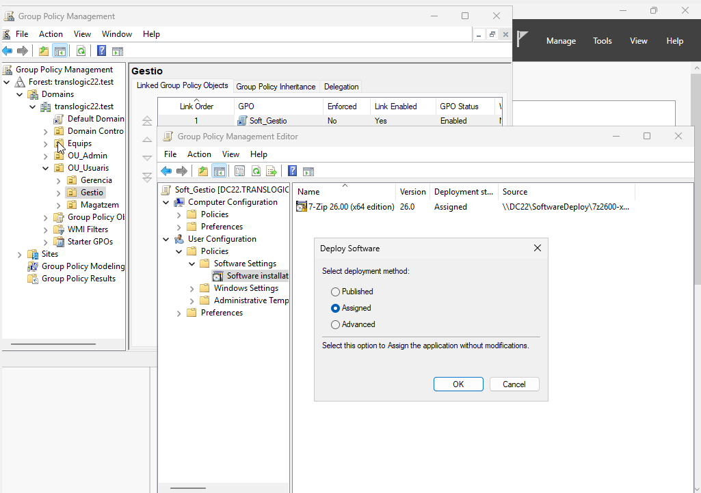
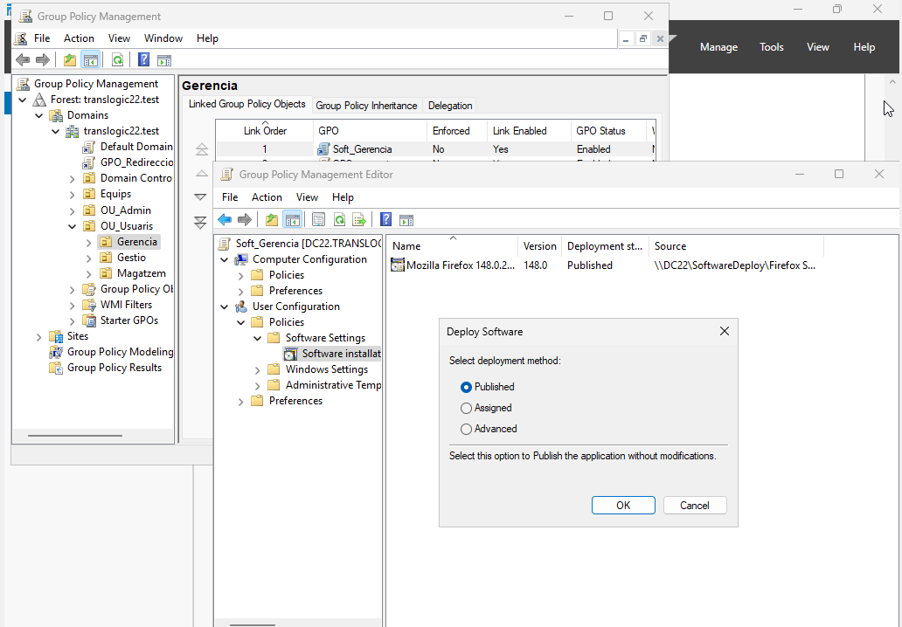
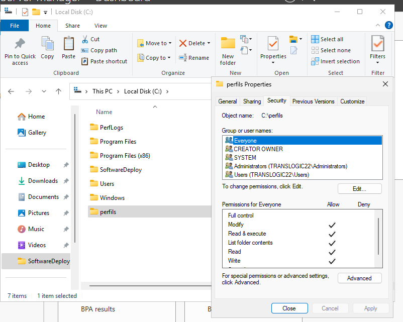
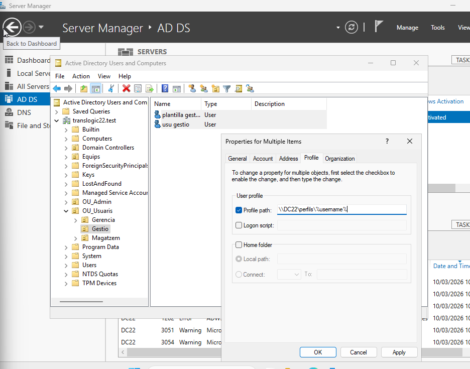
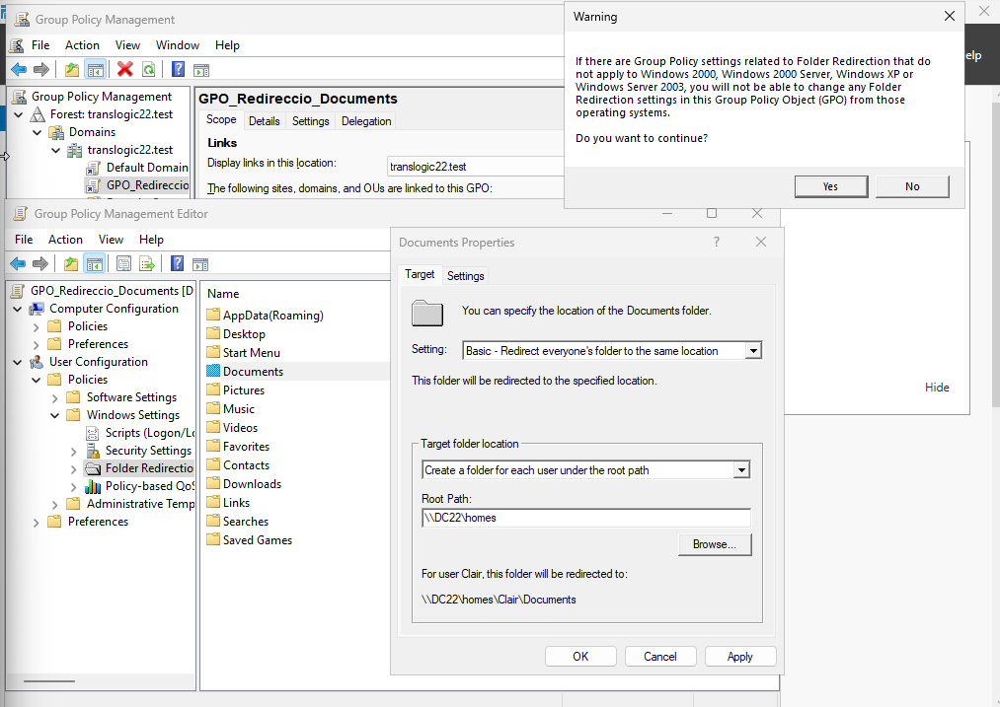
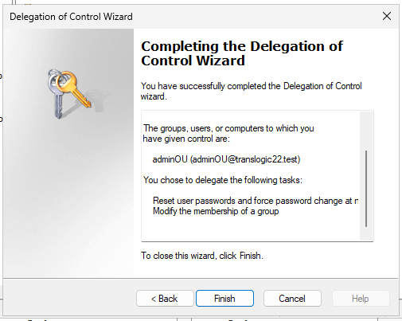

# T07 – TransLògic: Administració Avançada i Seguretat Corporativa


# 1. Estructura d'Unitats Organitzatives (OU)

## Proposta d’estructura

```
TransLogic
│
├── Usuaris
│   ├── gestio
│   ├── gerencia
│   ├── magatzem
│
├── Equips
│
└── OU_Admin
```


L'estructura s'ha dissenyat per segmentar objectes segons la seva funció en un entorn English Windows Server:

- Usuaris: Centralitza els comptes humans dividits per departaments (gestio, gerencia, magatzem).
- Equips: Separa les màquines dels usuaris per aplicar directives de sistema.
- OU_Admin: Aïlla el compte de suport tècnic per a la delegació de funcions.



***

## 2. Polítiques de Seguretat i Contrasenyes

### 2.1. Política Global (8 caràcters)

1. Obre Group Policy Management.
2. Edita la Default Domain Policy.
3. Ves a: Computer Configuration > Policies > Windows Settings > Security Settings > Account Policies > Password Policy.
4. Configura Minimum password length a 8.



## 2.2. Política per a Gerència

Al Group Policy Management, crea una GPO a la OU gerencia anomenada GPO_Password_Gerencia i fes clic a Edit.

Navega fins a: Computer Configuration > Policies > Windows Settings > Security Settings > Account Policies > Password Policy.

Configura tots els valors en aquesta mateixa llista:

Relax minimum password length limits: Enabled.

Minimum password length: 18 characters.

Maximum password age: 28 days.



Comprovació: Des del client, prem Ctrl + Alt + Del i tria Change a password. Intenta posar una contrasenya que no compleixi els caràcters (per exemple, 5 caràcters per a un usuari normal o 10 per a un directiu).



### 2.3. Millora Proactiva (GPO Bonus)

He triat el bloqueig de pantalla automàtic per als usuaris de magatzem.
Justificació: En una empresa logística, els operaris sovint deixen els terminals per moure paquets. El bloqueig automàtic evita que qualsevol persona accedeixi a les dades si l'ordinador queda desatès.

Configuració:

1. Crea una GPO a la OU magatzem.

2. Ves a: User Configuration > Policies > Administrative Templates > Control Panel > Personalization.

3. Activa Enable screen saver.

4. Activa Password protect the screen saver.

5. Activa Screen saver timeout i posa 300 segons (5 minuts).

***

## 3. Desplegament de Programari

### 3.1. 7zip per a Gestió (Assigned)

1. Crea una GPO a la OU gestio anomenada Soft_Gestio.
2. Ves a: User Configuration (Tambe es pot fer a computer confirutaion) > Policies > Software Settings > Software installation.
3. Fes clic dret > New > Package.
4. Selecciona el fitxer .msi des de la ruta UNC.
5. Tria l'opció: Assigned.




### 3.2. Firefox per a Gerència (Published)

1. Crea una GPO a la OU gerencia anomenada Soft_Gerencia.
2. Repeteix els passos anteriors però a l'hora de triar el mètode, selecciona: Published.
3. L'usuari el trobarà al client a Control Panel > Programs > Install a program from the network.




### 3.3. Com crear un .MSI des d'un .EXE?

Si una aplicació només s'ofereix com a .exe, s'ha d'utilitzar un programari de tercers com MSI Wrapper o Advanced Installer.
Aquests programes capturen la instal·lació i generen un fitxer .msi (repackaging) que permet la instal·lació desatesa mitjançant l'Active Directory.

***

## 4. Mobilitat (Roaming Profiles)

1. Crea la carpeta perfils al servidor i configura el Sharing amb permisos Full Control per a Everyone.

2. A Active Directory Users and Computers, selecciona els usuaris de gestio.
3. Ves a Properties > pestanya Profile.
4. Al camp Profile path, escriu: \\NOM-SERVIDOR\\perfils\%username%.



***

## 5. Seguretat de Dades (Folder Redirection)

1. Crea una GPO per a tot el domini anomenada Redirection_Policy.
2. Ves a: User Configuration > Policies > Windows Settings > Folder Redirection.
3. Fes clic dret a Documents > Properties.
4. Al desplegable Setting, tria: Basic - Redirect everyone's folder to the same location.
5. A Target folder location, selecciona Create a folder for each user under the root path i posa la ruta del servidor (ex: \\NOM-SERVIDOR\\homes).



***

## 6. Delegació de Funcions (Helpdesk)

1. Crea l'usuari adminOU dins la OU_Admin.
2. Fes clic dret a la OU principal TransLogic > Delegate Control.
3. A l'assistent, afegeix l'usuari adminOU.
4. A la llista de tasques comunes, marca:
    - Reset user passwords and force password change at next logon
    - Modify the membership of a group
5. Verificació: Inicia sessió amb adminOU i comprova que pots fer Reset Password d'un usuari però l'opció New > User no apareix o dóna error.


