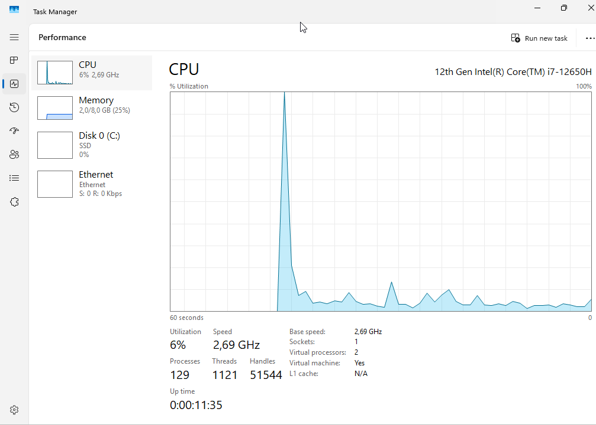
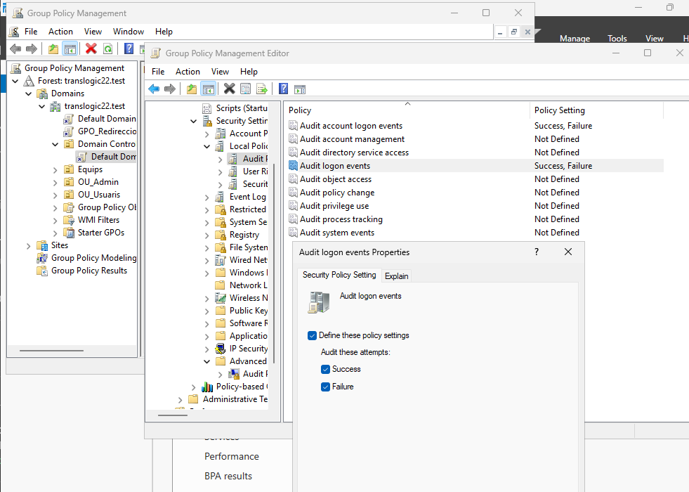
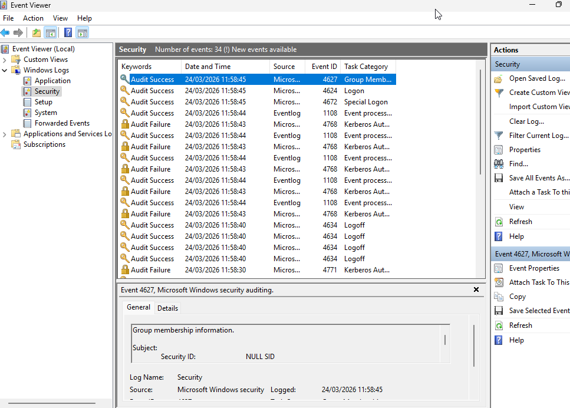

# T08: Vigilància i auditoria de sistemes

## 1. Monitorització de Recursos

Objectiu: Verificar si el servidor dimensionat suporta la càrrega de treball real.

1. Dins del Windows Server, obre el Task Manager (Ctrl + Shift + Esc).
2. Ves a la pestanya Performance.
3. La captura es veu el gràfic de CPU i Memory.

Dades: CPU al 6% i Memòria RAM al 25% (2,0/8,0 GB).
Interpretació: El servidor es troba en un estat de baixa càrrega. El dimensionament actual és superior a la demanda operativa del laboratori. No hi ha colls d'ampolla.

***

## 2. Configuració d'Auditoria de Seguretat

Aquesta configuració estableix les regles de vigilància per a tot el domini.

1. Obre el Group Policy Management.
2. Edita la Default Domain Controllers Policy (perquè auditi els accessos al domini).
3. Navega a:
Computer Configuration > Policies > Windows Settings > Security Settings > Local Policies > Audit Policy
4. Configura Audit account logon events i Audit logon events: activa les caselles Success i Failure.
5. Executa gpupdate /force al CMD del servidor.

***

## 3. Simulació d'Incidents (Hacking Ètic)

Ara posarem a prova el sistema des de la màquina de l'usuari.

1. Ves al Windows Client.
2. Si tens la sessió oberta, tanca-la (Sign out).
3. Intenta entrar amb un usuari existent (ex: l'usuari de magatzem).
4. Escriu una contrasenya incorrecta expressament 4 vegades. El sistema et donarà error d'accés cada vegada.
5. Finalment, entra correctament amb l'usuari Administrator (o l'usuari real) per poder seguir treballant.

***

## 4. Anàlisi Forense (Event Viewer)

Tornem al servidor per recollir les proves del "delicte" simulat.

1. Al Windows Server, obre l'Event Viewer (Visor d'Esdeveniments).
2. Ves a:
Windows Logs > Security.

Event ID 4771: Pre-autenticació de Kerberos fallida. És l'ID més precís en un domini modern per indicar una contrasenya incorrecta.
Event ID 4768: Sol·licitud de tiquet d'autenticació (TGT) denegada.

Conclusió: El sistema ha detectat l'anomalia en temps real. El registre inclou l'hora exacta (11:58:30) i l'usuari objectiu, complint amb els requisits d'auditoria de TransLògic S.A.
