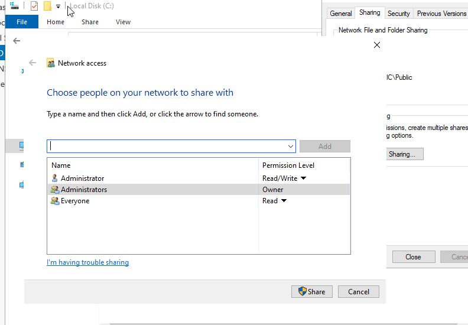
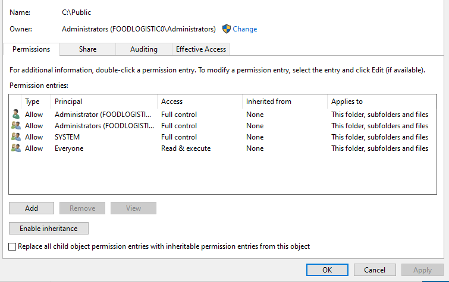
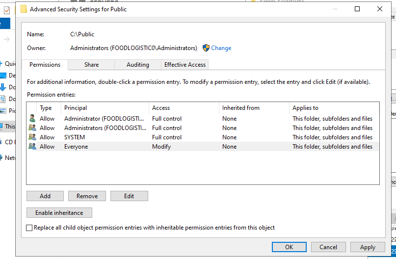
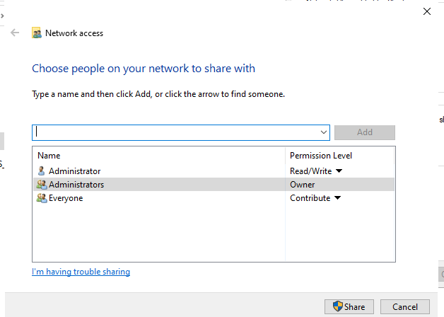
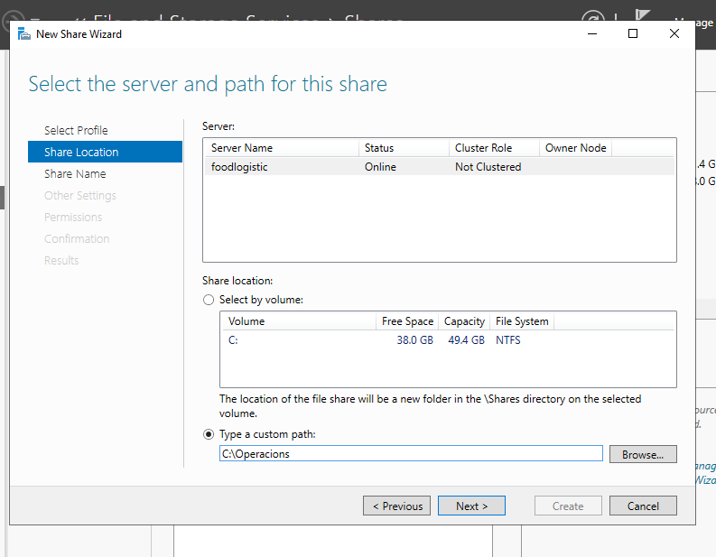
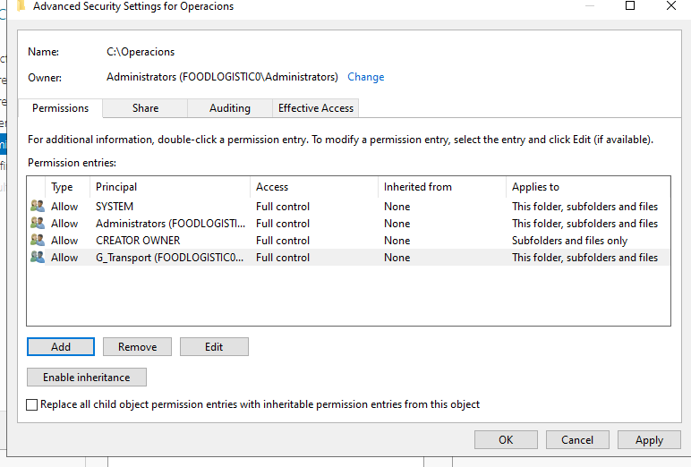
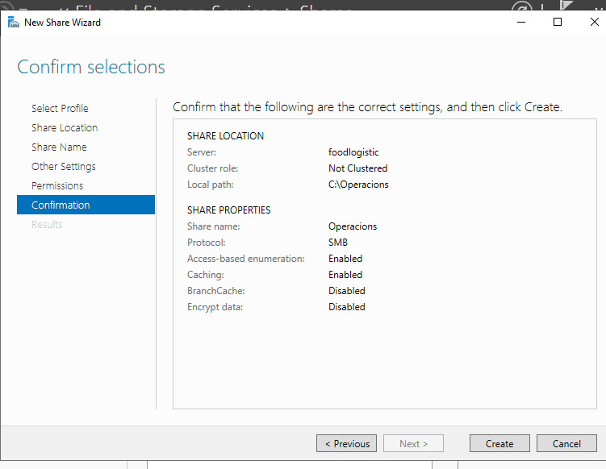
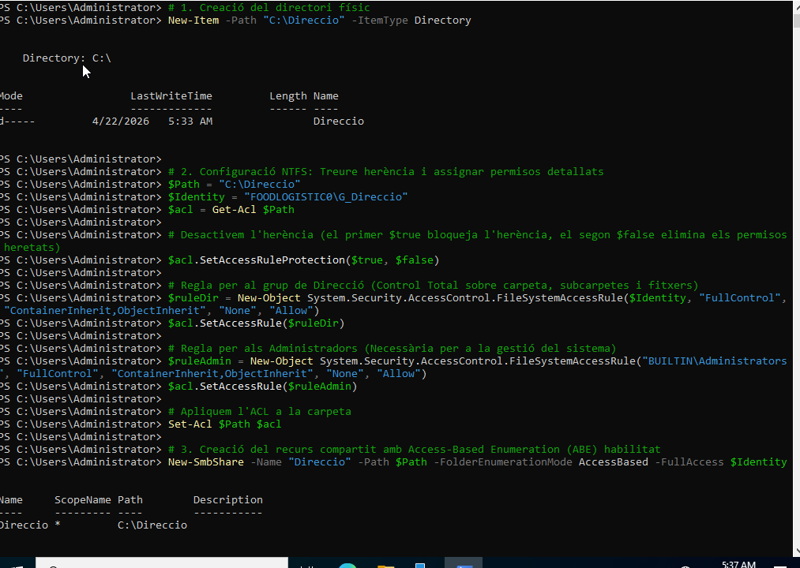
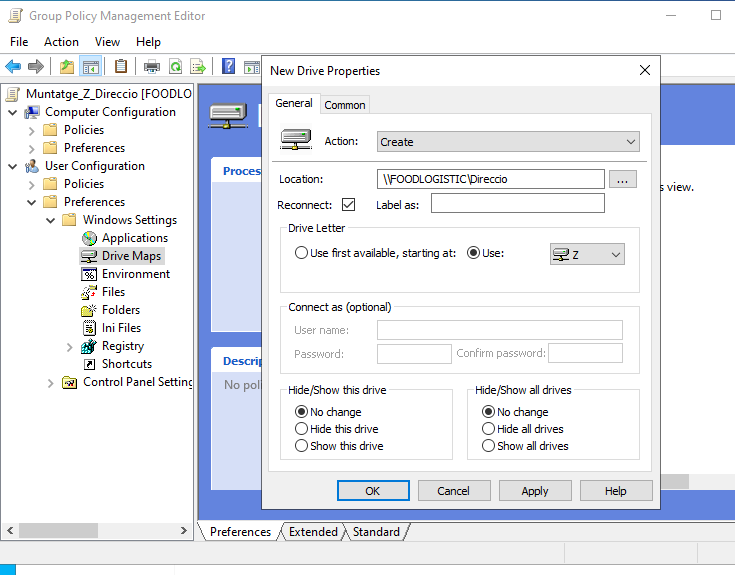

# Guia d'Implementació: Servidor de Fitxers FoodLogistic

## 1. Estructura Active Directory (AD DS)

- Domini: foodlogistic.test
- OU principal: FoodLogistic_OU
- Sub-OUs: Administracio, Transport, Direccio

### Grups de seguretat (Global)

- G_Administracio, dins l’OU Administracio
- G_Transport, dins l’OU Transport
- G_Direccio, dins l’OU Direccio


## 2. Implementació de recursos compartits

### A. Carpeta Public (Explorador de fitxers)

- Ruta: C:\Public
- Permisos SMB (Compartir): Everyone -> Lectura
- Permisos NTFS (Seguretat): Users / Grup_Estandard -> Modificació

### Resultat 
Depèn del que facis primer o segon serà el que afecti, el que posis segon es menjarà al primer modificant el que havies posat anteriorment

Abans de posar el NTFS:



Després de posar el NTFS sense tocar res més:



### B. Carpeta Operacions (Server Manager - FSSM)

Server Manager > File and Storage Services > Shares.

Tasks > New Share > SMB Share - Quick.

Share Location: Escribir ruta C:\Operacions.



Share Name: Operacions.

Other Settings: Marcar la casilla Enable access-based enumeration.

Permissions: * Click en Customize permissions.

Disable inheritance > "Convert inherited permissions...".

Eliminar Users. Añadir G_Transport con Full Control.



Finaliza el asistent.



### D. Carpeta Direccio (PowerShell avançat - Mètode D)

Execució del Script:

```powershell
# 1. Creació del directori físic
New-Item -Path "C:\Direccio" -ItemType Directory

# 2. Configuració NTFS: Treure herència i assignar permisos detallats
$Path = "C:\Direccio"
$Identity = "FOODLOGISTIC0\G_Direccio"
$acl = Get-Acl $Path

# Desactivem l'herència (el primer $true bloqueja l'herència, el segon $false elimina els permisos heretats)
$acl.SetAccessRuleProtection($true, $false)

# Regla per al grup de Direcció (Control Total sobre carpeta, subcarpetes i fitxers)
$ruleDir = New-Object System.Security.AccessControl.FileSystemAccessRule($Identity, "FullControl", "ContainerInherit,ObjectInherit", "None", "Allow")
$acl.SetAccessRule($ruleDir)

# Regla per als Administradors (Necessària per a la gestió del sistema)
$ruleAdmin = New-Object System.Security.AccessControl.FileSystemAccessRule("BUILTIN\Administrators", "FullControl", "ContainerInherit,ObjectInherit", "None", "Allow")
$acl.SetAccessRule($ruleAdmin)

# Apliquem l'ACL a la carpeta
Set-Acl $Path $acl

# 3. Creació del recurs compartit amb Access-Based Enumeration (ABE) habilitat
New-SmbShare -Name "Direccio" -Path $Path -FolderEnumerationMode AccessBased -FullAccess $Identity
```



### Configuració de la GPO (Unitat Z:):

Crear una GPO anomenada Muntatge_Z_Direccio i vincular-la a l'OU Direccio.

Ruta: User Configuration > Preferences > Windows Settings > Drive Maps.

Configurar: Acció Create, Ruta \\NomServidor\Direccio, Lletra Z.



## 3. Control d’emmagatzematge

### Quotes NTFS (nivell de volum)

- Acció: Propietats de la unitat C: > Quota.
- Configuració:
  - Enable quota management.
  - Limit disk space to 500 MB.
  - Set warning level to 450 MB.
  - Deny disk space to users exceeding limit.


### FSRM (File Server Resource Manager)

### Instal·lació del rol FSRM

Al Server Manager, ves a Manage (a dalt a la dreta) i selecciona Add Roles and Features.

Clica "Next" fins a arribar a la pestanya Server Roles.

Busca File and Storage Services i desplega-ho.

Desplega la subcategoria File and iSCSI Services.

Marca la casella File Server Resource Manager.

Se t'obrirà una finestra emergent; clica a Add Features per incloure les eines de consola.

Clica "Next" i finalment Install.


#### Quota de carpeta

- Prem Win + R i escriu fsrm.msc.

- Ves a Quota Management > Quotas.

- Fes clic dret i tria Create Quota.

- A Quota path, posa C:\Public.

- Tria Define custom quota properties i prem Custom Properties.

- Configura el límit a 200 MB i tipus Hard quota.

- Prem Add per al llindar (Threshold):

- Posa 90%.

- A la pestanya Event Log, marca la casella i enganxa el text: "Compte! FoodLogístic t’informa que estàs a punt d’esgotar l’espai compartit."


#### Filtratge de fitxers

- Obre la consola directa: Prem Win + R i escriu fsrm.msc.

- A l'arbre de l'esquerra, navega a File Screening Management > File Screens.

- Crea el filtre:

- Fes clic dret a l'espai central i tria Create File Screen...

- File screen path: Especifica C:\Operacions.

- Tipus de filtre: Marca Active screening: Do not allow users to save unauthorized files (Això és el que significa "Filtre: Actiu (Bloquejar)").

- Sota File groups, selecciona les caselles de:

- Executable Files

- Audio and Video Files


## 4. Verificació i auditoria

| Usuari de grup | Accés a Public | Accés a Operacions | Accés a Direccio (Z:) |
|---|---|---|---|
| G_Administracio | Lectura | Denegat (No visible) | No visible |
| G_Transport | Lectura | Accés total | No visible |
| G_Direccio | Lectura | Denegat (No visible) | Accés (Unitat Z:) |

### Prova de filtratge (Operacions)
- Intent copiar .exe: el sistema ha d’emetre l’error "Destination Folder Access Denied".
- Canvi d’extensió (.exe a .txt):
  - Si el filtre FSRM és només per extensió, permet la còpia.
  - Si s’habilita inspecció de signatures, bloqueja.
  - Per a l’activitat, es confirma que el filtratge es basa en l’extensió del fitxer.
